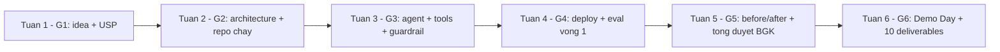

## Mục tiêu của tài liệu này

Cuốn sách này được thiết kế với một mục tiêu duy nhất: **giúp bạn xây dựng một dự án AI Agent đạt chất lượng cao**, từ thiết kế kiến trúc đến nộp bài cuối kỳ.

Bạn sẽ học được:

- Cách tổ chức dự án theo chuẩn industry — folder structure, config, environment
- Xây dựng AI Agent với LangGraph — state, nodes, edges, tools
- Phát triển API với FastAPI — routes, validation, error handling, streaming
- Thiết lập DevOps — Docker, CI/CD, deploy lên cloud
- Viết test và đánh giá chất lượng Agent
- Hoàn thành đầy đủ deliverables đúng deadline

Mỗi chương đi kèm code examples cụ thể, tips thực hành, và bài tập ôn tập. Đọc xong tài liệu này, bạn có thể tự tin build một project hoàn chỉnh.

> 🔑 **ĐIỂM CHÍNH:** Đây không phải sách lý thuyết. Mỗi chương đều có code bạn có thể copy, chạy, và modify ngay. Hãy mở terminal lên và code theo từng bước.

## Những sai lầm phổ biến cần tránh

Nhiều đội khi lần đầu xây dựng AI Agent mắc phải những sai lầm tương tự — không phải vì thiếu thông minh, mà vì thiếu kinh nghiệm engineering. Hãy ghi nhớ những lỗ hổng phổ biến này để tránh:

**Không thiết lập CI/CD pipeline.** CI/CD (Continuous Integration/Continuous Deployment) là quy chuẩn tối thiểu trong ngành phần mềm hiện đại. Khi push code lên repository, hệ thống tự động chạy test, kiểm tra code quality. Không có CI/CD = code được test thủ công, deploy cũng thủ công — rủi ro lỗi production rất cao.

**Bỏ qua evaluation (đánh giá chất lượng Agent).** Evaluation đo lường: Agent trả lời đúng bao nhiêu phần trăm? Có bị hallucination không? Tốc độ phản hồi thế nào? Không có evaluation, bạn không thể biết Agent thực sự tốt hay chỉ "trông có vẻ hoạt động" trong demo.

**README quá sơ sài hoặc thiếu hoàn toàn.** README là mặt tiền của dự án. Nó cho người đọc biết dự án làm gì, chạy thế nào, cấu trúc thư mục ra sao.

**Không có environment setup rõ ràng.** Người khác không thể chạy được dự án của bạn chỉ bằng cách đọc tài liệu. Trong môi trường thực tế, khả năng onboarding nhanh là yếu tố sống còn.

**Gộp tất cả code vào một file.** Dự án không có cấu trúc thư mục rõ ràng, khó maintain, khó test, khó review.

**Không viết test.** Không có test = không thể chứng minh code hoạt động đúng, không thể refactor an toàn.

> ⚠️ **LƯU Ý:** Những vấn đề trên phản ánh khoảng trống giữa kiến thức thuật toán và kỹ năng engineering thực tế. Cuốn sách này được thiết kế để lấp đầy khoảng trống đó.

## Đối tượng và kiến thức cần có

### Dành cho ai

- **Đối tượng chính:** Sinh viên tham gia chương trình AI20K Build Phase, muốn xây dựng AI Agent hoàn chỉnh từ con số không đến sản phẩm có thể demo và deploy
- **Đối tượng phụ:** Mentor, reviewer muốn tài liệu tham khảo chuẩn. Lập trình viên tự học muốn áp dụng best practices vào dự án AI Agent

### Kiến thức cần có trước

| Kiến thức | Mức độ cần thiết | Giải thích |
|-----------|-------------------|------------|
| Python cơ bản | Trung bình | Biết viết hàm, class, async/await, type hints |
| API & HTTP | Cơ bản | Hiểu GET/POST, JSON, REST |
| Git | Cơ bản | Clone, commit, push, branch |
| Terminal/CLI | Cơ bản | Chạy lệnh, navigate thư mục |
| AI/LLM | Không bắt buộc | Sách sẽ hướng dẫn từ đầu |

Nếu bạn chưa vững Python, hãy hoàn thành khóa "AI Python for Beginners" trên [DeepLearning.AI](https://www.deeplearning.ai/courses) trước khi bắt đầu.

## Cách sử dụng tài liệu này

### Lộ trình 6 tuần

| Tuần | Nội dung | Chương | Thời gian |
|------|----------|--------|-----------|
| 1 | Clone template, setup môi trường, git workflow | 1-2 | 4h |
| 2 | Thiết kế kiến trúc, vẽ diagram | 3 | 6h |
| 3 | Xây dựng AI Agent với LangGraph | 4 | 8h |
| 4 | Phát triển API + Giao diện | 5-6 | 8h |
| 5 | DevOps, Docker, CI/CD, deploy | 7 | 6h |
| 6 | Testing, evaluation, hoàn thiện deliverables | 8-9 | 8h |

### Cách đọc mỗi chương

Mỗi chương có cấu trúc thống nhất:

1. **Giới thiệu** — Mục tiêu của chương, bạn sẽ học được gì
2. **Nội dung chính** — Giải thích chi tiết kèm code examples
3. **Callout boxes** — Mẹo (💡), Lưu ý (⚠️), Điểm chính (🔑)
4. **Tóm tắt** — Key takeaways
5. **Câu hỏi ôn tập** — Kiểm tra hiểu biết

> 💡 **MẸO:** Đừng chỉ đọc — hãy mở terminal lên và code theo. Học bằng cách làm (learning by doing) là cách hiệu quả nhất. Mỗi code block trong sách đều có thể chạy được trực tiếp.

## Tổng quan 10 chương

| Chương | Nội dung | Điểm trọng tâm |
|---------|----------|----------------|
| 1 | Lời mở đầu (chương này) | Mục tiêu, cách sử dụng |
| 2 | Khởi tạo dự án | Template, setup, git workflow |
| 3 | Thiết kế kiến trúc | 3-tier architecture, diagrams, ADR |
| 4 | LangGraph Agent | State, nodes, edges, tools, RAG |
| 5 | FastAPI | Routes, validation, error handling |
| 6 | Giao diện người dùng | Next.js, responsive, streaming |
| 7 | DevOps | Docker, CI/CD, deploy, logging |
| 8 | Kiểm thử | Unit test, integration test, RAGAS |
| 9 | Nộp bài Demo Day | Deliverables, checklist, tips |
| 10 | Tài nguyên học tập | Courses, docs, BMAD method |

## Tóm tắt chương

- Cuốn sách này giúp bạn build AI Agent project đạt chất lượng cao, từ A đến Z
- 10 chương, 6 tuần, mỗi chương có code examples và bài tập
- Sai lầm phổ biến cần tránh: thiếu CI/CD, thiếu test, README kém, không evaluation
- Học bằng cách làm — mở terminal lên và code theo từng bước

## Câu hỏi ôn tập

1. Hãy liệt kê 3 sai lầm phổ biến khi xây dựng AI Agent mà bạn cần tránh. Tại sao mỗi sai lầm đó nghiêm trọng?
2. Bạn đã có những kiến thức nền tảng nào trong bảng "Kiến thức cần có"? Những phần nào cần bổ sung?
3. Lập lịch 6 tuần theo lộ trình, ghi cụ thể mỗi tuần bạn sẽ dành bao nhiêu giờ và hoàn thành chương nào.
