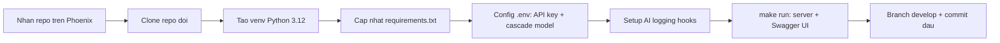

## Nhận repo của đội — Bắt đầu từ nền tảng đúng

Một trong những sai lầm phổ biến nhất của sinh viên khi bắt đầu dự án mới là tạo mọi thứ từ con số không — tự setup cấu trúc thư mục, tự cấu hình linting, tự viết CI/CD file, tự tạo Dockerfile. Kết quả là mỗi đội có một cấu trúc khác nhau, thiếu những file quan trọng, và mất hàng ngày chỉ để setup thay vì viết logic chính. Template dự án giải quyết vấn đề này bằng cách cung cấp một nền tảng đã được chuẩn hóa, bao gồm tất cả best practices mà bạn cần.

Trong AI20K bạn không phải tự clone template rồi tự tạo repository. Khi đội của bạn được chốt, hệ thống sinh sẵn một repo riêng cho đội **từ chính template này** — nằm trong org GitHub của khoá bạn đang học, đặt tên theo mã đội. Việc của bạn là clone nó về và bắt đầu code.

### Trước khi clone, kiểm tra hai điều

1. **Bạn đã vào org GitHub của khoá.** BTC gửi lời mời tới tài khoản GitHub bạn đã đăng ký; lời mời chưa được chấp nhận thì lệnh clone sẽ báo lỗi 404 (GitHub trả 404 chứ không phải 403 cho repo private mà bạn chưa có quyền). Kiểm tra tại [github.com/settings/organizations](https://github.com/settings/organizations).
2. **Repo của đội đã được tạo.** Link repo hiện ở trang đội trên Phoenix, đồng thời có một tin nhắn báo trong kênh feed GitHub trên Discord ngay khi repo được sinh ra.

Nếu chưa thấy repo của đội, **đừng tự tạo repo mới** — hãy báo BTC. Repo do đội tự tạo nằm ngoài org nên không bắn webhook về hệ thống chấm, và không được tính là bài nộp.

### Clone repo của đội

Mở terminal và chạy các lệnh sau:

```bash
# Thay <ORG-CỦA-KHOÁ>/<MÃ-ĐỘI> bằng URL thật — copy ở trang đội trên Phoenix
$ git clone https://github.com/<ORG-CỦA-KHOÁ>/<MÃ-ĐỘI>.git

# Di chuyển vào thư mục dự án
$ cd <MÃ-ĐỘI>

# Xác nhận remote trỏ đúng repo của đội, không phải template
$ git remote -v
```

Bạn **không** cần `rm -rf .git`, không cần `git init`, cũng không cần `git remote add`. Repo của đội được sinh bằng cơ chế *generate* của GitHub chứ không phải fork hay clone thủ công: nó bắt đầu bằng đúng một commit khởi tạo, lịch sử commit của template không đi theo. Thứ mà bước `rm -rf .git` ngày trước dùng để dọn dẹp thì nay không tồn tại.

Ngược lại, xoá `.git` lúc này là tự phá dự án của mình: mất remote trỏ về GitHub, mất luôn branch `main` đang được bảo vệ, và lần push sau đó không còn chỗ để đẩy lên.

### Cấu trúc thư mục và ý nghĩa

Sau khi clone, hãy mở thư mục dự án trong editor (khuyến nghị VS Code). Bạn sẽ thấy cấu trúc như sau:

```
<MÃ-ĐỘI>/
├── src/
│   ├── agent/           # LangGraph Agent logic
│   │   ├── __init__.py
│   │   ├── graph.py     # State graph definition
│   │   ├── state.py     # State schema
│   │   ├── nodes.py     # Node functions
│   │   └── tools.py     # Agent tools
│   ├── api/             # FastAPI endpoints
│   │   ├── __init__.py
│   │   ├── main.py      # FastAPI app entry point
│   │   ├── routes/      # API route modules
│   │   └── deps.py      # Dependencies injection
│   ├── core/            # Shared config & utilities
│   │   ├── __init__.py
│   │   ├── config.py    # Pydantic settings
│   │   └── logging.py   # Logging setup
│   └── models/          # Data models (Pydantic)
│       ├── __init__.py
│       └── schemas.py   # Request/Response schemas
├── tests/
│   ├── unit/            # Unit tests
│   ├── integration/     # Integration tests
│   └── eval/            # Agent evaluation tests
├── docs/
│   ├── architecture/    # Architecture diagrams
│   ├── api/             # API documentation
│   └── adr/             # Architecture Decision Records
├── eval/                # Evaluation datasets & scripts
│   ├── datasets/        # Test questions & expected outputs
│   └── scripts/         # Evaluation runner scripts
├── presentation/        # Demo Day slides & materials
├── .env.example         # Mẫu biến môi trường
├── .gitignore           # Git ignore rules
├── Dockerfile           # Container definition
├── docker-compose.yml   # Multi-container orchestration
├── requirements.txt     # Danh sách dependencies
├── ruff.toml            # Cấu hình linter/formatter
├── Makefile             # Common commands shortcut
└── README.md            # Project documentation
```

Mỗi thư mục phục vụ một mục đích cụ thể. Hãy hiểu rõ trước khi bắt đầu code:

**`src/agent/`** — Nơi chứa toàn bộ logic AI Agent của bạn. File `graph.py` định nghĩa state graph (sơ đồ trạng thái) cho Agent, `state.py` chứa schema dữ liệu truyền giữa các node, `nodes.py` chứa các hàm xử lý logic tại mỗi bước, và `tools.py` chứa các công cụ mà Agent có thể sử dụng (tìm kiếm web, truy vấn database, gọi API, v.v.). Đây là "bộ não" của ứng dụng.

**`src/api/`** — FastAPI backend. File `main.py` tạo ứng dụng FastAPI và cấu hình middleware. Thư mục `routes/` chứa các file định nghĩa API endpoints, mỗi file tương ứng với một nhóm chức năng. File `deps.py` quản lý dependency injection — ví dụ, tạo instance của Agent và inject vào các route handler.

**`src/core/`** — Cấu hình và tiện ích dùng chung. File `config.py` sử dụng pydantic-settings để load và validate biến môi trường. File `logging.py` thiết lập logging format.

**`src/models/`** — Pydantic models cho request và response. Đây là "hợp đồng" giữa client và server — định nghĩa rõ dữ liệu gửi lên phải có dạng gì, và dữ liệu trả về sẽ có dạng gì.

**`tests/`** — Bài kiểm thử. `unit/` cho unit tests (test từng hàm riêng lẻ), `integration/` cho integration tests (test nhiều component hoạt động cùng nhau), và `eval/` cho Agent evaluation (đánh giá chất lượng trả lời của Agent).

**`docs/`** — Tài liệu dự án. `architecture/` chứa sơ đồ kiến trúc (Mermaid hoặc hình ảnh), `api/` chứa tài liệu API bổ sung, và `adr/` chứa Architecture Decision Records — ghi lại lý do tại sao bạn chọn giải pháp A thay vì giải pháp B.

**`eval/`** — Dữ liệu và script để đánh giá Agent. Trong `datasets/` bạn đặt các câu hỏi test kèm câu trả lời mong đợi. Trong `scripts/` bạn viết script tự động chạy Agent qua tập test và tính điểm. Đây là phần mà hầu hết đội bỏ qua — hãy đảm bảo đội bạn khác biệt.

**`presentation/`** — Slide và tài liệu cho Demo Day. Không đợi đến phút cuối mới làm slide — hãy cập nhật dần trong suốt quá trình phát triển.

> 🔑 **ĐIỂM CHÍNH:** Cấu trúc thư mục không phải ngẫu nhiên — nó phản ánh nguyên tắc separation of concerns (tách biệt trách nhiệm). Agent logic tách biệt khỏi API logic, tách biệt khỏi config, tách biệt khỏi tests. Khi dự án lớn lên, bạn sẽ thấy cấu trúc này giúp bạn tìm và sửa code nhanh hơn rất nhiều so với "bỏ tất cả vào một file."

## Chọn tầng khởi đầu: Prototype nhanh hay build nghiêm túc?

> 💡 **Bài học cohort:** đội có idea chưa validate mà dựng full Docker/CI ngay tuần 1 → 3 tuần đầu "set up hạ tầng" chứ không học được gì từ user. Ngược lại, đội đã chắc idea mà vẫn code prototype tay → demo ngày bị lỗi dưới tải nặng. Chọn đúng tầng.

| | **Tầng 1 — Prototype ngày 1** (validate idea) | **Tầng 2 — Repo của đội** (chapter này) |
|---|---|---|
| Khi nào | Tuần 1-2, chưa chắc user cần gì; cần cái gì đó MÌNH THẤY được để hỏi 5 user thật | Đã có USP + ≥5 feedback khẳng định (xem Chương 5); bắt đầu build nghiêm túc trên repo đã cấp |
| Công cụ | AI Studio / Gemini canvas + Firebase/Supabase free — KHÔNG server, KHÔNG Docker | Repo này: FastAPI + LangGraph + Docker + CI |
| Mục tiêu | Trả lời "user có dùng không?" trong 48 giờ | Trả lời "sản phẩm chịu được Demo Day không?" trong 6 tuần |
| Bỏ gì | DevOps, tests, guardrails (chấp nhận — vì sẽ vứt đi) | Không bỏ gì được nữa |

**Quy tắc:** chuẩn bị "hoàn thành hơn hoàn hảo". Tầng 1 có thể vứt đi 100% — và đó là thắng, không phải lỗ. Khi chuyển lên tầng 2, mang theo đúng 2 thứ từ tầng 1: câu hỏi user thật (→ golden dataset Chương 10) + USP đã validate (Chương 5).



## Thiết lập môi trường — Đừng để "trên máy tôi chạy được"

Một câu nói kinh điển trong ngành phần mềm là "It works on my machine" — "Trên máy tôi chạy được." Nỗi ám ảnh này xuất phát từ việc môi trường phát triển không được setup đồng bộ: phiên bản Python khác, thư viện khác, biến môi trường khác. Phần này sẽ giúp bạn thiết lập môi trường đúng cách để không chỉ "trên máy bạn chạy được" mà "trên mọi máy đều chạy được."

### Yêu cầu hệ thống

Trước khi bắt đầu, hãy xác nhận máy bạn đáp ứng các yêu cầu sau:

- **Python 3.12 hoặc mới hơn.** FastAPI, Pydantic 2, LangChain/LangGraph 1.x đều đã hỗ trợ đầy đủ 3.12/3.13. Khuyến nghị: dùng Python 3.12.x (ổn định, thư viện lõi đã verify 2026-09).

- **pip phiên bản mới nhất.** Chạy `pip install --upgrade pip` để cập nhật.

- **Git 2.30+.** Chạy `git --version` để kiểm tra.

- **(Tùy chọn) Docker Desktop.** Cần nếu bạn muốn chạy ứng dụng trong container, nhưng không bắt buộc cho giai đoạn phát triển ban đầu.

Kiểm tra phiên bản Python:

```bash
$ python3 --version
# Output mong đợi: Python 3.12.x hoặc cao hơn

# Nếu bạn có nhiều phiên bản Python, kiểm tra chính xác:
$ python3.12 --version
```

### Tạo virtual environment

Virtual environment (venv) là một môi trường Python cô lập, tách biệt với hệ thống Python toàn cục. Mỗi dự án nên có venv riêng để tránh xung đột thư viện giữa các dự án.

```bash
# Từ thư mục gốc của dự án
$ python3.12 -m venv .venv

# Kích hoạt venv trên macOS/Linux
$ source .venv/bin/activate

# Kích hoạt venv trên Windows
$ .venv\Scripts\activate

# Xác nhận đang dùng Python trong venv
$ which python
# Output nên là: /path/to/your/project/.venv/bin/python
```

Sau khi kích hoạt, bạn sẽ thấy tên venv hiển thị ở đầu command prompt, ví dụ: `(.venv) $`. Điều này xác nhận bạn đang làm việc trong môi trường ảo. Mọi lệnh `pip install` từ bây giờ sẽ chỉ cài thư viện vào venv, không ảnh hưởng đến hệ thống.

> ⚠️ **LƯU Ý:** Không bao giờ cài thư viện trực tiếp vào system Python. Nếu bạn lỡ cài mà không kích hoạt venv trước, hãy gỡ bỏ bằng `pip uninstall` và làm lại đúng cách. Thư mục `.venv` đã được thêm vào `.gitignore`, nên nó sẽ không bị commit lên Git.

### Cài đặt dependencies

Template khai báo dependencies trong `requirements.txt` — cả thư viện chạy thật lẫn thư viện dùng để test và lint đều nằm trong một file, cài bằng một lệnh:

```bash
$ pip install -r requirements.txt
```

Không có bước `pip install -e .` như nhiều dự án Python khác: template không đóng gói `src/` thành package để cài, code chạy thẳng từ thư mục dự án (`uvicorn src.main:app`). Nghĩa là bạn sửa code trong `src/` thì lần chạy sau đã dùng bản mới, không cần cài lại gì.

Các dependencies chính trong template bao gồm:

- **`fastapi`** — Framework web backend, async, auto-docs.
- **`uvicorn`** — ASGI server để chạy FastAPI.
- **`langgraph`** — Framework xây dựng AI Agent dạng state machine.
- **`langchain`** — Thư viện cốt lõi của LangChain ecosystem.
- **`langchain-openai`** — Tích hợp với OpenAI models (GPT-4, GPT-3.5).
- **`pydantic`** và **`pydantic-settings`** — Data validation và settings management.
- **`python-dotenv`** — Load biến môi trường từ file `.env`.

Development dependencies:

- **`pytest`** và **`pytest-asyncio`** — Testing framework với hỗ trợ async.
- **`ruff`** — Linter và formatter thay thế cho flake8 + black, nhanh hơn 10-100x.
- **`mypy`** — Static type checker. Không có trong `requirements.txt`; muốn chạy `make typecheck` thì cài thêm: `pip install mypy`.
- **`httpx`** — HTTP client dùng cho testing API.

Cuối file còn vài dependency để sẵn dạng comment — SQLAlchemy, Alembic, psycopg2 cho database, ChromaDB cho vector store. Đội nào cần thì bỏ dấu `#` rồi cài lại, không cần tự đi tra phiên bản.

### Xác nhận cài đặt thành công

Sau khi cài xong, chạy các lệnh sau để xác nhận mọi thứ đã đúng:

```bash
# Kiểm tra FastAPI đã cài
$ python -c "import fastapi; print(f'FastAPI {fastapi.__version__}')"
# Output: FastAPI 0.x.x

# Kiểm tra LangGraph đã cài
$ python -c "import langgraph; print('LangGraph OK')"

# Chạy tests để xác nhận template hoạt động
$ make test
# Hoặc:
$ pytest tests/ -v
```

Nếu tất cả các lệnh trên chạy mà không có error, chúc mừng — môi trường của bạn đã sẵn sàng.

> 💡 **MẸO:** Nếu bạn gặp lỗi "Module not found" dù đã cài, nguyên nhân phổ biến nhất là bạn quên kích hoạt venv hoặc cài nhầm vào system Python. Chạy `which python` để xác nhận, và nếu cần, kích hoạt lại venv.

## Biến môi trường — Không bao giờ hardcode secrets

Một lỗi phổ biến và nguy hiểm mà nhiều sinh viên mắc phải là "hardcode" (nhúng trực tiếp) các giá trị nhạy cảm như API keys, database passwords vào trong source code. Khi bạn push code lên GitHub, bất kỳ ai cũng có thể thấy những giá trị này — và bot quét API keys hoạt động liên tục trên GitHub. Chỉ trong vài phút sau khi bạn push, key của bạn có thể bị đánh cắp và sử dụng trái phép, dẫn đến thiệt hại tài chính (OpenAI charge theo usage).

Biến môi trường (environment variables) là cách đúng để xử lý. Bạn lưu các giá trị nhạy cảm trong file `.env` (đã được gitignore), và code đọc từ môi trường thay vì hardcode.

### File .env.example

> 💰 **Tài khoản AI miễn phí:** hướng dẫn đăng ký OpenAI/Anthropic/Gemini/Groq/Cohere... cho học viên AI20K ở [free-accounts.md](free-accounts.md).

Template cung cấp sẵn file `.env.example` — đây là "mẫu" liệt kê tất cả biến môi trường cần thiết mà không chứa giá trị thực. Bước đầu tiên của bạn là copy nó thành `.env` và điền giá trị:

```bash
$ cp .env.example .env
```

Nội dung file `.env.example` mẫu:

```env
# Application
APP_NAME=ai-agent
APP_ENV=development
DEBUG=true
LOG_LEVEL=DEBUG

# API
API_HOST=0.0.0.0
API_PORT=8000
API_PREFIX=/api/v1

# LLM Provider
LLM_PROVIDER=openai
OPENAI_API_KEY=sk-your-key-here
# Cascade router (src/services/llm.py): model rẻ classify, model mạnh generate,
# judge PHẢI khác generate (app raise ValueError nếu trùng — chống self-preference bias)
MODEL_CLASSIFY=gpt-4o-mini
MODEL_GENERATE=gpt-4o
MODEL_JUDGE=gpt-4o-mini
OPENAI_TEMPERATURE=0.7
OPENAI_MAX_TOKENS=2048
# Agent loop: số vòng ReAct tối đa trước khi escape hatch finalize-with-partial
AGENT_MAX_ITERATIONS=8

# Database (nếu cần)
DATABASE_URL=sqlite:///./data/app.db

# Vector Store (cho RAG, nếu cần)
VECTOR_STORE_TYPE=chroma
CHROMA_PERSIST_DIR=./data/chroma
```

Sau khi copy, mở file `.env` và thay thế các giá trị placeholder bằng giá trị thực của bạn. Đặc biệt, thay `sk-your-key-here` bằng OpenAI API key của bạn.

> ⚠️ **LƯU Ý:** File `.env` không bao giờ được commit lên Git. Template đã bao gồm `.env` trong `.gitignore`. Nếu bạn vô tình commit `.env`, hãy ngay lập tức: (1) đổi API key trên dashboard của provider, (2) xóa file khỏi git history bằng `git filter-branch` hoặc BFG Repo-Cleaner.

### Config module với pydantic-settings

Template sử dụng `pydantic-settings` để quản lý cấu hình. Đây là cách hiện đại và type-safe để load biến môi trường. Hãy xem file `src/core/config.py`:

```python
from typing import Literal
from pydantic import Field, field_validator
from pydantic_settings import BaseSettings


class Settings(BaseSettings):
    """Application settings loaded from environment variables."""

    # Application
    app_name: str = "ai-agent"
    app_env: Literal["development", "staging", "production"] = "development"
    debug: bool = False
    log_level: Literal["DEBUG", "INFO", "WARNING", "ERROR"] = "INFO"

    # API
    api_host: str = "0.0.0.0"
    api_port: int = Field(default=8000, ge=1024, le=65535)
    api_prefix: str = "/api/v1"

    # LLM
    llm_provider: Literal["openai", "anthropic", "google"] = "openai"
    openai_api_key: str = Field(default="", alias="OPENAI_API_KEY")
    openai_model: str = "gpt-4o-mini"
    openai_temperature: float = Field(default=0.7, ge=0.0, le=2.0)
    openai_max_tokens: int = Field(default=2048, ge=1, le=128000)

    model_config = {
        "env_file": ".env",
        "env_file_encoding": "utf-8",
        "case_sensitive": False,
        "extra": "ignore",
    }


# Singleton instance
settings = Settings()
```

Phân tích từng phần quan trọng:

**`Literal` types** — `Literal["development", "staging", "production"]` giới hạn `app_env` chỉ nhận một trong ba giá trị. Nếu bạn đặt `APP_ENV=testing` (giá trị không hợp lệ), pydantic sẽ throw error ngay khi app khởi động, thay vì silently fail trong runtime. Đây là một ví dụ của "fail fast" principle — phát hiện lỗi càng sớm càng tốt.

**`Field` validators** — `Field(default=8000, ge=1024, le=65535)` áp dụng validation: port number phải từ 1024 đến 65535. Nếu ai đó đặt `API_PORT=80`, app sẽ báo lỗi ngay. Tương tự, `temperature` bị giới hạn từ 0.0 đến 2.0 (range hợp lệ của OpenAI), và `max_tokens` từ 1 đến 128000.

**`model_config`** — Chỉ định cách load biến môi trường. `env_file=".env"` nói rằng đọc từ file `.env`. `case_sensitive=False` cho phép biến môi trường viết hoa (OPENAI_API_KEY) map vào field viết thường (openai_api_key). `extra="ignore"` bỏ qua các biến môi trường không được định nghĩa trong Settings class.

**Singleton pattern** — Dòng `settings = Settings()` tạo một instance duy nhất của Settings ở module level. Khi bạn cần dùng config ở bất kỳ đâu trong code, chỉ cần `from src.core.config import settings` — instance này được tạo một lần và dùng chung cho toàn bộ ứng dụng.

```python
# Sử dụng ở bất kỳ đâu trong project
from src.core.config import settings

print(settings.openai_model)     # "gpt-4o-mini"
print(settings.api_port)         # 8000
print(settings.app_env)          # "development"
```

> 💡 **MẸO:** Khi thêm biến môi trường mới, luôn nhớ: (1) thêm vào `.env.example` với giá trị placeholder, (2) thêm field vào `Settings` class với type hint và default value, (3) thêm validation nếu cần. Đừng bao giờ thêm biến trực tiếp vào code mà không thông qua Settings.

## Git workflow — Làm việc nhóm không hỗn loạn

Một sai lầm phổ biến khi làm việc nhóm là thiếu quy trình Git thống nhất: đè code lên nhau (force push), merge conflict không giải quyết được, commit message vô nghĩa ("fix", "update", "test"), và code trên main branch liên tục bị hỏng. Nguyên nhân chính là thiếu quy trình rõ ràng. Phần này sẽ thiết lập quy trình mà toàn bộ đội phải tuân thủ.

### Chiến lược branching

Template khuyến nghị mô hình branching đơn giản nhưng hiệu quả:

- **`main`** — Branch chính, luôn ổn định và có thể deploy bất cứ lúc nào. Không bao giờ push trực tiếp lên main. Mọi thay đổi phải thông qua Pull Request.
- **`develop`** — Branch tích hợp, nơi tất cả feature branches merge vào trước khi lên main. Khi `develop` đã ổn định và sẵn sàng release, merge vào `main`.
- **`feature/TÊN-FEATURE`** — Mỗi tính năng mới hoặc bug fix được phát triển trên branch riêng. Tên branch phải mô tả rõ tính năng.

Ví dụ quy trình làm việc:

```bash
# Bắt đầu tính năng mới
$ git checkout develop
$ git pull origin develop
$ git checkout -b feature/agent-search-tool

# Làm việc, commit thường xuyên
$ git add src/agent/tools/search.py
$ git commit -m "feat(agent): thêm tool tìm kiếm web"

# Push và tạo Pull Request
$ git push origin feature/agent-search-tool
# Sau đó tạo PR trên GitHub: feature/agent-search-tool → develop
```

### Định dạng commit message

Commit message phải có ý nghĩa. Mỗi commit message tuân theo format:

```
type(scope): mô tả ngắn gọn

[mô tả chi tiết nếu cần]
```

Các type phổ biến:

- **`feat`** — Thêm tính năng mới. Ví dụ: `feat(api): thêm endpoint /chat/stream`
- **`fix`** — Sửa bug. Ví dụ: `fix(agent): sửa lỗi Agent không xử lý input rỗng`
- **`docs`** — Cập nhật tài liệu. Ví dụ: `docs: cập nhật README với hướng dẫn cài đặt`
- **`test`** — Thêm hoặc sửa tests. Ví dụ: `test(agent): thêm test cho search tool`
- **`refactor`** — Tái cấu trúc code không thay đổi functionality. Ví dụ: `refactor(config): chuyển config sang pydantic-settings`
- **`chore`** — Việc bảo trì (update dependencies, v.v.). Ví dụ: `chore: cập nhật ruff lên v0.4.0`

Scope là tùy chọn, nhưng khuyến nghị dùng: `agent`, `api`, `config`, `models`, `tests`, hoặc tên module khác.

### Pull Request process

Pull Request (PR) không chỉ là cách merge code — nó là cơ hội review và đảm bảo chất lượng. Mỗi PR nên:

1. **Có tiêu đề rõ ràng** theo format commit message.
2. **Có mô tả** giải thích: thay đổi gì, tại sao, và cách test.
3. **Nhỏ và tập trung** — một PR nên giải quyết một vấn đề, không phải 10.
4. **Được review bởi ít nhất 1 thành viên khác** trước khi merge.
5. **Pass tất cả automated checks** (tests, linting) trước khi merge.

```markdown
## PR Template

### Thay đổi
- Thêm tool tìm kiếm web cho Agent
- Tích hợp Tavily Search API

### Tại sao
Agent cần khả năng tìm kiếm thông tin real-time để trả lời câu hỏi về sự kiện hiện tại.

### Cách test
1. Set `TAVILY_API_KEY` trong `.env`
2. Chạy `pytest tests/unit/test_search_tool.py -v`
3. Hoặc test manual qua Swagger UI: POST /api/v1/chat

### Checklist
- [x] Code tuân thủ style guide
- [x] Đã viết unit test
- [x] Tất cả tests pass
- [x] Không có hardcoded secrets
```

> 🔑 **ĐIỂM CHÍNH:** Git workflow không phải "paperwork" — nó là mạng lưới an toàn. Khi ai đó vô tình xóa code quan trọng, bạn có thể revert. Khi có bug mới, bạn biết commit nào gây ra nhờ `git bisect`. Khi review PR, bạn học code của đồng đội. Đầu tư 5 phút cho mỗi commit message và PR sẽ tiết kiệm 5 giờ debug sau này.

## Chạy server lần đầu — Hello World moment

Sau khi setup môi trường và cấu hình, đây là khoảnh khắc quan trọng nhất: chạy ứng dụng lần đầu tiên và thấy nó hoạt động. Template đã bao gồm sẵn một FastAPI server cơ bản với health check endpoint.

### Khởi động server

```bash
# Đảm bảo venv đã kích hoạt
$ source .venv/bin/activate

# Chạy FastAPI server
$ uvicorn src.api.main:app --reload --host 0.0.0.0 --port 8000
```

Giải thích từng tham số:

- **`src.api.main:app`** — Đường dẫn đến FastAPI app instance. File `src/api/main.py` chứa dòng `app = FastAPI(...)`.
- **`--reload`** — Tự động reload server khi code thay đổi. Chỉ dùng trong development, không dùng trong production.
- **`--host 0.0.0.0`** — Lắng nghe trên tất cả network interfaces, cho phép truy cập từ thiết bị khác trong cùng mạng.
- **`--port 8000`** — Port number. Khớp với `API_PORT` trong config.

Output mong đợi:

```
INFO:     Will watch for changes in these directories: ['/path/to/project']
INFO:     Uvicorn running on http://0.0.0.0:8000 (Press CTRL+C to quit)
INFO:     Started reloader process [12345] using WatchFiles
INFO:     Started server process [12346]
INFO:     Waiting for application startup.
INFO:     Application startup complete.
```

### Swagger UI — API documentation tự động

Một trong những tính năng tuyệt vời nhất của FastAPI là **tự động sinh API documentation**. Mở trình duyệt và truy cập:

```
http://localhost:8000/docs
```

Bạn sẽ thấy Swagger UI — một giao diện tương tác cho phép bạn xem tất cả API endpoints, schema của request/response, và thậm chí "thử gọi" API trực tiếp từ trình duyệt mà không cần Postman hay curl.

### Health check endpoint

Template cung cấp sẵn health check endpoint để xác nhận server đang hoạt động:

```bash
# Dùng curl
$ curl http://localhost:8000/api/v1/health

# Hoặc mở trong trình duyệt
# http://localhost:8000/api/v1/health
```

Response mong đợi:

```json
{
  "status": "healthy",
  "version": "0.1.0",
  "environment": "development"
}
```

Nếu bạn thấy response này, chúc mừng — server đang chạy và config đã được load đúng. Nếu gặp lỗi, kiểm tra lại: (1) venv đã kích hoạt chưa, (2) file `.env` đã tạo chưa, (3) port 8000 có bị chiếm bởi process khác không (chạy `lsof -i :8000` để kiểm tra).

### Dùng Makefile cho lệnh thường dùng

Template bao gồm `Makefile` với các lệnh shortcut:

```bash
$ make run          # Chạy server
$ make test         # Chạy tất cả tests
$ make lint         # Chạy linter (ruff)
$ make format       # Format code (ruff format)
$ make typecheck    # Chạy type checker (mypy)
$ make check        # Chạy tất cả checks (lint + format + typecheck + test)
```

> 💡 **MẸO:** Bookmark `http://localhost:8000/docs` trong trình duyệt. Bạn sẽ dùng trang này rất thường xuyên trong suốt quá trình phát triển. Mỗi khi thêm endpoint mới, nó sẽ tự động xuất hiện ở đây. Swagger UI cũng là công cụ debug tuyệt vời — bạn có thể test API trực tiếp mà không cần viết script riêng.

## Bắt đầu project của bạn — Từ template thành sản phẩm

Bây giờ bạn đã có template chạy được trên máy. Nhưng template chỉ là bộ khung — bạn cần tùy chỉnh nó thành dự án của riêng mình. Phần này hướng dẫn bạn những gì cần thay đổi và những gì cần giữ nguyên.

### Những gì cần thay đổi ngay

**1. Rà lại `requirements.txt`:** bỏ dấu `#` ở những dependency đội thật sự dùng, và thêm thư viện mới vào đây thay vì cài lẻ trên máy — CI dựng môi trường từ đầu bằng đúng file này, thư viện không được khai báo thì chạy trên máy bạn được nhưng hỏng trên CI.

```
# Database — bỏ comment nếu đội dùng
sqlalchemy>=2.0.0
alembic>=1.14.0

# Vector Store — bỏ comment nếu đội làm RAG
chromadb>=0.5.0
```

Luôn ghi kèm ràng buộc phiên bản (`>=`), đừng để tên trần: một bản release mới của thư viện có thể làm hỏng build mà không ai đụng vào code.

**2. Cập nhật `README.md`:** Template có README placeholder. Thay thế bằng nội dung thực tế:

```markdown
# Team Alpha — AI Agent

## Mô tả
Agent tự động phân tích sentiment của bài đăng mạng xã hội và tạo báo cáo tóm tắt.

## Thành viên
- Nguyễn Văn A — Agent logic
- Trần Thị B — API & Backend
- Lê Văn C — Frontend & Testing

## Quick Start
```bash
python3.12 -m venv .venv
source .venv/bin/activate
pip install -r requirements.txt
cp .env.example .env  # Điền API key
make run
```

## API Docs
Sau khi chạy server, truy cập: http://localhost:8000/docs
```

**3. Cập nhật `.env` với API key thực:** Nếu bạn có OpenAI API key, thêm vào file `.env`:

```env
OPENAI_API_KEY=sk-proj-xxxxxxxxxxxxx
```

### Những gì cần giữ nguyên

- **Cấu trúc thư mục** — Đừng tái cấu trúc trừ khi có lý do rất tốt. Cấu trúc đã được thiết kế theo best practices.
- **Git workflow** — Branching strategy và commit message format.
- **CI/CD configuration** — Nếu template có sẵn file GitHub Actions, giữ nguyên và chỉ chỉnh sửa khi cần.
- **Testing setup** — thư mục `tests/` và cách `pytest` được gọi trong `Makefile` lẫn CI.
- **Linting configuration** — cấu hình `ruff` trong `ruff.toml`.

### Kế hoạch hành động cho tuần đầu tiên

Sau khi hoàn thành tất cả các bước trong chương này, bạn nên có:

1. Repo của đội đã clone về máy, `git remote -v` trỏ đúng org của khoá.
2. Môi trường ảo đã setup, tất cả dependencies đã cài.
3. File `.env` đã cấu hình với API key.
4. Server chạy được trên localhost, Swagger UI accessible.
5. README đã cập nhật với thông tin đội.
6. Branch `develop` đã tạo, ít nhất 1 commit trên `develop`.
7. AI Logging Hooks đã cài đặt (xem phần dưới).

Nếu bạn đã có đủ 7 mục trên, bạn đang đi đúng hướng. Sang Chương 3, chúng ta sẽ thiết kế kiến trúc hệ thống — quyết định quan trọng nhất ảnh hưởng đến toàn bộ dự án.

> ⚠️ **LƯU Ý:** Đừng vội bắt đầu viết Agent logic ngay. Template có sẵn placeholder code trong `src/agent/` — để yên cho đến khi bạn hoàn thành thiết kế kiến trúc ở Chương 3. Code mà không có thiết kế là code mà bạn sẽ phải viết lại. Kinh nghiệm cho thấy: các đội thiết kế trước khi code luôn có kết quả tốt hơn đáng kể so với các đội "code first, design later."

## Cài đặt AI Usage Logging Hooks

Template tích hợp sẵn hệ thống auto-logging — ghi lại mọi prompt và tool call khi bạn dùng AI coding tools. Đây là yêu cầu bắt buộc của chương trình: BTC cần theo dõi việc sử dụng AI tools của các đội.

### Tại sao cần AI Logging?

- **Transparency** — Minh bạch về việc sử dụng AI trong quá trình phát triển
- **Grading** — BTC sử dụng data này để đánh giá phần "AI Usage" trong rubric
- **Self-reflection** — Giúp đội xem lại pattern sử dụng AI của mình (tool nào dùng nhiều, prompt nào hiệu quả)

### Chạy setup (bắt buộc — 1 lần duy nhất)

```bash
# Linux / macOS / Git Bash
bash scripts/setup_hooks.sh

# Windows PowerShell
# powershell -ExecutionPolicy Bypass -File scripts\setup_hooks.ps1
```

Lệnh này cài git pre-push hook và tạo thư mục `.ai-log/`. Sau khi chạy, mọi AI tool dưới đây sẽ tự động log — không cần thao tác thêm.

### 6 AI tools được hỗ trợ tự động

| Tool | Cơ chế | Khi nào log |
|------|--------|-------------|
| **Claude Code** | `.claude/settings.json` hooks | Mỗi prompt + mỗi tool call |
| **Cursor** | `.cursor/hooks.json` | Mỗi prompt + khi stop |
| **OpenAI Codex CLI** | `.codex/hooks.json` | Mỗi prompt + khi stop |
| **Gemini CLI** | `.gemini/settings.json` | BeforeAgent + AfterModel + SessionEnd |
| **GitHub Copilot** | `.github/hooks/hooks.json` | Mỗi prompt + khi session end |
| **Antigravity IDE** | Pre-push scan transcript | Tự động quét transcript khi `git push` |

### Cách hoạt động

```
Bạn dùng AI tool (Claude Code, Cursor, v.v.)
        ↓
Hook tự động capture prompt + metadata
        ↓
Append vào .ai-log/session.jsonl
        ↓
git push → pre-push hook submit lên grading server
```

Metadata được log bao gồm: timestamp, tool name, model, repo, branch, commit, student email, prompt text, tool response.

### Log thủ công cho web tools

Nếu dùng ChatGPT, Claude.ai, Gemini Web, hoặc tool không có hook:

```bash
# Interactive (script sẽ hỏi tool + prompt)
bash scripts/_pyrun.sh scripts/log_manual.py

# One-line
bash scripts/_pyrun.sh scripts/log_manual.py --tool chatgpt --prompt "Brainstorm UI layout"
bash scripts/_pyrun.sh scripts/log_manual.py --tool gemini-web --prompt "Research scoring algorithms"
```

### Cấu hình `.env`

Template đã có sẵn trong `.env.example`:

```env
AI_LOG_SERVER=https://ai-logs.note.transformerlabs.ai/api/ingest
AI_LOG_API_KEY=<giáo viên sẽ cung cấp>
AI_LOG_DIR=.ai-log
```

Copy từ `.env.example` sang `.env` và điền `AI_LOG_API_KEY` do instructor cấp.

### Troubleshooting

| Vấn đề | Nguyên nhân | Cách fix |
|---------|-------------|----------|
| Hooks không log | Chưa chạy `setup_hooks.sh` | Chạy lại `bash scripts/setup_hooks.sh` |
| `python3: not found` | Thiếu Python trên PATH | `brew install python3` (macOS) hoặc cài từ python.org (Windows) |
| Submit failed | Sai `AI_LOG_API_KEY` hoặc không có network | Kiểm tra `.env`, logs vẫn giữ locally |
| Antigravity không log | Chưa có transcript | Chắc chắn dùng Antigravity IDE trong repo folder |

> ⚠️ **QUAN TRỌNG:** Đừng sửa hoặc xoá file trong `.ai-log/`. Đừng chạy `git push --no-verify` để bypass hook. Nếu hook báo lỗi, báo cho instructor thay vì tự bypass.

## Tóm tắt

Chương này hướng dẫn bạn khởi tạo dự án từ template — bước đầu tiên và quan trọng nhất. Chúng ta đã đi qua việc clone repository, hiểu cấu trúc thư mục (src/, tests/, docs/, eval/, presentation/), thiết lập môi trường ảo với Python 3.11+, cài đặt dependencies, và chạy server lần đầu tiên.

Bạn cũng đã học cách quản lý biến môi trường với pydantic-settings, thiết lập Git workflow với branching strategy và commit message convention, và hiểu được những gì cần tùy chỉnh so với những gì cần giữ nguyên từ template.

Template không phải là gông cùm — nó là đường ray. Đường ray không giới hạn tốc độ của tàu, mà đảm bảo tàu đi đúng hướng và không bị trật. Tương tự, template đảm bảo dự án của bạn có nền tảng vững chắc, trong khi vẫn cho bạn tự do sáng tạo ở phần logic và tính năng.

## Câu hỏi ôn tập

**Câu 1:** Tại sao chúng ta phải xóa `.git` của template và chạy `git init` lại? Điều gì sẽ xảy ra nếu không làm bước này?

**Câu 2:** Giải thích sự khác biệt giữa file `.env.example` và file `.env`. Tại sao file `.env.example` được commit lên Git nhưng file `.env` thì không? Điều gì xảy ra nếu bạn lỡ commit file `.env`?

**Câu 3:** Trong cấu hình pydantic-settings, tại sao chúng ta dùng `Literal["development", "staging", "production"]` thay vì `str` cho field `app_env`? Lợi ích của việc này là gì trong thực tế? Hãy cho một ví dụ cụ thể về tình huống mà Literal type giúp phát hiện lỗi sớm.
