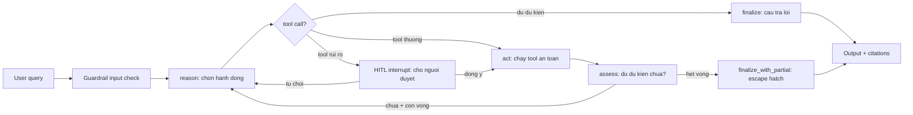
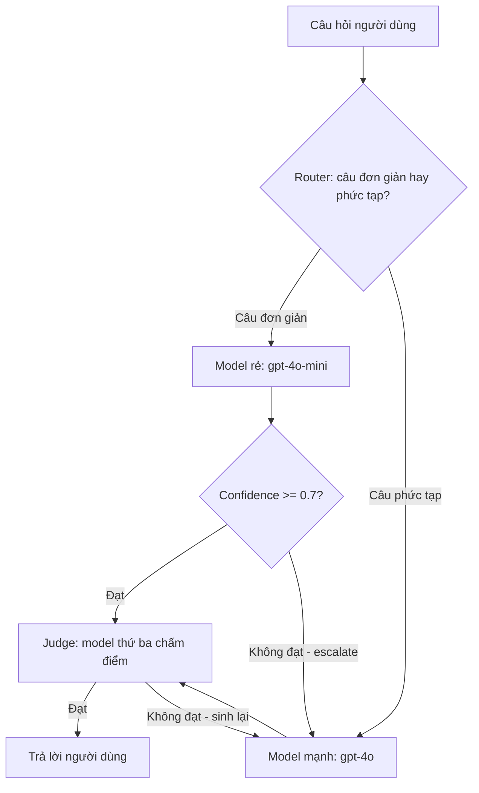

# Chương 4: Xây dựng AI Agent với LangGraph

Chương này là trái tim của toàn bộ tài liệu. Bạn sẽ học cách xây dựng AI Agent từ đầu — từ khái niệm cơ bản đến triển khai hoàn chỉnh — sử dụng LangGraph, thư viện mạnh mẽ nhất hiện nay cho việc xây dựng ứng dụng AI có trạng thái (stateful). Đến cuối chương này, bạn sẽ có đủ kiến thức để xây dựng một agent có khả năng suy nghĩ, hành động và phản hồi như một trợ lý thông minh thực thụ.

---

## 4.1 Agent là gì?

### Định nghĩa

Agent (tác nhân thông minh) là một hệ thống AI có khả năng **tự quyết định** cách thực hiện tác vụ thay vì chỉ làm theo kịch bản cố định. Khác với chatbot thông thường chỉ trả lời câu hỏi dựa trên một chuỗi xử lý định trước, agent có thể quan sát môi trường, suy nghĩ về bước tiếp theo, sử dụng công cụ (tools) để thu thập thông tin, và điều chỉnh hành vi dựa trên kết quả.

Hãy tưởng tượng sự khác biệt như sau: một chatbot giống như một nhân viên trực tổng đài đọc kịch bản — khi người dùng hỏi A, bot trả lời B. Còn agent giống như một trợ lý giỏi — khi nhận được yêu cầu, trợ lý sẽ tự đánh giá "mình cần làm gì để trả lời câu hỏi này?", có thể tìm kiếm tài liệu, tra cứu database, tính toán, rồi tổng hợp câu trả lời.

### Sự khác biệt giữa Chatbot và Agent

Để hiểu rõ hơn, hãy so sánh hai hệ thống:

**Chatbot (chuỗi cố định — Chain):**
- Luồng xử lý cố định: Input → LLM → Output
- Không có khả năng ra quyết định
- Không sử dụng công cụ bên ngoài
- Phù hợp cho hội thoại đơn giản, FAQ

**Agent (luồng linh hoạt):**
- Luồng xử lý linh hoạt, quyết định tại runtime
- Có khả năng gọi tools (tìm kiếm, tính toán, API)
- Có vòng lặp suy nghĩ: Think → Act → Observe
- Phù hợp cho tác vụ phức tạp, đa bước

### Tại sao chọn LangGraph?

LangGraph là thư viện được xây dựng trên đỉnh của LangChain, nhưng tiếp cận theo hướng **state machine (máy trạng thái)** thay vì **chain (chuỗi tuyến tính)**. Đây là điểm khác biệt quan trọng:

- **Chain (LangChain):** A → B → C → D. Luồng cố định, khó nhánh, khó lặp.
- **State Machine (LangGraph):** Các bước (nodes) được kết nối bằng edges, có thể có điều kiện, vòng lặp, và nhánh phức tạp.

LangGraph giải quyết bài toán mà chain không giải quyết được: agent cần **quay lại** bước trước đó, **nhảy** đến bước khác tùy điều kiện, và **giữ trạng thái** qua nhiều bước xử lý.

> 💡 **MẸO:** Không phải mọi ứng dụng AI đều cần agent. Nếu tác vụ của bạn đơn giản (ví dụ: dịch văn bản, tóm tắt bài viết), dùng chain hoặc thậm chí gọi LLM trực tiếp là đủ. Agent cần thiết khi: (1) tác vụ có nhiều bước, (2) cần ra quyết định tại runtime, (3) cần sử dụng tools bên ngoài.

### Khi nào nên dùng Agent?

Bạn nên cân nhắc xây dựng agent khi tác vụ có các đặc điểm sau:

1. **Đa bước (Multi-step):** Tác vụ cần nhiều bước xử lý tuần tự hoặc song song
2. **Cần quyết định (Decision-making):** Hệ thống cần chọn giữa nhiều hành động khác nhau
3. **Cần công cụ (Tool usage):** Cần tương tác với hệ thống bên ngoài (API, database, search)
4. **Cần phản hồi (Feedback loop):** Kết quả của bước trước ảnh hưởng đến bước sau
5. **Không xác định (Non-deterministic):** Không thể biết trước chính xác luồng xử lý

Ví dụ thực tế: một agent nghiên cứu khoa học cần (1) phân tích câu hỏi nghiên cứu, (2) tìm kiếm papers liên quan, (3) đọc và tóm tắt từng paper, (4) so sánh kết quả, (5) tổng hợp thành báo cáo. Đây là tác vụ hoàn hảo cho agent.

---

## 4.2 State — Bộ nhớ của Agent

State (trạng thái) là khái niệm quan trọng nhất trong LangGraph. State chính là **bộ nhớ** của agent — nó lưu trữ mọi thông tin cần thiết để agent hoạt động: tin nhắn, kết quả tìm kiếm, trạng thái xử lý, v.v. Mỗi node đọc từ state và ghi ngược lại state sau khi xử lý.

### TypedDict Pattern

Trong LangGraph, state được định nghĩa bằng `TypedDict` của Python. Đây là cách type-safe để khai báo cấu trúc dữ liệu mà agent sẽ sử dụng:

```python
from typing import TypedDict, Annotated, Sequence
from langchain_core.messages import BaseMessage

class AgentState(TypedDict):
    """State cho agent nghiên cứu."""
    messages: Annotated[Sequence[BaseMessage], "add_messages"]
    query: str  # Câu hỏi gốc của người dùng
    search_results: list[str]  # Kết quả tìm kiếm
    draft: str  # Bản nháp câu trả lời
    iteration: int  # Số lần lặp
```

`TypedDict` hoạt động như một schema — nó cho biết state có những trường gì, mỗi trường kiểu dữ liệu gì. LangGraph sẽ sử dụng thông tin này để quản lý state xuyên suốt quá trình agent chạy.

### total_false và Annotated

Khi định nghĩa state, bạn sẽ thường thấy `total=False` được sử dụng:

```python
from typing import TypedDict

class AgentState(TypedDict, total=False):
    """total=False cho phép các trường có thể không tồn tại."""
    messages: list  # Có thể không có lúc ban đầu
    query: str
    search_results: list[str]
    draft: str
```

`total=False` có nghĩa là không phải tất cả các trường đều bắt buộc. Điều này rất quan trọng vì trong quá trình agent chạy, một số trường chưa được tạo ra ở bước đầu tiên. Ví dụ: `search_results` sẽ rỗng cho đến khi node tìm kiếm chạy xong.

### Nguyên tắc thiết kế State

Khi thiết kế state cho agent, hãy tuân thủ các nguyên tắc sau:

1. **Chỉ lưu những gì cần thiết:** State được truyền giữa mọi node, đừng lưu dữ liệu thừa
2. **Tên trường rõ ràng:** Dùng tên như `query`, `search_results`, `draft` thay vì `data1`, `data2`
3. **Kiểu dữ liệu chính xác:** Luôn annotate kiểu để dễ debug và maintain
4. **Tách biệt concerns:** State cho agent nghiên cứu khác với state cho agent chatbot

### Reducer — Cách cập nhật State

Reducer là cơ chế xác định cách một trường trong state được cập nhật khi node trả về giá trị mới. Có hai pattern chính:

**Overwrite (ghi đè) — Mặc định:**

```python
class SimpleState(TypedDict):
    query: str  # Giá trị mới sẽ ghi đè hoàn toàn giá trị cũ
    result: str

# Node trả về {"query": "câu hỏi mới"} sẽ thay thế hoàn toàn query cũ
```

**Accumulate (tích lũy) — Dùng cho danh sách:**

```python
from typing import Annotated
from langgraph.graph.message import add_messages

class ChatState(TypedDict):
    messages: Annotated[list, add_messages]  # Thêm vào danh sách thay vì ghi đè
    context: str

# add_messages reducer sẽ thêm message mới vào danh sách messages hiện có
# thay vì thay thế toàn bộ danh sách
```

Reducer `add_messages` đặc biệt quan trọng vì nó xử lý logic phức tạp: nếu message mới có cùng ID với message cũ, nó sẽ cập nhật thay vì thêm mới. Điều này hữu ích khi LLM quyết định sửa đổi message trước đó.

### MessagesState

LangGraph cung cấp sẵn `MessagesState` cho trường hợp phổ biến nhất — agent chatbot:

```python
from langgraph.graph import MessagesState

# MessagesState tương đương với:
class MessagesState(TypedDict):
    messages: Annotated[list, add_messages]

# Sử dụng trực tiếp:
class MyAgentState(MessagesState):
    """Mở rộng MessagesState với các trường tùy chỉnh."""
    user_id: str
    conversation_id: str
```

`MessagesState` đã bao gồm reducer `add_messages` cho trường `messages`, nên bạn không cần định nghĩa lại. Chỉ cần mở rộng (extend) và thêm các trường bổ sung.

> ⚠️ **LƯU Ý:** Lỗi phổ biến nhất khi làm việc với state là quên thêm reducer cho trường kiểu list. Nếu bạn muốn tích lũy giá trị (thêm vào list), bắt buộc phải dùng `Annotated[list, add_messages]` hoặc reducer tùy chỉnh. Không có reducer, giá trị mới sẽ ghi đè hoàn toàn.

> 💡 **MẸO:** Hãy bắt đầu với state đơn giản nhất có thể, sau đó thêm trường khi cần. Đừng thiết kế state "cho tương lai" — YAGNI (You Aren't Gonna Need It). Bạn có thể dễ dàng mở rộng TypedDict sau này.

---

## 4.3 Nodes — Các bước xử lý

Node (nút) là đơn vị xử lý cơ bản trong LangGraph. Mỗi node là một hàm nhận state hiện tại, thực hiện xử lý, và trả về những thay đổi cần áp dụng lên state. Hãy nghĩ mỗi node như một "bước" trong quy trình làm việc của agent.

### Nguyên tắc: Hàm thuần (Pure Functions)

Node trong LangGraph nên được thiết kế gần giống hàm thuần (pure function):

1. **Nhận state, trả về thay đổi:** Node nhận toàn bộ state, nhưng chỉ trả về những trường cần cập nhật
2. **Không Side effect trên state:** Không mutate (thay đổi trực tiếp) state đầu vào
3. **Một trách nhiệm (Single Responsibility):** Mỗi node chỉ làm một việc duy nhất

```python
from typing import TypedDict

class AgentState(TypedDict, total=False):
    query: str
    search_results: list[str]
    answer: str
    error: str

# ✅ Node đúng: chỉ trả về trường cần thay đổi
def analyze_query(state: AgentState) -> dict:
    """Phân tích câu hỏi của người dùng."""
    query = state.get("query", "")
    # Xử lý...
    return {"query": query.lower().strip()}

# ❌ Node sai: mutate state trực tiếp
def bad_node(state: AgentState) -> dict:
    state["query"] = state["query"].lower()  # KHÔNG LÀM THẾ NÀY
    return state  # Trả về toàn bộ state
```

### Async Pattern

Khi node cần gọi API hoặc thực hiện I/O, hãy dùng async:

```python
import asyncio
from langchain_openai import ChatOpenAI

async def generate_answer(state: AgentState) -> dict:
    """Tạo câu trả lời sử dụng LLM (async)."""
    llm = ChatOpenAI(model="gpt-4o-mini")

    query = state.get("query", "")
    search_results = state.get("search_results", [])

    prompt = f"""Dựa trên kết quả tìm kiếm sau, trả lời câu hỏi.
    
    Câu hỏi: {query}
    Kết quả tìm kiếm: {search_results}
    
    Trả lời bằng tiếng Việt:"""

    response = await llm.ainvoke(prompt)

    return {"answer": response.content}
```

Dùng async khi node cần gọi LLM, HTTP API, database, hoặc bất kỳ thao tác I/O nào. LangGraph hỗ trợ cả sync và async, nhưng async thường hiệu quả hơn cho agent gọi nhiều API.

### Error Handling trong Node

Node nên xử lý lỗi graceful (không crash toàn bộ graph):

```python
async def search_web(state: AgentState) -> dict:
    """Tìm kiếm trên web với error handling."""
    query = state.get("query", "")
    
    try:
        # Giả sử gọi search API
        results = await search_api(query)
        return {"search_results": results}
    except ConnectionError:
        # Trả về lỗi trong state thay vì crash
        return {
            "search_results": [],
            "error": "Không thể kết nối đến API tìm kiếm. Vui lòng thử lại."
        }
    except Exception as e:
        return {
            "search_results": [],
            "error": f"Lỗi không xác định: {str(e)}"
        }
```

> 🔑 **ĐIỂM CHÍNH:** Mỗi node chỉ nên trả về những trường cần thay đổi. Nếu node xử lý tìm kiếm, chỉ trả về `{"search_results": [...]}`. Node khác sẽ đọc `search_results` từ state và xử lý tiếp. Điều này giúp code dễ debug, dễ test, và dễ hiểu.

> 💡 **MẸO:** Đặt tên node mô tả đúng hành động: `analyze_query`, `search_web`, `generate_answer`, `validate_result`. Tránh tên chung chung như `process`, `handle`, `step1`.

---

## 4.4 Edges — Điều hướng luồng

Nếu nodes là các "trạm" xử lý, thì edges (cạnh) là các "con đường" kết nối chúng. Edges xác định luồng thực thi của graph — node nào chạy sau node nào, và theo điều kiện gì.

### Direct Edges (Cạnh trực tiếp)

Direct edge kết nối hai node cố định. Sau khi node A chạy xong, node B chắc chắn chạy tiếp:

```python
from langgraph.graph import StateGraph, START, END

graph = StateGraph(AgentState)

# Thêm nodes
graph.add_node("analyze", analyze_query)
graph.add_node("search", search_web)
graph.add_node("answer", generate_answer)

# Direct edges — luồng cố định
graph.add_edge(START, "analyze")      # Bắt đầu → analyze
graph.add_edge("analyze", "search")   # analyze → search
graph.add_edge("search", "answer")    # search → answer
graph.add_edge("answer", END)         # answer → Kết thúc
```

`START` và `END` là sentinel (đánh dấu đặc biệt) của LangGraph: `START` là điểm bắt đầu graph, `END` là điểm kết thúc. Graph luôn bắt đầu từ `START` và kết thúc tại `END`.

### Conditional Edges (Cạnh có điều kiện)

Conditional edge cho phép agent **ra quyết định** — chọn node tiếp theo dựa trên điều kiện tại runtime:

```python
def route_after_analysis(state: AgentState) -> str:
    """Quyết định node tiếp theo dựa trên phân tích."""
    query = state.get("query", "")
    
    if "tính" in query.lower() or "bao nhiêu" in query.lower():
        return "calculate"  # Cần tính toán
    elif "tìm" in query.lower() or "search" in query.lower():
        return "search"     # Cần tìm kiếm
    else:
        return "answer"     # Trả lời trực tiếp

# Thêm conditional edge
graph.add_conditional_edges(
    "analyze",                  # Node nguồn
    route_after_analysis,       # Hàm routing
    {                           # Map kết quả → node đích
        "calculate": "calculate",
        "search": "search",
        "answer": "answer",
    }
)
```

### Routing Function

Routing function (hàm định tuyến) là trái tim của conditional edge. Nó nhận state hiện tại và trả về tên của node tiếp theo:

```python
def should_continue(state: AgentState) -> str:
    """Kiểm tra xem agent có cần tiếp tục lặp không."""
    messages = state.get("messages", [])
    
    # Kiểm tra message cuối cùng có gọi tool không
    last_message = messages[-1] if messages else None
    
    if hasattr(last_message, "tool_calls") and last_message.tool_calls:
        return "tools"  # Chuyển đến node xử lý tools
    
    return END  # Không còn tool calls → kết thúc

graph.add_conditional_edges(
    "agent",
    should_continue,
    {"tools": "tools", END: END}
)
```

Pattern này đặc biệt quan trọng cho ReAct agent (sẽ nói ở section 4.6) — agent cần quyết định có tiếp tục gọi tool hay đã có đủ thông tin để trả lời.

> ⚠️ **LƯU Ý:** Routing function phải trả về một chuỗi khớp với key trong map. Nếu trả về giá trị không tồn tại trong map, LangGraph sẽ throw error. Hãy luôn có fallback (default case) trong routing function.

> 🔑 **ĐIỂM CHÍNH:** Edges là thứ biến một tập hợp nodes thành một agent thông minh. Direct edges cho luồng cố định, conditional edges cho luồng linh hoạt. Hầu hết agent thực tế sẽ kết hợp cả hai loại.

---

## 4.5 Tools — Mở rộng khả năng

Tools (công cụ) là cách để agent tương tác với thế giới bên ngoài — tìm kiếm web, tính toán, gọi API, đọc file, v.v. Nếu LLM là "bộ não" của agent, thì tools là "đôi tay" giúp agent hành động.

### @tool Decorator

LangGraph (thông qua LangChain) cung cấp decorator `@tool` để định nghĩa tool:

```python
from langchain_core.tools import tool

@tool
def multiply(a: int, b: int) -> int:
    """Nhân hai số với nhau."""
    return a * b

@tool
def search_web(query: str) -> str:
    """Tìm kiếm thông tin trên web."""
    # Giả sử gọi API tìm kiếm
    return f"Kết quả tìm kiếm cho '{query}': ..."
```

### Tầm quan trọng của Docstring

Docstring của tool không chỉ là documentation — nó là **prompt** mà LLM sử dụng để quyết định khi nào gọi tool và với tham số gì. Hãy viết docstring rõ ràng, mô tả chính xác tool làm gì:

```python
# ✅ Docstring tốt — mô tả rõ ràng khi nào và dùng thế nào
@tool
def search_papers(query: str, max_results: int = 5) -> str:
    """Tìm kiếm bài báo khoa học theo từ khóa.
    
    Args:
        query: Từ khóa tìm kiếm (ví dụ: "transformer attention mechanism")
        max_results: Số kết quả tối đa (mặc định: 5, tối đa: 20)
    
    Returns:
        Danh sách bài báo với tiêu đề, tác giả, và tóm tắt.
    """
    # Implementation...

# ❌ Docstring tồi — LLM không biết khi nào dùng
@tool
def search(q: str) -> str:
    """Search."""
    return "results"
```

### Type Hints

Type hints giúp LLM biết chính xác kiểu dữ liệu mỗi tham số. Điều này đặc biệt quan trọng vì LLM cần sinh JSON đúng kiểu để gọi tool:

```python
from typing import Literal, Optional

@tool
def get_weather(
    city: str,
    unit: Literal["celsius", "fahrenheit"] = "celsius",
    forecast_days: Optional[int] = None
) -> str:
    """Lấy thông tin thời tiết cho một thành phố.
    
    Args:
        city: Tên thành phố (ví dụ: "Hà Nội", "TP.HCM")
        unit: Đơn vị nhiệt độ
        forecast_days: Số ngày dự báo (None = chỉ thời tiết hiện tại)
    """
    # LLM sẽ biết city là string, unit chỉ được "celsius" hoặc "fahrenheit"
    # forecast_days có thể null hoặc int
    return f"Weather data for {city}..."
```

### Error Handling trong Tools

Tools nên xử lý lỗi graceful và trả về thông báo hữu ích:

```python
import httpx

@tool
def fetch_api_data(url: str) -> str:
    """Gọi HTTP GET đến URL và trả về response.
    
    Args:
        url: URL cần gọi (phải là URL hợp lệ)
    """
    try:
        response = httpx.get(url, timeout=10.0)
        response.raise_for_status()
        return response.text[:5000]  # Giới hạn 5000 ký tự
    except httpx.TimeoutException:
        return "Lỗi: Request timeout. URL không phản hồi trong 10 giây."
    except httpx.HTTPStatusError as e:
        return f"Lỗi HTTP {e.response.status_code}: {e.response.reason_phrase}"
    except Exception as e:
        return f"Lỗi không xác định: {str(e)}"
```

### Ví dụ: Tool tìm kiếm

```python
@tool
def web_search(query: str, num_results: int = 5) -> str:
    """Tìm kiếm thông tin trên internet sử dụng Tavily Search API.
    
    Sử dụng tool này khi cần tìm thông tin mới, sự kiện hiện tại,
    hoặc kiến thức không có trong training data của model.
    
    Args:
        query: Câu truy vấn tìm kiếm (nên cụ thể, rõ ràng)
        num_results: Số kết quả trả về (1-10)
    """
    from langchain_community.tools.tavily_search import TavilySearchResults
    
    search = TavilySearchResults(max_results=num_results)
    try:
        results = search.invoke(query)
        return str(results)
    except Exception as e:
        return f"Lỗi tìm kiếm: {str(e)}. Hãy thử lại với query khác."
```

### Ví dụ: Tool tính toán

```python
import math
import ast
import operator

# Mapping an toàn từ AST operators sang hàm toán học
_SAFE_OPERATORS = {
    ast.Add: operator.add,
    ast.Sub: operator.sub,
    ast.Mult: operator.mul,
    ast.Div: operator.truediv,
    ast.Pow: operator.pow,
    ast.USub: operator.neg,
    ast.Mod: operator.mod,
}

_SAFE_FUNCTIONS = {
    "sqrt": math.sqrt,
    "sin": math.sin,
    "cos": math.cos,
    "tan": math.tan,
    "log": math.log,
    "log10": math.log10,
    "pi": math.pi,
    "e": math.e,
    "abs": abs,
    "round": round,
}

def _safe_eval(node: ast.AST) -> float:
    """Đệ quy đánh giá AST node — không dùng eval()."""
    if isinstance(node, ast.Constant):  # Số literal (3.14, 42, "hello")
        return node.value
    elif isinstance(node, ast.Name):    # Biến (pi, e)
        if node.id in _SAFE_FUNCTIONS:
            return _SAFE_FUNCTIONS[node.id]
        raise ValueError(f"Tên không hợp lệ: {node.id}")
    elif isinstance(node, ast.Call):    # Hàm (sqrt(144), sin(0))
        func_name = node.func.id if isinstance(node.func, ast.Name) else ""
        if func_name not in _SAFE_FUNCTIONS:
            raise ValueError(f"Hàm không hợp lệ: {func_name}")
        args = [_safe_eval(arg) for arg in node.args]
        return _SAFE_FUNCTIONS[func_name](*args)
    elif isinstance(node, ast.BinOp):   # Phép tính nhị phân (2 + 3)
        left = _safe_eval(node.left)
        right = _safe_eval(node.right)
        op_type = type(node.op)
        if op_type in _SAFE_OPERATORS:
            return _SAFE_OPERATORS[op_type](left, right)
        raise ValueError(f"Phép toán không hỗ trợ: {op_type.__name__}")
    elif isinstance(node, ast.UnaryOp): # Phép toán một ngôi (-5)
        operand = _safe_eval(node.operand)
        op_type = type(node.op)
        if op_type in _SAFE_OPERATORS:
            return _SAFE_OPERATORS[op_type](operand)
        raise ValueError(f"Phép toán không hỗ trợ: {op_type.__name__}")
    else:
        raise ValueError(f"Biểu thức không hỗ trợ: {type(node).__name__}")

@tool
def calculate(expression: str) -> str:
    """Tính toán biểu thức toán học an toàn.

    Hỗ trợ các phép tính cơ bản (+, -, *, /, **), 
    và hàm toán học (sqrt, sin, cos, log, abs, round).
    Không sử dụng eval() — phân tích AST an toàn.

    Args:
        expression: Biểu thức toán học (ví dụ: "2 ** 10", "sqrt(144)")
    """
    try:
        tree = ast.parse(expression, mode="eval")
        result = _safe_eval(tree.body)
        return f"Kết quả: {expression} = {result}"
    except (SyntaxError, ValueError) as e:
        return f"Biểu thức không hợp lệ '{expression}': {str(e)}"
    except Exception as e:
        return f"Không thể tính toán '{expression}': {str(e)}"
```

> ⚠️ **LƯU Ý:** Không bao giờ dùng `eval()` trong production code, đặc biệt khi input đến từ LLM. Dù `eval(expression, {"__builtins__": {}}, allowed_names)` giới hạn scope, vẫn có kỹ thuật bypass (dunder attributes, subclassing). Phân tích AST (như code trên) là cách an toàn hơn — bạn kiểm soát chính xác node nào được đánh giá.

> 💡 **MẸO:** LLM không biết tool nào tồn tại cho đến khi bạn cho nó biết. Khi bind tools vào LLM, model sẽ tự động quyết định tool nào cần gọi dựa trên câu hỏi và docstring. Hãy viết docstring như thể bạn đang hướng dẫn một đồng nghiệp mới: rõ ràng, cụ thể, có ví dụ.

> ⚠️ **LƯU Ý:** Không bao giờ trust input từ LLM một cách mù quáng. LLM có thể sinh ra tham số không hợp lệ. Luôn validate và sanitize input trong tool. Ví dụ: giới hạn số kết quả tìm kiếm, kiểm tra URL hợp lệ, v.v.

---

## 4.6 Pattern ReAct

ReAct (Reasoning + Acting) là pattern phổ biến nhất để xây dựng agent. Pattern này mô phỏng cách con người giải quyết vấn đề: **suy nghĩ → hành động → quan sát → lặp lại**.

### Vòng lặp Think → Act → Observe

Quá trình ReAct hoạt động như sau:

1. **Thought (Suy nghĩ):** Agent nhận câu hỏi, phân tích cần làm gì
2. **Action (Hành động):** Agent gọi tool để thu thập thông tin
3. **Observation (Quan sát):** Agent nhận kết quả từ tool
4. **Lặp lại:** Nếu chưa đủ thông tin, quay lại bước 1
5. **Answer (Trả lời):** Khi đủ thông tin, agent tổng hợp và trả lời

Ví dụ minh họa với câu hỏi "Giá vàng hôm nay bao nhiêu?":

```
Thought: Tôi cần tìm giá vàng hôm nay. Tôi sẽ dùng tool search.
Action: search_web("giá vàng hôm nay")
Observation: Giá vàng SJC hôm nay 78.5 triệu/lượng
Thought: Đã có thông tin. Tôi có thể trả lời.
Answer: Giá vàng SJC hôm nay là 78.5 triệu đồng/lượng.
```

### Khi nào dùng ReAct?

ReAct phù hợp khi:
- Agent cần **nhiều bước** để trả lời (phân tích → tìm kiếm → tổng hợp)
- Agent cần **quyết định** có cần thêm thông tin không
- Luồng xử lý **không thể biết trước** — phụ thuộc vào kết quả trung gian

ReAct KHÔNG phù hợp khi:
- Tác vụ đơn giản, một bước (dùng chain thay)
- Luồng xử lý cố định, không cần quyết định (dùng workflow thay)
- Cần tốc độ tối đa (ReAct có độ trễ do nhiều vòng LLM call)

### Ví dụ với create_react_agent

LangGraph cung cấp hàm `create_react_agent` để tạo ReAct agent nhanh:

```python
from langgraph.prebuilt import create_react_agent
from langchain_openai import ChatOpenAI

# Khởi tạo LLM
llm = ChatOpenAI(model="gpt-4o-mini")

# Khởi tạo tools
tools = [web_search, calculate, fetch_api_data]

# Tạo ReAct agent — một dòng code!
agent = create_react_agent(llm, tools)

# Chạy agent
result = agent.invoke({
    "messages": [{"role": "user", "content": "GDP của Việt Nam năm 2024 là bao nhiêu? Tính GDP per capita nếu dân số là 100 triệu."}]
})

print(result["messages"][-1].content)
```

`create_react_agent` tự động tạo graph với: node agent (gọi LLM), node tools (thực thi tool calls), và conditional edge (kiểm tra có tool calls không). Đây là cách nhanh nhất để tạo agent hoạt động.

### ReAct Graph thủ công

Để hiểu sâu hơn, hãy xây dựng ReAct graph thủ công:

```python
from langgraph.graph import StateGraph, MessagesState, START, END
from langchain_openai import ChatOpenAI
from langchain_core.messages import HumanMessage, SystemMessage

# Khởi tạo
llm = ChatOpenAI(model="gpt-4o-mini")
llm_with_tools = llm.bind_tools([web_search, calculate])

# Node 1: Agent suy nghĩ và quyết định
async def agent_node(state: MessagesState) -> dict:
    """Agent phân tích và quyết định hành động tiếp theo."""
    system = SystemMessage(content="""Bạn là trợ lý AI thông minh.
    Khi cần thông tin, hãy dùng tools. Khi đã đủ thông tin, hãy trả lời trực tiếp.
    Trả lời bằng tiếng Việt.""")
    
    messages = [system] + state["messages"]
    response = await llm_with_tools.ainvoke(messages)
    return {"messages": [response]}

# Node 2: Thực thi tools
async def tools_node(state: MessagesState) -> dict:
    """Thực thi tool calls từ message cuối cùng."""
    from langchain_core.messages import ToolMessage
    from langgraph.prebuilt import ToolNode
    
    tool_node = ToolNode([web_search, calculate])
    return await tool_node.ainvoke(state)

# Routing: Kiểm tra có tool calls không
def should_use_tools(state: MessagesState) -> str:
    """Nếu message cuối có tool calls → chạy tools, ngược lại → kết thúc."""
    last_message = state["messages"][-1]
    if hasattr(last_message, "tool_calls") and last_message.tool_calls:
        return "tools"
    return END

# Xây dựng graph
graph = StateGraph(MessagesState)
graph.add_node("agent", agent_node)
graph.add_node("tools", tools_node)

graph.add_edge(START, "agent")
graph.add_conditional_edges("agent", should_use_tools, {"tools": "tools", END: END})
graph.add_edge("tools", "agent")  # Sau khi chạy tools → quay lại agent

app = graph.compile()
```

Chú ý dòng `graph.add_edge("tools", "agent")` — đây tạo ra **vòng lặp** (loop). Sau khi tools chạy xong, agent sẽ lại suy nghĩ xem cần thêm thông tin không. Vòng lặp tiếp tục cho đến khi agent quyết định trả lời (không có tool calls).

> 🔑 **ĐIỂM CHÍNH:** ReAct là pattern "tư duy → hành động → quan sát". Vòng lặp giữa agent và tools tiếp tục cho đến khi agent quyết định đã đủ thông tin. Pattern này là nền tảng cho hầu hết agent hiện đại.

---

## 4.7 Xây dựng Graph hoàn chỉnh

Bây giờ chúng ta sẽ kết hợp tất cả kiến thức để xây dựng một agent hoàn chỉnh: **Planning Agent** — agent nhận câu hỏi, lập kế hoạch nghiên cứu, tìm kiếm thông tin, và tạo câu trả lời chi tiết.

### Tổng quan kiến trúc

```
START → analyze → plan → [research → synthesize → review] → END
                        ↑                            |
                        └──────── (cần bổ sung) ──────┘
```

Agent hoạt động như sau:
1. **Analyze:** Phân tích câu hỏi, xác định loại và yêu cầu
2. **Plan:** Lập kế hoạch nghiên cứu — cần tìm kiếm gì
3. **Research:** Thực hiện tìm kiếm theo kế hoạch
4. **Synthesize:** Tổng hợp kết quả thành câu trả lời
5. **Review:** Kiểm tra chất lượng — nếu chưa đủ, quay lại bước 3

### Code hoàn chỉnh

```python
import asyncio
from typing import TypedDict, Annotated
from langgraph.graph import StateGraph, START, END
from langgraph.graph.message import add_messages
from langchain_openai import ChatOpenAI
from langchain_core.messages import HumanMessage, SystemMessage, BaseMessage
from langchain_core.tools import tool

# ==================== STATE ====================

class ResearchState(TypedDict, total=False):
    """State cho Planning Agent."""
    messages: Annotated[list[BaseMessage], add_messages]
    query: str                    # Câu hỏi gốc
    query_type: str               # Loại câu hỏi (factual, analytical, creative)
    research_plan: list[str]      # Kế hoạch nghiên cứu
    search_results: list[str]     # Kết quả tìm kiếm
    draft: str                    # Bản nháp câu trả lời
    quality_score: float          # Điểm chất lượng (0-1)
    iteration: int                # Số lần lặp
    error: str                    # Thông báo lỗi (nếu có)

# ==================== TOOLS ====================

@tool
def web_search(query: str) -> str:
    """Tìm kiếm thông tin trên web.
    
    Args:
        query: Từ khóa tìm kiếm cụ thể
    """
    # Placeholder — thay bằng API thực tế (Tavily, SerpAPI, v.v.)
    return f"[Kết quả tìm kiếm cho '{query}']: Thông tin mẫu..."

# ==================== NODES ====================

async def analyze_node(state: ResearchState) -> dict:
    """Phân tích câu hỏi của người dùng."""
    llm = ChatOpenAI(model="gpt-4o-mini", temperature=0)
    
    query = state.get("query", "")
    if not query and state.get("messages"):
        last_msg = state["messages"][-1]
        query = last_msg.content if hasattr(last_msg, "content") else str(last_msg)
    
    prompt = f"""Phân tích câu hỏi sau và xác định loại.
    
    Câu hỏi: {query}
    
    Trả về JSON:
    {{
        "query_type": "factual|analytical|creative",
        "needs_research": true/false
    }}
    
    Chỉ trả về JSON, không thêm gì khác."""
    
    response = await llm.ainvoke([HumanMessage(content=prompt)])
    
    import json
    try:
        analysis = json.loads(response.content)
    except json.JSONDecodeError:
        analysis = {"query_type": "factual", "needs_research": True}
    
    return {
        "query": query,
        "query_type": analysis.get("query_type", "factual"),
        "iteration": 0,
    }

async def plan_node(state: ResearchState) -> dict:
    """Lập kế hoạch nghiên cứu."""
    llm = ChatOpenAI(model="gpt-4o-mini", temperature=0)
    
    query = state.get("query", "")
    query_type = state.get("query_type", "factual")
    
    prompt = f"""Lập kế hoạch nghiên cứu cho câu hỏi sau.
    
    Câu hỏi: {query}
    Loại: {query_type}
    
    Liệt kê 3-5 bước tìm kiếm cần thực hiện, mỗi bước là một câu truy vấn tìm kiếm.
    Trả về danh sách JSON array các string. Chỉ trả về JSON array."""
    
    response = await llm.ainvoke([HumanMessage(content=prompt)])
    
    import json
    try:
        plan = json.loads(response.content)
        if not isinstance(plan, list):
            plan = [query]
    except json.JSONDecodeError:
        plan = [query]
    
    return {"research_plan": plan}

async def research_node(state: ResearchState) -> dict:
    """Thực hiện tìm kiếm theo kế hoạch."""
    plan = state.get("research_plan", [])
    results = []
    
    for search_query in plan:
        try:
            result = web_search.invoke({"query": search_query})
            results.append(f"Query: {search_query}\nResult: {result}")
        except Exception as e:
            results.append(f"Query: {search_query}\nError: {str(e)}")
    
    iteration = state.get("iteration", 0) + 1
    
    return {
        "search_results": results,
        "iteration": iteration,
    }

async def synthesize_node(state: ResearchState) -> dict:
    """Tổng hợp kết quả thành câu trả lời."""
    llm = ChatOpenAI(model="gpt-4o-mini")
    
    query = state.get("query", "")
    search_results = state.get("search_results", [])
    
    prompt = f"""Dựa trên kết quả nghiên cứu, viết câu trả lời chi tiết cho câu hỏi.
    
    Câu hỏi: {query}
    
    Kết quả nghiên cứu:
    {chr(10).join(search_results)}
    
    Yêu cầu:
    - Trả lời đầy đủ, có cấu trúc rõ ràng
    - Trích dẫn nguồn khi có thể
    - Nếu thông tin không đủ, ghi chú điều cần bổ sung
    - Viết bằng tiếng Việt"""
    
    response = await llm.ainvoke([HumanMessage(content=prompt)])
    
    return {"draft": response.content}

async def review_node(state: ResearchState) -> dict:
    """Đánh giá chất lượng câu trả lời."""
    llm = ChatOpenAI(model="gpt-4o-mini", temperature=0)
    
    query = state.get("query", "")
    draft = state.get("draft", "")
    
    prompt = f"""Đánh giá chất lượng câu trả lời sau trên thang 0-1.
    
    Câu hỏi: {query}
    Câu trả lời: {draft}
    
    Tiêu chí:
    - Độ đầy đủ: Có trả lời đủ câu hỏi không?
    - Độ chính xác: Thông tin có đáng tin không?
    - Độ rõ ràng: Có dễ hiểu không?
    
    Trả về JSON: {{"score": 0.0-1.0, "needs_more": true/false, "feedback": "..."}}
    Chỉ trả về JSON."""
    
    response = await llm.ainvoke([HumanMessage(content=prompt)])
    
    import json
    try:
        review = json.loads(response.content)
        score = float(review.get("score", 0.5))
    except (json.JSONDecodeError, ValueError):
        score = 0.5
        review = {"needs_more": True, "feedback": "Không thể parse review"}
    
    return {"quality_score": score}

# ==================== ROUTING ====================

def should_continue_research(state: ResearchState) -> str:
    """Quyết định có cần nghiên cứu thêm không."""
    score = state.get("quality_score", 0.0)
    iteration = state.get("iteration", 0)
    
    # Nếu chất lượng đủ tốt hoặc đã lặp quá nhiều lần → kết thúc
    if score >= 0.7 or iteration >= 3:
        return "finalize"
    
    # Ngược lại → nghiên cứu thêm
    return "research"

# ==================== BUILD GRAPH ====================

async def finalize_node(state: ResearchState) -> dict:
    """Chuẩn bị câu trả lời cuối cùng."""
    from langchain_core.messages import AIMessage
    draft = state.get("draft", "Không thể tạo câu trả lời.")
    return {"messages": [AIMessage(content=draft)]}

graph = StateGraph(ResearchState)

# Thêm nodes
graph.add_node("analyze", analyze_node)
graph.add_node("plan", plan_node)
graph.add_node("research", research_node)
graph.add_node("synthesize", synthesize_node)
graph.add_node("review", review_node)
graph.add_node("finalize", finalize_node)

# Thêm edges
graph.add_edge(START, "analyze")
graph.add_edge("analyze", "plan")
graph.add_edge("plan", "research")
graph.add_edge("research", "synthesize")
graph.add_edge("synthesize", "review")

# Conditional edge từ review
graph.add_conditional_edges(
    "review",
    should_continue_research,
    {
        "research": "research",    # Lặp lại nghiên cứu
        "finalize": "finalize",    # Hoàn thành
    }
)

graph.add_edge("finalize", END)

# Compile
app = graph.compile()

# ==================== CHẠY ====================

async def main():
    result = await app.ainvoke({
        "messages": [HumanMessage(content="AI agents đang thay đổi ngành phần mềm như thế nào?")],
        "query": "AI agents đang thay đổi ngành phần mềm như thế nào?"
    })
    
    print("=" * 60)
    print("CÂU TRẢ LỜI:")
    print("=" * 60)
    print(result.get("draft", "Không có kết quả"))
    print(f"\nSố lần lặp: {result.get('iteration', 0)}")
    print(f"Điểm chất lượng: {result.get('quality_score', 0):.2f}")

if __name__ == "__main__":
    asyncio.run(main())
```

> 💡 **MẸO:** Khi xây dựng graph phức tạp, hãy bắt đầu với version đơn giản nhất (linear flow), sau đó thêm conditional edges và loops dần. Đừng cố xây dựng graph hoàn hảo ngay từ đầu — iterate như cách bạn iterate code.

---

## 4.8 RAG — Kết hợp tìm kiếm kiến thức

RAG (Retrieval-Augmented Generation) là kỹ thuật kết hợp tìm kiếm kiến thức với khả năng sinh text của LLM. Thay vì chỉ dựa vào kiến thức đã học trong training data, agent có thể tìm kiếm trong kho tài liệu riêng để trả lời chính xác hơn.

### RAG hoạt động như thế nào?

1. **Index (Đánh chỉ mục):** Chia tài liệu thành các đoạn nhỏ (chunks), tạo vector embedding cho mỗi đoạn, lưu vào vector store
2. **Retrieve (Truy xuất):** Khi có câu hỏi, tạo embedding cho câu hỏi, tìm các đoạn tài liệu có embedding tương tự nhất
3. **Generate (Sinh câu trả lời):** Đưa câu hỏi + các đoạn tài liệu tìm được cho LLM, yêu cầu trả lời dựa trên thông tin đó

### Embedding và Vector Store

```python
from langchain_openai import OpenAIEmbeddings
from langchain_community.vectorstores import Chroma

# Khởi tạo embedding model
embeddings = OpenAIEmbeddings(model="text-embedding-3-small")

# Tạo vector store từ tài liệu
from langchain_text_splitters import RecursiveCharacterTextSplitter

documents = [
    "LangGraph là thư viện xây dựng AI agent dựa trên state machine...",
    "State trong LangGraph được định nghĩa bằng TypedDict...",
    "Nodes là các hàm xử lý nhận state và trả về thay đổi...",
    # ... thêm tài liệu
]

text_splitter = RecursiveCharacterTextSplitter(
    chunk_size=500,
    chunk_overlap=50,
)
chunks = text_splitter.create_documents(documents)

vectorstore = Chroma.from_documents(
    documents=chunks,
    embedding=embeddings,
    collection_name="ai20k_docs"
)

# Tìm kiếm
results = vectorstore.similarity_search("LangGraph state là gì?", k=3)
for doc in results:
    print(doc.page_content)
```

### Thêm RAG vào Graph

```python
from langchain_openai import ChatOpenAI, OpenAIEmbeddings
from langchain_community.vectorstores import Chroma

async def retrieve_node(state: ResearchState) -> dict:
    """Tìm kiếm tài liệu liên quan từ vector store."""
    query = state.get("query", "")
    
    try:
        # Tạo retriever từ vector store
        embeddings = OpenAIEmbeddings(model="text-embedding-3-small")
        vectorstore = Chroma(
            collection_name="ai20k_docs",
            embedding_function=embeddings,
        )
        
        retriever = vectorstore.as_retriever(search_kwargs={"k": 3})
        docs = await retriever.ainvoke(query)
        
        # Format kết quả
        context = "\n\n".join([
            f"[Tài liệu {i+1}]: {doc.page_content}"
            for i, doc in enumerate(docs)
        ])
        
        return {"search_results": [context]}
    except Exception as e:
        return {"error": f"Lỗi retrieval: {str(e)}"}

async def rag_generate_node(state: ResearchState) -> dict:
    """Sinh câu trả lời dựa trên tài liệu đã truy xuất."""
    llm = ChatOpenAI(model="gpt-4o-mini")
    
    query = state.get("query", "")
    search_results = state.get("search_results", [])
    context = "\n".join(search_results)
    
    prompt = f"""Dựa trên tài liệu sau, trả lời câu hỏi. 
    Nếu thông tin không có trong tài liệu, hãy nói rõ.
    
    Tài liệu:
    {context}
    
    Câu hỏi: {query}
    
    Trả lời bằng tiếng Việt:"""
    
    response = await llm.ainvoke([HumanMessage(content=prompt)])
    return {"draft": response.content}

# Thêm vào graph
graph.add_node("retrieve", retrieve_node)
graph.add_node("rag_generate", rag_generate_node)

# Có thể chọn giữa web search và RAG tùy loại câu hỏi
def route_search(state: ResearchState) -> str:
    query_type = state.get("query_type", "")
    if query_type == "factual":
        return "retrieve"  # Dùng RAG cho câu hỏi kiến thức
    return "research"      # Dùng web search cho câu hỏi thời sự
```

> ⚠️ **LƯU Ý:** Chất lượng RAG phụ thuộc rất nhiều vào chất lượng chunks và embedding. Chunk size quá lớn → mất thông tin chi tiết. Chunk size quá nhỏ → mất ngữ cảnh. Hãy thử nghiệm với chunk_size 300-1000 và chunk_overlap 50-200.

> 🔑 **ĐIỂM CHÍNH:** RAG giải quyết vấn đề "LLM không biết dữ liệu riêng của bạn". Thay vì fine-tune model (đắt và phức tạp), bạn chỉ cần đưa tài liệu liên quan vào context. Đây là cách phổ biến nhất để xây dựng agent có kiến thức chuyên biệt.

---



## 4.8A Harness Engineering — Khung quanh agent

### Harness là gì?

Nếu LLM là bộ não thì **harness** (khung kết cấu) là toàn bộ phần còn lại của cơ thể: scaffolding (vòng lặp agent), tools, guardrails, giới hạn chi phí, và feedback loop. Một công thức dùng nhiều trong ngành năm 2026:

> **Agent giỏi là agent có harness giỏi.**

Điều này giải thích vì sao các nền tảng lớn — Claude Agent SDK, OpenAI Agents SDK, LangGraph — đều converge về cùng một kiến trúc: chúng không bán "model thông minh hơn", chúng cung cấp **harness có sẵn**: vòng lặp tool-call có kiểm soát, giới hạn bước, context quản lý, permission gate. Stanford CS329Z (Engineering AI Agents, Fall 2026) thậm chí đặt homework đầu tiên là "Build an Agentic Harness" — trước cả bài tập về model.

Một harness tối thiểu gồm 4 thành phần:

1. **Scaffolding:** vòng lặp agent — tools — observation (mà bạn đã xây ở §4.6)
2. **Tools:** tập công cụ được khai báo schema rõ ràng (§4.5, §4.8B)
3. **Guardrails:** kiểm tra input/output, giới hạn quyền, chống prompt injection
4. **Feedback loop:** cách agent nhận biết kết quả tốt/xấu và tự sửa (review node ở §4.7 là một dạng)

### Chống pattern drift

Pattern drift là hiện tượng agent **sao chép pattern xấu trong chính codebase của bạn** — nếu prompt mẫu hoặc tool cũ trong repo viết thiếu error handling, agent (và cả đồng đội dùng AI assistant) sẽ sinh code mới theo đúng pattern xấu đó, và lỗi lan truyền qua từng commit. Chống pattern drift bằng cách tập trung harness vào **một chỗ duy nhất**: system prompt, khai báo tools, guardrails, và giới hạn đều được định nghĩa ở một module, mọi agent trong dự án dùng chung.

```python
from dataclasses import dataclass, field
from langchain_core.tools import BaseTool

@dataclass
class AgentHarness:
    """Harness = mọi thứ quanh LLM, khai báo tập trung một chỗ."""
    system_prompt: str
    tools: list[BaseTool] = field(default_factory=list)
    guardrails: list = field(default_factory=list)   # hàm check_input / check_output
    max_steps: int = 10          # chống loop vô hạn (chi tiết §4.8C)
    budget_usd: float = 0.10     # trần chi phí mỗi phiên

# Toàn bộ agent trong dự án dùng chung harness này —
# sửa một chỗ, mọi nơi được cập nhật, không drift.
HARNESS = AgentHarness(
    system_prompt="Bạn là trợ lý nghiên cứu. Chỉ dùng tool được cấp...",
    tools=[web_search, calculate],
    guardrails=[block_prompt_injection, mask_pii],
)
```

### Log agent (ch02) và harness sản phẩm (phần này) — khác nhau thế nào?

Chương 2 đã dạy bạn cài **hooks Claude Code để LOG** usage AI của đội: capture prompt, tool call, gửi về grading server khi git push. Đó là harness **cho quy trình làm việc** (workflow) — quan sát con người dùng AI như thế nào. Phần này là harness **cho sản phẩm**: khung chạy quanh agent mà người dùng cuối tương tác. Hai thứ bổ sung nhau: hooks ch02 cho bạn dữ liệu quy trình để báo cáo; harness sản phẩm quyết định agent của đội chạy an toàn và ổn định thế nào. Đội có cả hai là đội hiểu agent ở cả hai tầng.

> 💡 **MẸO:** Khi đọc code các agent SDK (Claude Agent SDK, OpenAI Agents SDK), hãy đếm xem bao nhiêu phần trăm code là "vòng lặp LLM" và bao nhiêu là phần còn lại — permission, retry, giới hạn, format context. Con số thứ hai thường chiếm đa số, và đó chính là harness.

---

## 4.8B MCP — Model Context Protocol

### Chuẩn công nghiệp cho tool access

Tới năm 2026, **MCP (Model Context Protocol)** — được Anthropic công bố cuối 2024 và chuyển sang Linux Foundation — đã trở thành chuẩn công nghiệp để agent truy cập tools: một protocol mở chuẩn hóa cách khai báo tool, cách agent gọi tool, và cách server cung cấp tool. Thay vì mỗi dự án tự viết lớp kết nối riêng tới mỗi API, bạn viết **một MCP server** và mọi client hiểu MCP (Claude Code, Cursor, LangChain, ChatGPT, v.v.) dùng được ngay.

Vì sao điều này quan trọng với đội của bạn:

1. **Viết một lần, dùng mọi nơi:** tool search viết thành MCP server chạy được trong Claude Code khi dev, và trong app LangGraph khi deploy
2. **Tách biệt quyền:** MCP server chạy tiến trình riêng — có thể giới hạn quyền, log, sandbox độc lập với agent
3. **Ngôn ngữ trung tính:** server viết bằng Python, client bằng TypeScript, giao tiếp qua JSON-RPC

### MCP server đơn giản với FastMCP

```python
# server_search.py — MCP server cung cấp tool tìm kiếm
from mcp.server.fastmcp import FastMCP

mcp = FastMCP("web-search")

@mcp.tool()
def web_search(query: str, max_results: int = 5) -> str:
    """Tìm kiếm thông tin trên web cho câu truy vấn.

    Args:
        query: Câu truy vấn tìm kiếm, cụ thể và rõ ràng
        max_results: Số kết quả tối đa (1-10, mặc định 5)
    """
    # Giữ nguyên logic web_search bạn đã viết ở §4.5
    return f"[Kết quả cho '{query}']: ..."

if __name__ == "__main__":
    mcp.run(transport="stdio")  # chạy local qua stdin/stdout
```

Và phía agent LangGraph, kết nối tới MCP server bằng `langchain-mcp-adapters`:

```python
from langchain_mcp_adapters.client import MultiServerMCPClient
from langgraph.prebuilt import create_react_agent

async def main():
    async with MultiServerMCPClient(
        {
            "web-search": {
                "command": "python",
                "args": ["server_search.py"],
                "transport": "stdio",
            }
        }
    ) as client:
        tools = client.get_tools()  # MCP tools trở thành LangChain tools
        agent = create_react_agent(llm, tools)
        result = await agent.ainvoke(
            {"messages": [("user", "GDP Việt Nam 2024 là bao nhiêu?")]}
        )
```

### Khi nào dùng MCP, khi nào viết tool thường?

| Tình huống | Nên chọn |
|---|---|
| Tool nội bộ, chỉ agent của đội dùng, logic đơn giản | Tool thường (`@tool`) — ít lớp trừu tượng hơn |
| Cần dùng cùng tool trong nhiều môi trường (dev CLI + app deploy) | MCP server |
| Tool cần quyền truy cập nhạy cảm (DB nội bộ, API trả phí) — muốn tách quyền, log riêng | MCP server |
| Dùng service có sẵn MCP server (GitHub, filesystem, browser, Slack...) | Luôn MCP — không tự viết lại |

Case cohort 2 minh họa hướng đi này: đội **Aclaris aiKnowledge Hub** xây pipeline biên soạn tri thức bằng 2 agent dùng **MCP tools** cho các thao tác đọc/ghi tri thức, tách phần thực thi khỏi phần suy luận — nhờ đó pipeline MAP → REDUCE → REFINE → VERIFY → COMMIT (xem §4.8E) chạy ổn định qua nhiều tool call dài hạn.

**Bài tập 4.8A-B.** Chuyển tool `web_search` ở §4.5 của bạn thành một MCP server (file `server_search.py`), rồi viết script client kết nối và gọi tool qua MCP. **Output nộp:** (1) file server, (2) screenshot hoặc log một lượt gọi tool thành công qua MCP client, (3) một đoạn 5 dòng giải thích đội bạn sẽ dùng MCP cho tool nào trong dự án và tại sao.

---

## 4.8C Loop Engineering — Thiết kế điều kiện dừng

### Vòng lặp nào cũng cần lối ra

ReAct ở §4.6 tạo ra vòng lặp `agent → tools → agent`. Vòng lặp là sức mạnh của agent — nhưng vòng lặp **không có điều kiện dừng tốt** là cách nhanh nhất để đốt hết ngân sách API. Loop engineering là kỹ năng thiết kế **stopping criteria** một cách tường minh, thay vì hy vọng LLM "tự biết lúc nào đủ".

Bốn lớp điều kiện dừng, từ thô tới tinh:

1. **Max-iterations:** giới hạn cứng số vòng lặp — lớp bắt buộc, không bao giờ bỏ
2. **Budget tokens/chi phí:** dừng khi tổng chi phí phiên vượt ngưỡng (ví dụ 0.10 USD)
3. **Self-assessment node:** một node cho agent **tự hỏi** "đủ dữ kiện trả lời chưa?" trước mỗi vòng
4. **Escape hatch:** mọi trạng thái đều phải có đường tới END — kể cả khi mọi thứ lỗi

### Self-assessment node

```python
async def assess_node(state: ResearchState) -> dict:
    """Agent tự hỏi: đã đủ dữ kiện trả lời chưa?"""
    prompt = f"""Bạn đang trả lời câu hỏi: {state['query']}
Đã thu thập: {len(state.get('search_results', []))} kết quả tìm kiếm.
Đủ dữ kiện để trả lời đầy đủ chưa?
Trả về JSON: {{"enough": true/false, "missing": "thiếu gì nếu chưa đủ"}}"""
    response = await llm.ainvoke([HumanMessage(content=prompt)])
    import json
    try:
        return {"enough_info": json.loads(response.content).get("enough", False)}
    except json.JSONDecodeError:
        return {"enough_info": False}  # parse lỗi → coi như chưa đủ, vòng sau chốt
```

### Escape hatch — học từ đội CareerPulse (011)

Đội **CareerPulse (cohort 1)** làm đúng bài toán này trong agent phỏng vấn: node interviewer **tự kiểm tra số câu hỏi đã hỏi**, khi `question_count >= max` thì chuyển sang pha `Closing` — luôn luôn có đường tới END, kể cả khi LLM vẫn "muốn hỏi thêm". Kèm theo `retry_policy` tối đa 3 lần và SqliteSaver checkpoint để phục hồi phiên. Logic routing chỉ cần vài dòng:

```python
MAX_QUESTIONS = 5
BUDGET_USD = 0.10

def route_interview(state: dict) -> str:
    """Escape hatch: mọi nhánh đều có đường tới END."""
    if state.get("question_count", 0) >= MAX_QUESTIONS:
        return "closing"                      # hết lượt hỏi
    if state.get("cost_usd", 0.0) >= BUDGET_USD:
        return "closing"                      # hết ngân sách
    if state.get("enough_info"):
        return "closing"                      # agent tự đánh giá đã đủ
    return "ask"                              # chưa đủ → hỏi tiếp
```

Nguyên tắc thiết kế: **điều kiện dừng nằm trong code (deterministic), không nằm trong prompt**. Prompt có thể nói "hãy ngừng khi đủ thông tin" — nhưng chỉ dòng code `question_count >= MAX_QUESTIONS` mới bảo đảm dừng. Tư duy này cũng là trọng tâm câu hỏi loop-breaking assessment của case Gamma: agent sản phẩm phải chốt được câu trả lời trong trần lượt, chứ không "tự do" vô hạn.

> ⚠️ **LƯU Ý:** Vòng lặp ReAct mặc định của `create_react_agent` đã có `recursion_limit` (mặc định 25 bước) — graph vượt giới hạn sẽ raise `GraphRecursionError`. Đây là lưới an toàn cuối cùng, không phải điều kiện dừng chính của bạn. Thiết kế điều kiện dừng như một phần của sản phẩm, đừng delegate việc đó cho exception.

---

## 4.8D Graph Orchestration — Khi nào cần graph thật?

### Graph không phải là mặc định

Chương này dạy LangGraph từ đầu vì graph là mô hình tư duy đúng cho agent có trạng thái. Nhưng một quan sát quan trọng từ chính các đội AI20K: **nhiều team outgrow LangGraph** — bắt đầu với graph 10 node, rồi nhận ra luồng thực tế chỉ đi 2-3 đường cố định. Đội **NexusEdu (007)** — đội có điểm code cao nhất cohort 1 — ghi thẳng trong README rằng họ đã "refactored from complex graph models for maximum reliability": rời khỏi graph phức tạp sang deterministic chains, và sản phẩm ổn định hơn. **Rời graph khi không cần là quyết định kiến trúc đúng, không phải thất bại.**

Mọi layer orchestration thêm vào đều có giá: debug khó hơn, onboarding đồng đội chậm hơn, lỗi state khó tái hiện hơn. Dùng đúng tầng vừa đủ:

| Tình huống | Nền tảng nên dùng | Ví dụ |
|---|---|---|
| Luồng cố định A → B → C, không nhánh | **Chain đơn** (gọi LLM tuần tự) | Dịch, tóm tắt, extract |
| Có phân loại đầu vào, mỗi loại một luồng xử lý | **Router + chain** (conditional edge đầu graph) | Phân loại câu hỏi → RAG hoặc web search (§4.8) |
| Cần vòng lặp, quay lại bước trước theo điều kiện runtime | **Graph** (LangGraph) | Planning agent §4.7, ReAct §4.6 |
| Nhiều vai trò chuyên biệt, cần phân công và tổng hợp kết quả | **Multi-agent / supervisor-worker** | DevCoach 002: 6 agents một supervisor |

### Nếu dùng graph: ba tính năng đáng giá

**1. Conditional edge THẬT** — routing function phải thật sự thay đổi luồng, không phải no-op trả về cùng một node mọi trường hợp (một lỗi template cũ từng mắc: khai báo conditional edge nhưng map cả hai nhánh về cùng node — graph "có điều kiện" trên giấy, tuyến tính trong thực tế). Mọi nhánh trong map phải dẫn tới node khác nhau:

```python
graph.add_conditional_edges(
    "review",
    should_continue_research,
    {
        "research": "research",   # lặp lại — đường về trước
        "finalize": "finalize",   # chốt — hai đường THẬT khác nhau
    },
)
```

**2. Subgraph** — gói một graph con thành một node của graph cha, để phân tách mối quan tâm (ví dụ: subgraph "nghiên cứu" làm việc với `search_results`, graph cha chỉ thấy `draft`):

```python
research_subgraph = research_builder.compile()   # graph §4.7 như một module
graph.add_node("research", research_subgraph)    # dùng như node thường
```

**3. Checkpointer** — lưu state sau mỗi bước để debug time-travel và phục hồi phiên (đội 011 dùng SqliteSaver cho persistence phiên phỏng vấn):

```python
from langgraph.checkpoint.memory import InMemorySaver

app = graph.compile(checkpointer=InMemorySaver())
result = await app.ainvoke(
    {"query": "..."},
    config={"configurable": {"thread_id": "demo-day-001"}},
)
```

**Bài tập 4.8C-D.** Viết một trang ADR (Architecture Decision Record, xem chương 3) cho dự án đội bạn, trả lời: dự án cần chain, router, graph, hay multi-agent? Trích 2 yêu cầu chức năng làm bằng chứng. Nếu chọn graph: vẽ graph (node + edge thật, không no-op) và chỉ rõ điều kiện dừng từng vòng lặp theo 4 lớp ở §4.8C. **Output nộp:** file `docs/ADR-orchestration.md` + diagram.

---

## 4.8E Multi-LLM — Cascade Routing và Judge khác Generator

### Không phải task nào cũng cần model đắt

Dùng một model duy nhất cho mọi request là lãng phí: phần lớn câu hỏi người dùng (FAQ, tra cứu đơn giản) không cần model flagship. **Cascade routing cheap-first** chạy model rẻ trước, chỉ escalate lên model mạnh khi cần:

```python
CHEAP = "gpt-4o-mini"
STRONG = "gpt-4o"
CONFIDENCE_THRESHOLD = 0.7

async def cascade_answer(query: str, state: dict) -> dict:
    """Model rẻ trả lời trước; confidence thấp thì escalate model mạnh."""
    cheap = await llm_with_confidence(CHEAP).ainvoke(query)
    if cheap.confidence >= CONFIDENCE_THRESHOLD:
        return {"answer": cheap.text, "model_used": CHEAP}
    strong = await llm_with_confidence(STRONG).ainvoke(query)
    return {"answer": strong.text, "model_used": STRONG}
```

Luồng cascade:



Theo các số liệu công bố về cascade routing (OpenAI, Microsoft AI agent design patterns), cách phân tầng này thường giúp **giảm đáng kể chi phí** — con số ~60% được ghi nhận ở các hệ thống có tỷ lệ lớn câu hỏi đơn giản — vì phần lớn request không bao giờ chạm tới model đắt. Đội bạn nên đo tỷ lệ escalate thực tế của chính mình thay vì lấy số của người khác.

### Judge khác Generator — người chấm phải khác người viết

Khi cần đánh giá chất lượng câu trả lời tự động (LLM-as-judge), quy tắc số một: **model chấm phải khác model sinh**. Model tự chấm bài của chính mình có bias thiên vị kết quả mình tạo ra — điểm tự chấm thường cao hơn điểm chấm bởi model khác. Dùng model thứ ba làm judge, hoặc tối thiểu một phiên bản/pipeline khác.

Liên hệ các case đã học:

- **Aclaris aiKnowledge Hub (cohort 2):** kiến trúc **2-agent** — agent biên soạn chạy pipeline MAP → REDUCE → REFINE → VERIFY → COMMIT, agent verifier **độc lập** dò mâu thuẫn nội dung trước khi COMMIT vào wiki. Chính cấu trúc generator ≠ verifier này giúp đạt Hit Rate 0.91 và Groundedness 0.96 trong eval.
- **NurA Nurse Assistant (cohort 2):** mở rộng thành nhiều lớp kiểm tra nối tiếp — phủ định keyword → LLM intent classifier → grounding guard → output guard. Mỗi lớp bắt loại lỗi lớp trước có thể bỏ sót.
- **VibeMaster (009, cohort 1):** tự định nghĩa **citation-accuracy metric** — đo đích số trích dẫn có thật trong nguồn — thay vì chỉ hỏi LLM "câu trả lời tốt không". Metric cụ thể, đếm được, luôn thắng đánh giá chung chung.

Chi tiết methodology LLM-as-judge (rubric, pairwise so pointwise, chống judge bias) thuộc chương 10 — Evaluation. Ở đây bạn chỉ cần nhớ nguyên tắc kiến trúc: **tách người viết khỏi người chấm, ở cả tầng model lẫn tầng node.**

**Bài tập 4.8E.** Ghi log 50 câu hỏi thật (từ demo hoặc bạn bè chơi thử sản phẩm) với cascade router ở trên: mỗi câu ghi model nào xử lý và confidence. **Output nộp:** bảng kết quả 50 dòng + tỷ lệ câu xử lý bởi model rẻ + ước lượng tiết kiệm chi phí (% request không chạm model mạnh nhân chênh lệch giá) + một đoạn nhận xét: ngưỡng confidence 0.7 của đội bạn là quá cao, quá thấp, hay hợp lý?

---

## 4.9 Error Handling — Ba tầng bảo vệ

Agent chạy nhiều bước, gọi nhiều API, xử lý nhiều loại dữ liệu — nên lỗi là điều không thể tránh khỏi. Một agent production cần ba tầng error handling: node level, graph level, và tool level.

### Tầng 1: Node Level — Graceful Failure

Mỗi node nên xử lý lỗi riêng, không để lỗi lan truyền:

```python
async def search_node(state: ResearchState) -> dict:
    """Node tìm kiếm với error handling đầy đủ."""
    query = state.get("query", "")
    
    if not query:
        return {"error": "Query rỗng, không thể tìm kiếm."}
    
    try:
        results = await search_api(query)
        return {"search_results": results}
    except ConnectionError:
        # Lỗi kết nối — có thể retry
        return {
            "search_results": [],
            "error": "Mất kết nối. Sẽ thử lại ở vòng tiếp theo."
        }
    except RateLimitError:
        # Lỗi rate limit — chờ rồi thử
        await asyncio.sleep(2)
        try:
            results = await search_api(query)
            return {"search_results": results}
        except Exception:
            return {
                "search_results": [],
                "error": "Rate limit. Vui lòng thử lại sau."
            }
    except Exception as e:
        # Lỗi không xác định — ghi log và tiếp tục
        import logging
        logging.error(f"Unexpected error in search_node: {e}")
        return {
            "search_results": [],
            "error": f"Lỗi không xác định: {type(e).__name__}"
        }
```

### Tầng 2: Graph Level — Retry Policy

LangGraph hỗ trợ retry policy tự động ở level node. Bạn truyền `retry` parameter khi thêm node vào graph:

```python
from langgraph.types import RetryPolicy

# Lưu ý: RetryPolicy có thể nằm ở module khác tùy phiên bản LangGraph — kiểm tra documentation chính thức

# Định nghĩa retry policy
retry_policy = RetryPolicy(
    max_attempts=3,           # Thử tối đa 3 lần
    initial_interval=1.0,     # Đợi 1 giây lần đầu
    backoff_factor=2.0,       # Nhân đôi mỗi lần: 1s, 2s, 4s
    max_interval=10.0,        # Đợi tối đa 10 giây
    retry_on=[ConnectionError, TimeoutError],  # Chỉ retry các lỗi này
)

# Áp dụng retry policy khi thêm node
graph.add_node("search", search_node, retry=retry_policy)

# Hoặc cấu hình khi invoke
result = await app.ainvoke(
    {"query": "test"},
    config={"retry": retry_policy}
)
```

### Tầng 3: Tool Level — handle_tool_errors

Khi tool throw error, bạn không muốn toàn bộ agent crash. LangGraph cung cấp `handle_tool_errors`:

```python
from langgraph.prebuilt import ToolNode

# Cách 1: ToolNode với handle_tool_errors
tool_node = ToolNode(
    tools=[web_search, calculate, fetch_api_data],
    handle_tool_errors=True,  # Tự động catch lỗi và trả về error message
)

# Cách 2: Custom error handler
def custom_error_handler(error: Exception, tool_call: dict) -> str:
    """Xử lý lỗi tool và trả về message cho agent."""
    if isinstance(error, ConnectionError):
        return "Không thể kết nối. Hãy thử tool khác hoặc trả lời dựa trên kiến thức có sẵn."
    elif isinstance(error, TimeoutError):
        return "Tool timeout. Hãy thử lại hoặc dùng cách khác."
    else:
        return f"Tool error: {str(error)}. Hãy thử cách tiếp cận khác."

tool_node = ToolNode(
    tools=[web_search, calculate],
    handle_tool_errors=custom_error_handler,
)
```

### Kết hợp ba tầng

```python
# Ví dụ đầy đủ: agent với 3 tầng error handling

# 1. Tool level: handle errors trong tools
@tool
def robust_search(query: str) -> str:
    """Tìm kiếm với error handling."""
    try:
        return search_api(query)
    except Exception as e:
        return f"Lỗi tìm kiếm: {str(e)}"  # Tool tự xử lý lỗi

# 2. Node level: xử lý lỗi trong node
async def safe_search_node(state: ResearchState) -> dict:
    """Node với fallback."""
    try:
        results = await robust_search.ainvoke({"query": state.get("query", "")})
        return {"search_results": [results]}
    except Exception as e:
        # Fallback: dùng kết quả cũ hoặc trả về empty
        return {
            "search_results": state.get("search_results", []),
            "error": f"Search failed: {str(e)}"
        }

# 3. Graph level: retry policy
app = graph.compile(
    retry=RetryPolicy(max_attempts=2),
)

# Thêm error vào routing
def route_after_search(state: ResearchState) -> str:
    if state.get("error"):
        return "handle_error"  # Node xử lý lỗi riêng
    return "synthesize"
```

> 💡 **MẸO:** Nguyên tắc quan trọng: **fail gracefully, never crash**. Agent production không bao giờ được crash vì lỗi tool hay API. Mỗi lỗi nên được catch, log, và agent nên có fallback plan (thử tool khác, trả lời dựa trên kiến thức có sẵn, hoặc thông báo lỗi cho user).

---

## 4.10 Testing Agent

Testing agent khó hơn testing code thông thường vì agent không determinstic — kết quả có thể khác nhau mỗi lần chạy. Tuy nhiên, bạn vẫn có thể test hiệu quả bằng cách test từng thành phần riêng lẻ.

### Unit Testing Nodes

Test mỗi node độc lập bằng cách truyền state giả (mock state):

```python
import pytest
from unittest.mock import AsyncMock, patch

@pytest.mark.asyncio
async def test_analyze_node():
    """Test node analyze với mock LLM."""
    # Arrange: tạo mock state
    mock_state = {
        "query": "GDP Việt Nam 2024?",
        "messages": [],
    }
    
    # Act: gọi node
    with patch("langchain_openai.ChatOpenAI.ainvoke") as mock_llm:
        mock_llm.return_value = AsyncMock(
            content='{"query_type": "factual", "needs_research": true}'
        )
        result = await analyze_node(mock_state)
    
    # Assert
    assert "query_type" in result
    assert result["query_type"] in ["factual", "analytical", "creative"]
    assert result["iteration"] == 0

@pytest.mark.asyncio
async def test_research_node():
    """Test node research."""
    mock_state = {
        "research_plan": ["GDP Vietnam 2024", "Vietnam economy statistics"],
        "iteration": 0,
    }
    
    with patch("__main__.web_search") as mock_search:
        mock_search.invoke.return_value = "GDP Việt Nam 2024: 430 tỷ USD"
        result = await research_node(mock_state)
    
    assert "search_results" in result
    assert len(result["search_results"]) == 2
    assert result["iteration"] == 1
```

### Integration Testing Graph

Test toàn bộ graph với mock LLM:

```python
@pytest.mark.asyncio
async def test_full_graph():
    """Test toàn bộ graph end-to-end."""
    with patch("langchain_openai.ChatOpenAI.ainvoke") as mock_llm:
        # Mock các response theo thứ tự
        mock_llm.side_effect = [
            AsyncMock(content='{"query_type": "factual", "needs_research": true}'),  # analyze
            AsyncMock(content='["search query 1", "search query 2"]'),                # plan
            AsyncMock(content="Câu trả lời mẫu về GDP..."),                            # synthesize
            AsyncMock(content='{"score": 0.9, "needs_more": false}'),                 # review
            AsyncMock(content="Câu trả lời cuối cùng."),                               # finalize
        ]
        
        result = await app.ainvoke({
            "query": "GDP Việt Nam 2024?",
            "messages": [],
        })
    
    # Assert
    assert "draft" in result
    assert len(result["draft"]) > 0
    assert result.get("quality_score", 0) >= 0.7

@pytest.mark.asyncio
async def test_graph_handles_empty_query():
    """Test graph xử lý query rỗng."""
    result = await app.ainvoke({
        "query": "",
        "messages": [],
    })
    
    # Graph không crash
    assert result is not None
```

### Mock LLM Responses

Pattern quan trọng: mock LLM response thay vì gọi API thật trong test:

```python
from unittest.mock import AsyncMock, MagicMock

def create_mock_llm(responses: list[str]):
    """Tạo mock LLM trả về responses theo thứ tự."""
    mock = MagicMock()
    mock.ainvoke = AsyncMock()
    mock.ainvoke.side_effect = [
        AsyncMock(content=response) for response in responses
    ]
    return mock

# Sử dụng
def test_with_mock():
    llm = create_mock_llm([
        "Response 1 from analyze",
        "Response 2 from plan",
        "Response 3 from generate",
    ])
    
    # Test code sử dụng llm...
```

### Test Conditional Routing

```python
def test_should_continue_research():
    """Test routing function."""
    # Case 1: Score thấp → cần nghiên cứu thêm
    state_low_score = {"quality_score": 0.3, "iteration": 1}
    assert should_continue_research(state_low_score) == "research"
    
    # Case 2: Score cao → kết thúc
    state_high_score = {"quality_score": 0.9, "iteration": 1}
    assert should_continue_research(state_high_score) == "finalize"
    
    # Case 3: Score thấp nhưng đã lặp quá nhiều → kết thúc
    state_max_iteration = {"quality_score": 0.3, "iteration": 3}
    assert should_continue_research(state_max_iteration) == "finalize"
```

> ⚠️ **LƯU Ý:** Không test agent bằng cách gọi LLM thật. LLM trả về kết quả khác nhau mỗi lần (nhiệt độ > 0), tốn tiền, và chậm. Luôn mock LLM trong unit test và integration test. Chỉ gọi LLM thật trong end-to-end test thủ công hoặc staging environment.

> 💡 **MẸO:** Test theo pyramid: nhiều unit tests (cho nodes, routing functions), ít integration tests (cho graph), và rất ít E2E tests (với LLM thật). Pattern này giúp test suite chạy nhanh, ổn định, và ít tốn kém.

---

## Tóm tắt

1. **Agent** là hệ thống AI có khả năng tự quyết định luồng xử lý, khác với chatbot chạy theo kịch bản cố định. Agent cần thiết cho tác vụ đa bước, cần tools, và có vòng lặp phản hồi.

2. **State** (TypedDict) là bộ nhớ của agent. Thiết kế state cẩn thận: chỉ lưu những gì cần, dùng reducer đúng (overwrite vs accumulate), và bắt đầu đơn giản.

3. **Nodes** là các hàm xử lý — mỗi node một trách nhiệm, nhận state, trả về thay đổi. Dùng async cho I/O và luôn xử lý lỗi graceful.

4. **Edges** kết nối nodes thành luồng: direct edges cho luồng cố định, conditional edges cho luồng linh hoạt. `START` và `END` là sentinel đặc biệt.

5. **Tools** mở rộng khả năng agent — viết docstring rõ ràng (đó là prompt cho LLM), dùng type hints, và luôn validate input.

6. **ReAct** (Think → Act → Observe) là pattern phổ biến nhất cho agent. Vòng lặp giữa agent và tools tiếp tục cho đến khi agent quyết định đã đủ thông tin.

7. **RAG** kết hợp tìm kiếm tài liệu riêng với LLM, giải quyết bài toán "LLM không biết dữ liệu của bạn".

8. **Error handling** cần ba tầng: node level (try-except), graph level (RetryPolicy), và tool level (handle_tool_errors). Nguyên tắc: fail gracefully, never crash.

9. **Testing** agent theo pyramid: nhiều unit tests cho nodes/routing, ít integration tests cho graph, mock LLM thay vì gọi thật.

10. **Graph hoàn chỉnh** kết hợp tất cả: state design + nodes + edges + tools + error handling. Bắt đầu đơn giản, iterate dần.

11. **Harness** là khung quanh agent: scaffolding + tools + guardrails + feedback loop + giới hạn, khai báo tập trung một chỗ để chống pattern drift. Agent giỏi là agent có harness giỏi — phân biệt với hooks logging ở chương 2 (quan sát quy trình) khác harness sản phẩm (khung chạy agent).

12. **MCP** là chuẩn công nghiệp cho tool access: viết tool một lần dưới dạng MCP server, mọi client hiểu MCP dùng được. Chọn MCP khi cần tái sử dụng đa môi trường, tách quyền, hoặc dùng server có sẵn.

13. **Loop engineering**: mọi vòng lặp cần điều kiện dừng tường minh — max-iterations, budget chi phí, self-assessment node, escape hatch. Điều kiện dừng nằm trong code (deterministic), không nằm trong prompt.

14. **Graph orchestration**: graph không phải mặc định — bảng quyết định chain / router / graph / multi-agent; rời graph khi không cần là quyết định đúng. Nếu dùng graph: conditional edge thật, subgraph, checkpointer.

15. **Multi-LLM**: cascade routing cheap-first (model rẻ trước, escalate theo confidence) giảm chi phí; judge phải khác model generator vì model tự chấm bài mình có bias.

---

## Câu hỏi ôn tập

1. Sự khác biệt cơ bản giữa chatbot (chain) và agent (state machine) là gì? Cho ví dụ tác vụ phù hợp cho mỗi loại.

2. Tại sao `Annotated[list, add_messages]` cần thiết cho trường `messages` trong state? Điều gì xảy ra nếu chỉ dùng `list` không có reducer?

3. Giải thích vòng lặp ReAct (Think → Act → Observe). Tại sao `graph.add_edge("tools", "agent")` tạo ra vòng lặp này?

4. Viết một routing function quyết định node tiếp theo dựa trên nội dung câu hỏi. Ví dụ: câu hỏi về thời tiết → weather node, câu hỏi về toán → calculate node, khác → answer node.

5. Bạn đang xây dựng agent trả lời câu hỏi về tài liệu nội bộ công ty. Bạn sẽ chọn RAG hay web search? Tại sao? Mô tả flow từ câu hỏi đến câu trả lời.

6. Phân biệt harness và agent: nếu bỏ hết harness (guardrails, giới hạn, feedback loop), phần còn lại của agent là gì? Vì sao pattern drift nguy hiểm hơn khi dự án có nhiều thành viên dùng AI assistant?

7. Đội bạn có một tool tra cứu điểm số sinh viên cần dùng trong cả Claude Code (khi dev) và app LangGraph (khi deploy). Nên viết tool thường hay MCP server? Giải thích lợi ích và một rủi ro cần guard.

8. Thiết kế điều kiện dừng cho agent tư vấn tuyển sinh: agent được phép hỏi tối đa 5 câu làm rõ, mỗi phiên chi không quá 0.05 USD. Viết routing function (dưới 10 dòng) đảm bảo mọi nhánh đều có đường tới END.

9. Dự án của bạn có luồng cố định: nhận CV → trích thông tin → chấm điểm → trả kết quả, không nhánh nào. Có nên dùng LangGraph không? Trình bày lập luận theo bảng quyết định ở §4.8D và nêu một tình huống trong tương lai có thể khiến bạn đổi quyết định.

10. Vì sao model chấm điểm (judge) phải khác model sinh câu trả lời? Nếu buộc phải dùng cùng một model cho cả hai vai trò, bạn có thể giảm bias bằng cách nào?
