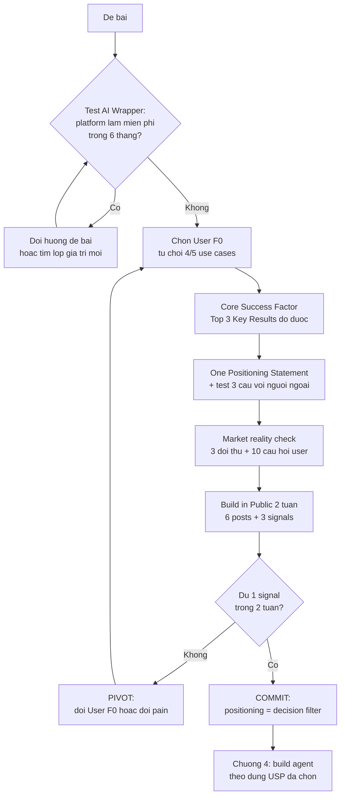

# Chương 5: Từ đề bài đến USP — Khảo sát thị trường & Positioning

> 📊 **Bằng chứng cohort —** Ở phase RA, messaging lệch giữa các bề mặt đã hạ niềm tin trực tiếp: Gamma ghi "~60 min" ở hero nhưng entry-test chỉ chạy "~35 phút" (G-07), và để lộ nav link rỗng trước khi khách mới kịp thấy giá trị (G-02); Beta treo "Practice SOON" / "Exam NEW" trên chính tính năng cốt lõi (A-03); Alpha xây chatbot tuyển sinh nhưng knowledge base nghèo về học bổng và hạn nộp — đúng 2 chủ đề user hỏi nhiều nhất. Phía bên kia, đội làm sâu đúng 1 USP đã thắng: Alpha đạt 8.5/10 điểm AI cao nhất nhờ dồn toàn lực vào chống-bịa + citation; Aclaris aiknowledge Hub [C2-118] chứng minh USP "không phải RAG bot thông thường" bằng con số đo được — Hit Rate 0.91, Groundedness 0.96, $0.0011 mỗi câu trả lời.

Chương này đứng giữa "đề bài" và "build". [Chương 2](chapter-02.md) giúp bạn khởi tạo repo, [Chương 4](chapter-04.md) giúp bạn build agent — nhưng nếu positioning sai, bạn build càng nhanh càng lãng phí. Vấn đề của đa số đội không phải là code kém; đó là **xây đúng thứ sai**: sản phẩm không ai cần, hoặc một wrapper mà platform sắp làm miễn phí, hoặc một USP nói một đằng làm một nẻo.

**Positioning là chọn trận, không phải viết tagline.** Bạn không "định vị" bằng một câu slogan đẹp trên landing page. Bạn định vị bằng việc **từ chối** 4 trong 5 hướng đi khả dĩ, dồn nguồn lực vào 1 người dùng đầu tiên, và dùng positioning statement làm bộ lọc cho mọi quyết định build về sau.

Toàn bộ chương đi theo một vòng lặp — nếu tín hiệu thị trường không đến, bạn quay lại đầu vòng chứ không phải build thêm tính năng:

Mỗi mục dưới đây đi kèm bài tập có output dạng file `usp/*.md` trong repo đội bạn. Đây là bằng chứng positioning cho QA và ban giám khảo — không có file, coi như chưa làm.

---

## 5.1 Nhận diện AI Wrapper — sản phẩm của bạn còn lại gì sau 6 tháng?

**AI Wrapper** là sản phẩm mà toàn bộ giá trị nằm ở việc "bọc" một API của platform (OpenAI, Google, Anthropic...) bằng một giao diện mỏng. Hình ảnh của workshop: **xe máy chạy vào làn đường container** — bạn đang cạnh tranh trực diện với những gã khổng lồ trên chính sân của họ.

Test chỉ có một câu hỏi:

> **"Nếu platform (OpenAI/Google/Anthropic) phát hành tính năng này miễn phí trong 6 tháng tới, sản phẩm của tôi còn lại gì?"**

Nếu câu trả lời là "không còn gì" — bạn không có sản phẩm, bạn có một tính năng của người khác.

Hai bằng chứng thật mà mọi đội đều phải thuộc:

- **GPT Store ra mắt 11/2023** — cả một thế hệ "ChatGPT cho X" (wrapper mỏng quanh một prompt) mất giá trị gần như trong một đêm, vì chính OpenAI cho người dùng tạo và chia sẻ GPTs miễn phí.
- **ChatGPT Memory ra mắt 5/2024** — các sản phẩm bán "chatbot nhớ ngữ cảnh cá nhân" bị thu hẹp còn đúng phần giá trị mà họ tự xây được ngoài memory mặc định (dữ liệu riêng, workflow riêng, tích hợp riêng).

Câu hỏi tiếp theo: **lớp giá trị nào KHÔNG thể bị nuốt?** Thường rơi vào 4 nhóm:

| Lớp giá trị | Ví dụ thật từ cohort | Vì sao khó bị nuốt |
|---|---|---|
| **Dữ liệu/domain riêng** | Gamma dùng dữ liệu leaderboard cohort thật (level 0.0–2.2) thay vì câu hỏi tổng quát | Platform không có dữ liệu của bạn |
| **Workflow sâu** | Aclaris: pipeline MAP → REDUCE → REFINE → VERIFY → COMMIT + verifier dò mâu thuẫn, không phải 1 prompt | Là chuỗi bước có kiểm chứng, không thay được bằng 1 lần gọi API |
| **Guardrail/governance theo domain** | NurA [C2-074]: guardrail 4 lớp cho tiếng Việt y khoa; MindCare [C2-109]: risk classifier trước khi AI phản hồi | Platform không chịu trách nhiệm domain của bạn |
| **Tích hợp vào chỗ user đang ở** | Chatbot nằm đúng trong flow tuyển sinh/nhập học, kèm nguồn chính thức | Context phân phối là của bạn |

> 💡 **MẸO:** Cách trả lời test này nhanh nhất là viết USP của bạn ra thành 1 câu, rồi gạch bỏ mọi từ mà platform cũng làm được miễn phí. Còn lại mấy từ? Đó chính là phần xây. Còn lại 0 từ — pivot đề bài ngay từ hôm nay, đừng đợi đến QA.

**Bài tập 1 — Wrapper check (output: `usp/wrapper-check.md`)**

Với đề bài của đội bạn, viết:
1. Câu mô tả sản phẩm hiện tại (tối đa 2 câu).
2. Trả lời test "platform miễn phí trong 6 tháng" — gạch bỏ từng từ, liệt kê phần còn lại.
3. Xếp giá trị còn lại vào 1 trong 4 nhóm ở bảng trên. Nếu không vào nhóm nào — đây là red flag, mang đi hỏi coach trước khi viết thêm dòng code nào.

---

## 5.2 User F0 / Beachhead — từ chối quan trọng hơn lựa chọn

**User F0** (beachhead) là nhóm người dùng đầu tiên bạn chọn để THẮNG tuyệt đối — không phải "phục vụ vừa đủ". Nguyên tắc số 1 của workshop: **"từ chối quan trọng hơn lựa chọn"**. Một đội 4 người không đủ nguồn lực để thắng 5 thị trường cùng lúc; liệt kê 5 use cases rồi chọn 1 nghĩa là bạn có 4 lý do từ chối rõ ràng — đó mới là bằng chứng bạn đã thật sự chọn.

### Bài tập chọn User F0 (20 phút, làm nhóm)

**Bài tập 2 — Beachhead statement (output: `usp/beachhead.md`)**

1. Liệt kê **5 use cases** của đề bài (nhóm người cụ thể + việc cụ thể họ cần làm). Ví dụ với đề bài chatbot tuyển sinh: thí sinh hỏi học bổng, phụ huynh so sánh ngành, học sinh năm 2 tư vấn chuyển ngành, giáo viên counselor tra deadline, thí sinh quốc tế hỏi visa.
2. Đánh giá từng use cases theo 3 tiêu chí: pain có thật không, đội bạn có lợi thế không, có chạm được người dùng thật trong 2 tuần không.
3. **Chọn 1** — viết thành Beachhead statement: *"Chúng tôi phục vụ [nhóm người], giúp họ [việc cụ thể], thay cho [cách họ đang làm hôm nay]."*
4. **Từ chối 4** — điền bảng dưới đây. Bảng từ chối quan trọng ngang statement, vì nó là phần "chứng minh bạn đã nghĩ".

Bảng lý do từ chối 4 use cases (điền vào `usp/beachhead.md`):

| Use case bị từ chối | Họ sẵn trả tiền không? / Pain gì? | Sao không chọn? / Có expand được sau này không? |
|---|---|---|
| (VD: Phụ huynh so sánh ngành) | Không trả tiền — tra miễn phí trên web nhà trường; pain thấp | Pain thật nhưng quyết định không nằm ở họ; có thể expand ở giai đoạn 2 sau khi thắng thí sinh |
| ... | ... | ... |

Ba cột bắt buộc: **sẵn trả tiền / pain gì / expand đâu**. Nếu một use case bị từ chối mà bạn không viết nổi lý do vào cột giữa — bạn chưa nghĩ đủ, chưa tính là từ chối.

Lỗi thật của cohort ở bước này: Alpha chọn user là thí sinh hỏi tuyển sinh, nhưng knowledge base **thiếu 2 chủ đề user hỏi nhiều nhất** (học bổng, hạn nộp undergraduate). Chọn user xong mà không biết user thật hỏi gì thì lựa chọn chỉ nằm trên giấy — bài tập ở mục 5.5 sẽ đóng lỗ hổng này bằng 10 câu hỏi user thật.

---

## 5.3 Core Success Factor → Top 3 Key Results đo được

Bạn đã chọn trận (User F0). Câu hỏi tiếp: **cần thắng cái gì để GIÀNH thị trường đó?** Core Success Factor (CSF) là yếu tố quyết định thắng/thua ở User F0 đã chọn — không phải danh sách việc cần làm.

Từ CSF, rút ra **Top 3 Key Results** — mỗi KR phải đo được bằng số, có deadline. Nếu KR không đo được thì nó là mong muốn, không phải key result.

5 seed KR để đội khởi động (chọn 3, hoặc viết lại theo domain — nhưng phải giữ tính đo được):

| # | Seed Key Result | Đo thế nào |
|---|---|---|
| 1 | Tính năng lõi chạy đúng end-to-end từ UI công khai đến output (không tính demo nội bộ, không tính stub) | Checklist chạy tay từng bước trên URL công khai; mọi bước có output thật |
| 2 | Tốc độ phản hồi trung bình < 3 giây với câu hỏi phổ biến | Log timestamp mỗi request (đã có pattern timing per-step ở chương RAG); đo 20 câu mẫu |
| 3 | Accuracy >= 90% trên bộ câu hỏi vàng, hoặc >= 4/5 sao từ LLM-judge | Golden dataset + runner — xem [Chương 10](chapter-10.md); NurA đạt 4.62/5 LLM-judge là mốc tham chiếu |
| 4 | Onboarding < 5 phút từ lần mở đầu tiên đến giá trị đầu tiên (user mới tự làm, không có member đội ngồi cạnh) | Nhờ 3 người ngoài đội thử, bấm giờ; ghi lại chỗ họ kẹt |
| 5 | >= 50% user thử quay lại trong tuần đầu | Cơ chế đăng ký user (dù chỉ Google Form + email nhắc); đếm tỷ lệ quay lại |

Chỉ chọn **3**. Chọn 5 nghĩa là không chọn gì. Số dư bị loại cũng ghi lại lý do vào file bài tập — lại là bằng chứng "đã nghĩ".

**Bài tập 3 — Key Results (output: `usp/key-results.md`)**

1. Viết CSF của đội trong 1 câu: "Để thắng [User F0], chúng tôi phải thắng ở [yếu tố]."
2. Chọn Top 3 KR từ bảng seed (hoặc tự viết), mỗi KR ghi: giá trị mục tiêu, cách đo (công cụ cụ thể), deadline.
3. Với mỗi KR bị loại: 1 dòng lý do.

Bài học cohort liên quan trực tiếp: "video demo thiếu 11/11 đội, eval evidence thiếu 82%" (phản hồi ban giám khảo) và 10/12 đội cohort trước nộp eval placeholder trống. KR số 3 ở trên chính là thứ phân biệt đội có bằng chứng với đội chỉ có lời nói — chọn nó trừ khi bạn có lý do rất tốt.

---

## 5.4 One Positioning Statement — một câu làm trọng tài

Mọi thứ trên hội tụ về **một** câu. Một câu duy nhất, không phải 3 phiên bản cho 3 kênh. Nếu landing page nói một câu, pitch deck nói câu khác, demo lại nhấn thứ ba — người nghe sẽ tự chọn tin câu nào thuận tiện cho việc chê sản phẩm của bạn nhất.

Khung câu:

> **[Tên sản phẩm] giúp [User F0] [làm gì cụ thể] bằng cách [cơ chế đặc trưng] — khác với [cách hiện tại/đối thủ] ở điểm [khác biệt đo được].**

Hai ví dụ thật từ cohort:

- **Gamma** (định vị sắc, đáng học): *"Prove your AI readiness — 5 axes, 5 levels, LLM-judged, AI-Ready Certificate."* Ngắn, có cơ chế, có output xác thực.
- **Aclaris** [C2-118] (USP đi kèm bằng chứng): định vị "không phải RAG bot thông thường" — pipeline biên soạn tri thức 5 bước + verifier dò mâu thuẫn, và chứng minh bằng Hit Rate 0.91 / Groundedness 0.96 / $0.0011 mỗi câu.

Điểm chung: cả hai đều có **cơ chế** (5-axis assessment, pipeline VERIFY) chứ không chỉ có tính từ ("thông minh", "nhanh", "toàn diện" — những từ này là slop positioning, ai cũng gắn được).

### Test 3 câu với người ngoài

Viết xong statement, đưa cho **3 người không thuộc đội, không biết đề bài** (bạn cùng lớp khác nhóm, người nhà, admin group cộng đồng). Mỗi người đọc câu rồi trả lời:

1. Sản phẩm này dành cho ai?
2. Người đó làm được gì với nó?
3. Nếu không có sản phẩm này, họ sẽ dùng gì thay thế?

Nếu 3 người trả lời lệch nhau ở câu 1 — statement chưa đủ hẹp. Nếu câu 3 trả lời "dùng ChatGPT thôi mà" — bạn vừa trượt test wrapper ở mục 5.1 trong thực tế. Sửa rồi test lại với 3 người mới.

**Bài tập 4 — Positioning statement (output: `usp/positioning-statement.md`)**

1. Statement theo khung trên.
2. Kết quả test 3 câu x 3 người (ghi nguyên văn câu trả lời của họ — không biên tập lại cho đẹp).
3. Statement bản sửa (nếu có) sau khi test.

File này trở thành **single source of truth cho messaging**: mọi text trên landing page, pitch deck, demo script, post BIP đều phải đọc lại từ file này trước khi xuất bản. Đây cũng là biện pháp chống trực tiếp lỗi messaging lệch kiểu Gamma (60 phút ở hero vs 35 phút ở entry-test) — hai bề mặt đó phải quote cùng một con số từ cùng một file.

---

## 5.5 Market reality check checklist — đối thủ, câu hỏi thật, messaging đồng nhất

Đây là checklist mà báo cáo bài học cohort khuyến nghị làm **bắt buộc trước khi build** — vì cả bốn đội phase RA đều vấp ở các mục của nó.

### Checklist 4 mục

**1. Ba đối thủ trực tiếp + bảng so feature.** "Trực tiếp" nghĩa là: cùng user, cùng pain, đang được dùng thật (không phải "đối thủ về ý tưởng"). Với mỗi đối thủ, dùng thử 15 phút (hoặc xem review của user thật trên group Facebook / Reddit / App Store). Ghi vào bảng:

| Feature User F0 cần | Sản phẩm bạn | Đối thủ 1 | Đối thủ 2 | Đối thủ 3 |
|---|---|---|---|---|
| (VD: Trả lời câu học bổng có trích nguồn) | Có / Không | | | |
| ... | | | | |

Bảng này có hai công dụng: tìm chỗ positioning đứng được (feature đối thủ đều "Không"), và chặn việc build lại thứ thị trường đã có sẵn miễn phí.

**2. Mười câu hỏi user thật nhất.** Thu thập từ 3 nguồn: phỏng vấn 5 người thuộc User F0 (Tally / Google Form + 15 phút gọi), đọc 20 thread hỏi-đáp trong group mà user thật của bạn hay ở, và review 1-2 sao của sản phẩm đối thủ. Rút ra 10 câu hỏi xuất hiện nhiều nhất. Đây chính là nội dung tối thiểu của knowledge base và của golden dataset ở [Chương 10](chapter-10.md). Lỗi Alpha (KB thiếu học bổng + deadline — 2 chủ đề được hỏi nhiều nhất) là hậu quả của việc bỏ qua mục này.

**3. Messaging đồng nhất mọi bề mặt.** Đối chiếu từng con số, từng claim trên 4 bề mặt: landing hero, flow trong sản phẩm, pitch deck, demo script. Mọi con số phải về đúng một nguồn: `usp/positioning-statement.md` và `usp/key-results.md`. Quy tắc: một con số chỉ được viết ở một chỗ rồi tham chiếu — không copy tay.

**4. Tính năng chưa làm thì ẩn hoặc gắn nhãn rõ.** Không treo "SOON" / "NEW" / "Locked" trên tính năng cốt lõi (lỗi A-03 của Beta: "Practice SOON", "Exam NEW", Day 02–15 Locked khiến người đánh giá không thể kiểm tra đúng giá trị AI). Quy tắc: nếu tính năng nằm trên User F0 path mà chưa chạy được — ẩn hoàn toàn; nếu muốn giữ lộ trình — gắn nhãn lộ trình riêng, tách khỏi khu vực trải nghiệm chính. Nav không chứa link rỗng `#` (lỗi G-02 của Gamma: khách mới chưa thấy giá trị đã thấy sản phẩm bỏ trống).

### Case study tổng hợp — sai lầm thật vs làm đúng

| Đội | Việc xảy ra | Hậu quả | Bài học rút |
|---|---|---|---|
| **Beta** | Tính năng chính treo "Practice SOON"/"Exam NEW"; Day 02–15 Locked | Người đánh giá không thể kiểm chứng giá trị AI Tutor — điểm AI chỉ 6.5/10 dù tổng 78 | Tính năng cốt lõi phải chạm được từ UI công khai; chưa xong thì ẩn |
| **Gamma** | Hero "~60 min" vs entry-test "~35 phút" | Giảm niềm tin (G-07) — bị bắt trong 1 phiên QA | Một con số, một nguồn, mọi bề mặt |
| **Alpha** | KB thiếu học bổng và hạn nộp undergraduate | Chatbot tuyển sinh trả lời kém đúng 2 chủ đề user hỏi nhiều nhất | 10 câu hỏi user thật phải có TRƯỚC khi build KB |
| **Delta (đúng)** | Landing honest: "MVP · Chỉ để luyện tập · Không liên kết nhà tuyển dụng" | Điểm cao nhất phase RA (80) — niềm tin tăng thay vì giảm | Honest messaging không làm sản phẩm kém đi; nó làm lời nói trở nên đáng giá |
| **Gamma (đúng)** | Positioning 5-axis + AI-Ready Certificate | Định vị rõ nhất phase RA dù tổng điểm thấp | Một câu cơ chế cụ thể thắng mười tính từ |
| **Aclaris (đúng)** | USP "không phải RAG bot thông thường" + số đo | Hit Rate 0.91, Groundedness 0.96 — định vị có bằng chứng | Claim đi kèm con số đo được, luôn |

**Bài tập 5 — Market reality check (output: `usp/competitor-matrix.md`)**

File này gộm cả 4 mục checklist: bảng 3 đối thủ (mục 1), danh sách 10 câu hỏi user thật kèm nguồn từng câu (mục 2), bảng đối chiếu messaging 4 bề mặt với trạng thái Đồng nhất / Lệch (mục 3), danh sách tính năng ẩn kèm lý do (mục 4). Không hoàn thành file này thì không qua gate "được phép build" — quyết định này thuộc coach.

---

## 5.6 Build in Public — 2 tuần, 6 posts, 3 signals

**Build in Public (BIP)** là đăng tải tiến trình sản phẩm thật trước khi hoàn thiện, ở nơi User F0 của bạn hay ở (Facebook group chuyên ngành, LinkedIn, Discord server, campus forum). Mục đích không phải marketing — mà là **thu tín hiệu thị trường sớm nhất có thể**, thay vì ngồi đoán.

Kế hoạch tối thiểu 2 tuần (từ Positioning Workshop):

- **6 posts** (3 mỗi tuần): mỗi post nói về 1 khía cạnh của USP đang build — vấn đề của User F0, cách tiếp cận của bạn, kết quả đo được (số thật từ KR). Post có số thật luôn outranking post cảm nghĩ.
- **3 việc mỗi tuần** trong đội: (1) build đúng KR đang ưu tiên, (2) sản xuất 1-2 post từ chính kết quả đó, (3) trả lời/phỏng vấn user thật để lấp bảng 10 câu hỏi. Ba việc này khớp vòng BIP → Positioning → Focus của workshop: điều bạn học từ post quay lại sửa positioning.

**3 signals validate** — ít nhất 1 trong 3 xuất hiện trong 2 tuần:

| Signal | Ngưỡng | Nghĩa là |
|---|---|---|
| Comments có nội dung trên posts | >= 10 comments | Người lạ quan tâm đủ để viết |
| DM hỏi giá / hỏi dùng thử | >= 5 người | Có ý định dùng thật — tín hiệu mạnh nhất |
| Trials thật (dùng thử từ người ngoài đội) | >= 20 lượt | Sản phẩm chạm được người thật |

**2 tuần không thấy signal nào — PIVOT.** Không phải "build thêm tính năng rồi xem sao". Pivot nghĩa là quay lại mục 5.2: đổi User F0, hoặc đổi pain đang nhắm — rồi chạy lại vòng.

**Bài tập 6 — BIP tracker (output: `usp/bip-tracker.md` hoặc Google Sheets)**

1. Lịch 6 posts: ngày, kênh, chủ đề, KR liên quan.
2. Bảng tracker: mỗi post ghi lượt comments / DM / trials phát sinh.
3. 3 signals với ngưỡng và ngày hết hạn (14 ngày kể từ post đầu). Cột kết luận: ĐÚNG / PIVOT — điền theo dữ liệu, không theo cảm giác.

---

## 5.7 Đọc tín hiệu thị trường — đừng tin survey, hãy tin credit card

Signal ở mục 5.6 chỉ có giá trị nếu bạn đọc đúng. Ba câu hỏi tách tín hiệu thật khỏi nhiễu:

**1. Ai THỰC SỰ đang dùng — có đúng User F0 bạn chọn không?**

Nếu người dùng chủ động lại là sinh viên công nghệ tò mò (đồng trang lứa với bạn) chứ không phải User F0 đã khai trong `usp/beachhead.md` — đó là tín hiệu lệch. Ghi lại ai đã dùng thật (bio, ngữ cảnh), so với statement. Dùng lệch nhiều hơn dùng đúng = positioning sai đối tượng, hoặc product đang thu hút sớm-adopters thay vì user mục tiêu — cần phân biệt rõ hai trường hợp này trước khi quyết định.

**2. User mô tả sản phẩm của bạn bằng những từ gì?**

Đọc nguyên văn comment và DM (đừng tóm tắt lại cho hợp ý mình). Nếu user mô tả đúng theo statement — positioning hoạt động. Nếu họ mô tả theo một giá trị khác (mà bạn vô tình làm tốt hơn) — thị trường đang chỉ cho bạn hướng pivot nào đáng cân nhắc. Đem các từ của user về đối chiếu với `usp/positioning-statement.md`.

**3. Ai trả tiền — hoặc hành xử như người chuẩn bị trả tiền?**

Nguyên tắc: **"Đừng tin survey, hãy tin credit card."** Trong survey, ai cũng nói "hay đấy, sẽ dùng"; cái đếm được là hành vi tốn công/tốn tiền: điền form đăng ký đầy đủ, hỏi giá cụ thể, quay lại lần hai, chủ động chia sẻ cho người khác. 5 DM hỏi giá nặng ký hơn 100 like. Đây cũng là lý do KR số 5 (>= 50% quay lại tuần đầu) là một trong những seed đáng chọn — hành vi quay lại không giả vờ được.

Kết thúc 2 tuần BIP, viết `usp/verdict.md` (nửa trang): signal nào xuất hiện với con số bao nhiêu, ai dùng thật, user mô tả thế nào, quyết định ĐÚNG (commit) hay PIVOT (về lại mục 5.2 với bài học gì).

---

## 5.8 Positioning làm decision filter — nối sang chương build

Sau khi commit, positioning statement không bị đóng khung. Nó trở thành **bộ lọc quyết định** cho mọi việc build về sau. Mỗi khi tranh luận trong đội về nên làm gì tiếp (và đội nào cũng tranh luận), đặt câu hỏi theo thứ tự:

1. Tính năng này có nằm trên path của User F0 không? Không — loại.
2. Tính năng này có giúp Top 3 Key Results không? Không — để sau.
3. Tính năng này platform có thể làm miễn phí trong 6 tháng không? Có — nghĩ lại giá trị của nó.
4. Sau khi làm xong, messaging trên mọi bề mặt có cần đổi không? Có — cập nhật `usp/positioning-statement.md` trước khi viết code.

Quy tắc này giải thích trực tiếp vì sao "làm sâu 1 USP thắng trải mỏng 10 feature": Alpha đạt 8.5/10 điểm AI với đúng một USP (chống-bịa + citation) làm thật end-to-end, trong khi các đội dàn trải bị đánh giá theo "user chưa chạm được giá trị AI cốt lõi" — một product được đánh giá theo khả năng user chạm giá trị, không theo số lượng feature. Quy tắc "USP phải chạy được từ UI công khai đến output" (từ template cohort 3) là câu kiểm tra cuối cùng trước mọi lần nộp bài.

Từ đây, mọi file `usp/*.md` bạn đã viết trở thành đầu vào thật của việc build: 10 câu hỏi user thật là golden dataset, Top 3 KR là acceptance criteria, positioning statement là ràng buộc messaging. Sang [Chương 4](chapter-04.md) để build agent theo đúng những ràng buộc đó.

---

## Bảng tự đánh giá "lên Giỏi" — tiêu chí Demo Day "Ý tưởng & ứng dụng thực tế"

Dùng bảng này tự chấm trước khi nộp. Mức bạn tự chấm phải đứng được trước QA ngoài đội (nhớ lại: không team nào trong cohort tự phát hiện lỗi của mình — mọi CRITICAL/HIGH do QA bên ngoài bắt; nên nhờ 1 đội bạn chấm chéo).

| Mức | Nhận diện đề bài & thị trường | USP & bằng chứng | Ứng dụng thật |
|---|---|---|---|
| **1 — Chưa đạt** | Chưa xác định được đối thủ trực tiếp; chưa nói được user thật hỏi gì | USP là tính từ chung chung ("thông minh", "nhanh"), không đo được | Chưa có người ngoài đội dùng thử; tính năng cốt lõi không chạm được từ UI công khai |
| **2 — Đạt** | Liệt kê được 3 đối thủ; có 10 câu hỏi user (nguồn sơ sài) | Có USP cụ thể nhưng bằng chứng chỉ là demo nội bộ | < 5 người ngoài đội thử; chưa có số đo hành vi |
| **3 — Tốt** | Bảng so feature 3 đối thủ hoàn chỉnh; 10 câu hỏi có nguồn từng câu; messaging đồng nhất 4 bề mặt | USP có cơ chế đặc trưng + số đo (accuracy, tốc độ) trên golden dataset; signal đầu tiên xuất hiện (comments/DM/trials) | >= 20 người ngoài đội dùng thử; KR đang đo đều có dashboard/log |
| **4 — Giỏi** | Đối thủ được dùng thử thật và ghi nhận điểm yếu cụ thể; phát hiện được chỗ trống thị trường mà bảng feature chứng minh; messaging 4 bề mặt quote một nguồn | 1 USP làm sâu end-to-end + bằng chứng độc lập đo lại được (kiểu Aclaris 0.91/0.96, AI Finance Assistant 64% → 96%); đạt >= 1 ngưỡng signal (>= 5 DM hỏi giá hoặc >= 20 trials) | User thật quay lại theo dõi KR; verdict ĐÚNG/PIVOT có dữ liệu 2 tuần; sản phẩm sống đúng positioning statement từ UI công khai đến output |

## Exit-test — 4 câu trả lời thay lời kết

Trước khi rời chương này (và trước mọi lần pitch), mỗi thành viên phải tự trả lời được 4 câu — mỗi câu là một tradeoff bạn đã chủ động chấp nhận, không phải câu trả lời êm tai:

1. **Nếu platform phát hành tính năng cốt lõi của bạn miễn phí trong 6 tháng, sản phẩm còn lại gì?** — nếu trả lời là "chúng tôi tin tốc độ thực thi", đó chưa phải câu trả lời; hãy chỉ ra nhóm giá trị (dữ liệu riêng / workflow sâu / guardrail domain / tích hợp) mà bạn đang nắm.
2. **Bạn đã từ chối 4/5 use cases vì lý do gì, và từ chối đó khiến bạn mất gì?** — bảng `usp/beachhead.md` phải cho thấy cái giá của sự từ chối, không chỉ lời giải thích.
3. **Signal nào sẽ khiến bạn pivot, và đến hết 2 tuần bạn đã thấy hoặc chưa thấy nó ở mức nào?** — trả lời bằng con số từ `usp/bip-tracker.md`, kèm ngày hết hạn; "team thấy có vẻ ổn" không phải tín hiệu.
4. **Tính năng nào bạn đang ẩn hoặc gắn nhãn lộ trình, và việc ẩn nó có làm positioning statement sai đi không?** — nếu phải ẩn quá nhiều thứ mà statement vẫn hứa, vấn đề không nằm ở UI; nó nằm ở statement.

Trả lời được 4 câu với bằng chứng trong các file `usp/*.md` — bạn đã sẵn sàng build. Sang [Chương 4](chapter-04.md).
