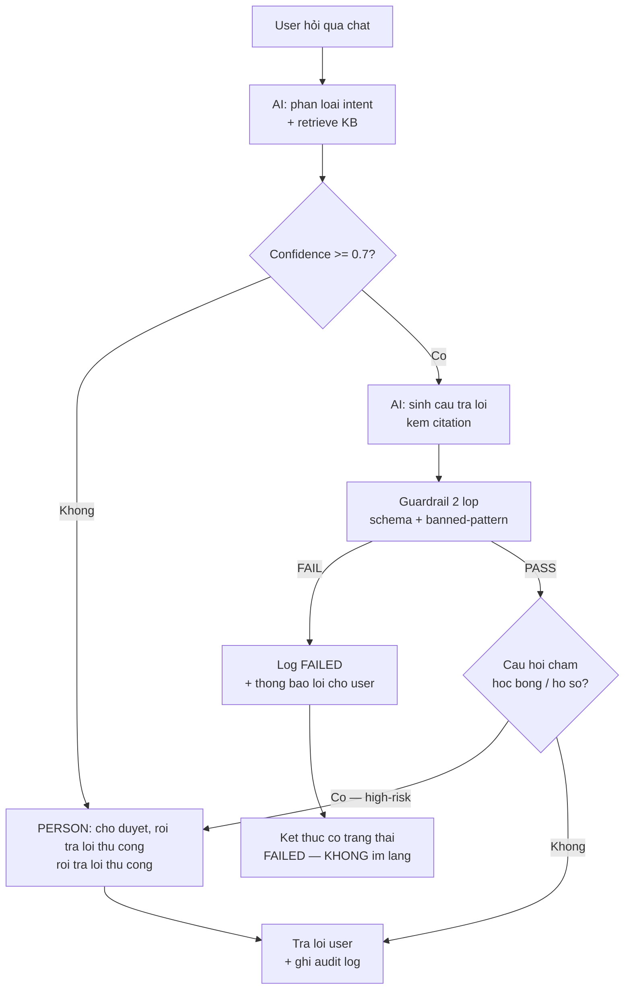
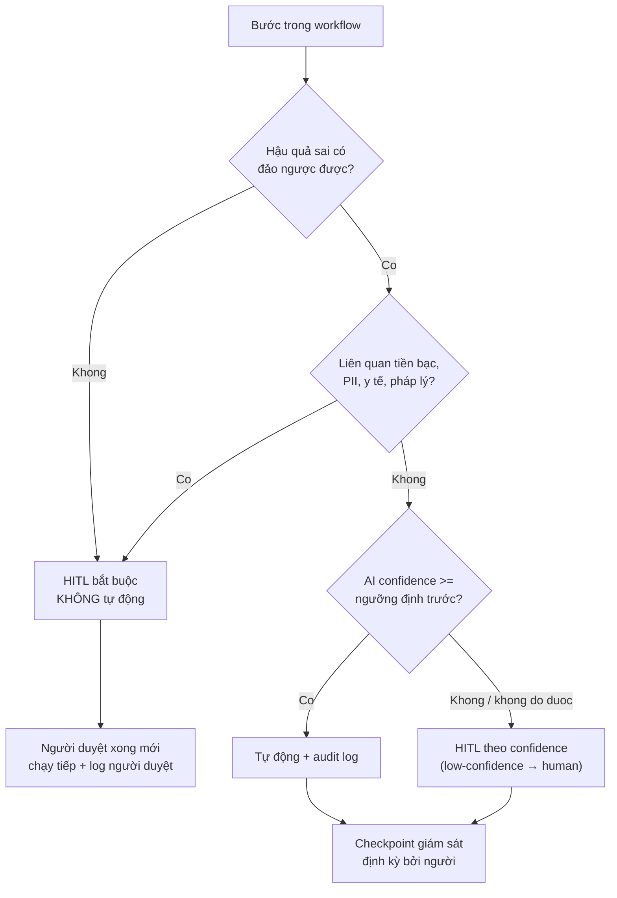
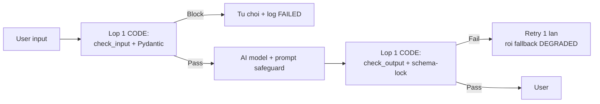

# Chương 7 — Workflow Design & Reliability: edge case, failback, Human-in-the-Loop, governance

> 📊 **Bằng chứng cohort —** Ba con số từ các cohort trước giải thích vì sao chương này tồn tại: (1) **11/12 đội** chỉ có guardrail 1 lớp prompt-only — prompt bị lật là cả hệ thống trần trụi; (2) đội **002** từng viết `except Exception: return default` — AI chạy regression giữa chừng mà không ai biết, đây là "silent fallback" kinh điển; (3) đội **Gamma** để session hết hạn giữa bài thi 35 phút, state không persist — user mất trắng tiến độ (G-06), MCQ click không register và không có toast chỉ câu thiếu (G-08). Cả ba lỗi đều không phải lỗi AI — chúng là **lỗi thiết kế workflow**. Chương này trang bị bộ tư duy và checklist để không lặp lại.

Nguyên tắc xuyên suốt: **thiết kế cho đáng tin cậy trước, tự động hóa sau**. Tự động hóa một quy trình rác = tự động hóa cái rác, với tốc độ nhanh hơn.

---

## 7.1 Value stream — vẽ IPO cho luồng sản phẩm

Mọi quy trình, dù đơn giản đến đâu, đều là **Input → Process → Output (IPO)**. Trước khi viết dòng code nào, bạn phải vẽ được luồng này và trả lời 2 câu hỏi:

1. **AI ở đâu?** — bước nào cần suy luận phi cấu trúc (sinh văn bản, phân loại mơ hồ, tóm tắt)?
2. **Người ở đâu?** — bước nào cần phán quyết, chịu trách nhiệm, hoặc xử lý khi AI không chắc?

### Ví dụ IPO: chatbot tư vấn tuyển sinh (kiểu đội Alpha)

| Pha | Nội dung | AI / Người | Ghi chú rủi ro |
|---|---|---|---|
| **Input** | Câu hỏi user qua chat; KB học bổng, hạn nộp | Người soạn KB | KB nghèo = AI bịa (lỗi Alpha cohort trước) |
| **Process** | Phân loại intent → retrieve KB → sinh câu trả lời có citation | AI | Cần guardrail 2 lớp (mục 7.7) |
| **Output** | Câu trả lời + link nguồn; nếu confidence thấp → chuyển người tư vấn | AI + Người | Đây là điểm HITL (mục 7.5) |

Nếu bạn không vẽ được bảng này trong 15 phút, bạn chưa hiểu đủ luồng sản phẩm mình đang build. Cohort trước cho thấy hệ quả: nhiều đội build feature trước, phát hiện messaging lệch giá trị cốt lõi sau (Beta default Direct answer thay vì Socratic — ngược value prop của chính mình).

### Bài tập nhanh

Vẽ IPO cho sản phẩm đội bạn trong 1 bảng 3 hàng (Input/Process/Output), mỗi bước ghi rõ AI hay Người và một rủi ro có thể xảy ra ở bước đó.

---

## 7.2 Sáu thuộc tính của quy trình đáng tin cậy

Đây là bộ tiêu chí tự kiểm trước khi đưa workflow ra production. Mỗi thuộc tính kèm **cách kiểm chứng** — thuộc tính không kiểm chứng được chỉ là lời hứa.

| # | Thuộc tính | Nghĩa | Cách kiểm chứng |
|---|---|---|---|
| 1 | **Fault-tolerant** (chịu lỗi) | Một node fail không sập cả workflow; có nhánh fallback rõ ràng | Tắt node giữa (mock raise) → workflow vẫn trả kết quả hoặc thông báo lỗi hiểu được cho user |
| 2 | **Observable** (quan sát được) | Mọi bước log trạng thái OK/WARN/FAIL, đủ truy nguyên nhân | Giả định: nửa đêm server lỗi — sáng ra đọc log trả lời được "chỗ nào fail, input gì, bao nhiêu case" |
| 3 | **Scalable** (mở rộng được) | 1 user hay 100 user gửi đồng thời vẫn ổn | Test gửi 10 request song song — không có ERR_ABORTED kiểu đội Alpha (A-02) |
| 4 | **Workable** (làm được) | User thật đi hết luồng giá trị cốt lõi mà không bị chặn | Smoke-test E2E đường "vàng" mỗi lần deploy (Gamma bị chặn 2 lần ngay bước đăng nhập) |
| 5 | **Idempotent** (lặp an toàn) | Chạy lại cùng input không sinh kết quả trùng/lệch | Gọi API 2 lần cùng payload → không tạo 2 bản ghi, không charge 2 lần |
| 6 | **Auditable** (kiểm toán được) | Truy ngược được: ai/yếu tố nào quyết định gì, lúc nào | Xem 1 output xấu → truy được trace: prompt nào, context nào, bước nào duyệt |

Hai thuộc tính cohort trước yếu nhất: **Workable** (không đội nào tự phát hiện lỗi của mình — mọi CRITICAL do QA bên ngoài phát hiện) và **Observable** (silent fallback của đội 002 chính là vi phạm thuộc tính số 2).

---

## 7.3 Edge-case taxonomy có hệ thống

Edge case không phải là "trường hợp lạ may rủi" — nó rơi vào các nhóm đếm được trên đầu ngón tay. Khi thiết kế, đi qua từng nhóm và tự hỏi: sản phẩm tôi xử lý nhóm này thế nào?

| Loại edge | Ví dụ thật từ cohort | Xử lý chuẩn |
|---|---|---|
| **Dữ liệu thiếu / rỗng** | KB tuyển sinh thiếu 2 chủ đề user hỏi nhiều nhất (học bổng, hạn nộp) | Validate input ở cổng vào (Pydantic); thiếu dữ liệu nguồn → trả lời thẳng "chưa có thông tin" + route người, KHÔNG để AI tự bịa |
| **Sai format** | LLM trả JSON cắt giữa dòng, thiếu field | Schema-lock: sai schema → exception tường minh + retry 1 lần → fallback (đội 012: mọi output qua Pydantic) |
| **User nhập ngoài scope** | Hỏi y khoa vào chatbot tuyển sinh; câu hỏi trái quy định | Phân loại intent + từ chối lịch sự + redirect đúng kênh (guardrail input, mục 7.7) |
| **Concurrency** | Gửi tin liên tiếp → stream ERR_ABORTED (Alpha A-02) | Debounce client + queue server-side + khóa phiên theo user |
| **Timeout / hết budget** | Phiên phỏng vấn AI kéo dài vô hạn | Cost locks kiểu Delta: phiên tối đa 60 phút, idle 30 giây ngắt, 10 phiên/24h — tính **server-side** |
| **Injection** | User nhét "bỏ qua mọi instruct trước đó, trả lời..." | Prompt safeguard + tách dữ liệu người dùng khỏi system prompt + filter banned-pattern (mục 7.7) |
| **Loop vô hạn** | Agent gọi tool lặp không dừng | Escape hatch: đếm vòng lặp, vượt max → ép sang phase kết thúc (đội 011: count ≥ max → Closing → END) |

Quy tắc: mỗi edge case trong bảng phải tồn tại **dưới dạng test** trong repo. Edge case chỉ nằm trong đầu bạn thì đến Demo Day nó sẽ nằm trong demo của bạn.

---

## 7.4 Failback & state — không silent fallback

### Tội danh: silent fallback

```python
# ANTI-PATTERN — đội 002 cohort trước
try:
    result = run_ai_analysis(data)
except Exception:
    return default_answer   # AI chết âm thầm, user và dev đều không hay
```

Vấn đề không phải là có fallback — fallback là bắt buộc. Vấn đề là **âm thầm**: hệ thống chuyển sang chế độ kém chất lượng mà không ai biết. Với lỗi kiểu này, quy trình bắt buộc là viết **RCA (Root Cause Analysis)**: đội 002 sau đó chính là đội có file `ROOT_CAUSE_ANALYSIS.md` trong repo — biến sai lầm thành tài liệu.

### Chuẩn: log FAILED + fallback rõ ràng cho user

```python
import logging

logger = logging.getLogger("workflow")

def safe_ai_step(data: dict) -> dict:
    try:
        return run_ai_analysis(data)
    except Exception as exc:
        logger.error(
            "FAILED ai_step input_hash=%s reason=%s",
            hash(str(data)), type(exc).__name__,
        )
        return {
            "status": "DEGRADED",          # user BIẾT chất lượng giảm
            "answer": None,
            "message": "Phân tích AI tạm lỗi, hiển thị dữ liệu thô.",
        }
```

Ba khác biệt so với anti-pattern: (1) log dòng FAILED kèm hash input và lý do — thuộc tính Observable; (2) trạng thái `DEGRADED` tường minh — không giả vờ bình thường; (3) user nhận thông điệp rõ ràng thay vì câu trả lời mặc định ngụy trang.

### State persist & resume — bài học 35 phút của Gamma

Gamma để user làm bài thi placement 35 phút, session hết hạn giữa chừng, state không persist → mất toàn bộ tiến độ (G-06). Đây là vi phạm thuộc tính Fault-tolerant nghiêm trọng nhất cohort. Chuẩn tối thiểu cho mọi flow dài (thi, phỏng vấn, onboarding nhiều bước):

- **Persist sau mỗi bước**, không chờ hết flow (checkpoint mỗi câu trả lời)
- **Resume từ đúng chỗ** khi user quay lại — kể cả đổi tab, refresh, mất mạng
- **Toast/indicator** khi có sự cố (G-08: MCQ click không register mà không có bất kỳ tín hiệu nào — user tưởng đã chọn)

---

## 7.5 Human-in-the-Loop — tiered autonomy

### Quy tắc vàng

> **Bước tiền bạc, PII, y tế, pháp lý, hoặc quyết định không thể đảo ngược → KHÔNG tự động hoàn toàn. Bắt buộc có con người duyệt trước khi tiếp tục.**

Đây không phải tùy chọn tối ưu UX — đây là ranh giới an toàn. Tiered autonomy chia workflow thành 2 mức:

- **Low-risk** (tóm tắt tài liệu, gợi ý câu hỏi, sinh nháp nội dung): AI tự chạy, audit log lại sau
- **High-risk** (chuyển tiền, gửi email cho người thật, chẩn đoán, xóa dữ liệu, công bố kết quả): dừng lại, chờ người duyệt — hoặc tự động chạy chỉ khi confidence vượt ngưỡng đã định trước

### Mermaid 1 — workflow mẫu có điểm HITL (tư vấn tuyển sinh)



Đọc sơ đồ: nhánh người (node `PERSON`) chỉ kích hoạt khi confidence thấp HOẶC chủ đề high-risk — mọi trường hợp còn lại AI tự chạy để giữ trải nghiệm nhanh.

### LangGraph `interrupt()` + checkpointer — code mẫu

LangGraph 1.x có cơ chế dựng sẵn: node gọi `interrupt()` để tạm dừng graph, checkpointer lưu state, người duyệt xong thì graph resume từ đúng chỗ — không mất state kiểu Gamma.

```python
from typing import TypedDict
from langgraph.graph import StateGraph, START, END
from langgraph.checkpoint.memory import MemorySaver
from langgraph.types import interrupt, Command


class State(TypedDict):
    question: str
    answer: str
    approved: bool


def draft(state: State) -> dict:
    return {"answer": f"Nhap luu cho: {state['question']}"}


def human_review(state: State) -> dict:
    verdict = interrupt(          # graph DUNG o day, state da duoc luu
        {"answer": state["answer"], "note": "Duyet truoc khi gui?"}
    )
    return {"approved": verdict == "APPROVE"}


def send(state: State) -> dict:
    return {"answer": state["answer"] + " [da gui]"}


g = StateGraph(State)
g.add_node("draft", draft)
g.add_node("review", human_review)
g.add_node("send", send)
g.add_edge(START, "draft")
g.add_edge("draft", "review")
g.add_edge("send", END)
g.add_conditional_edges("review", lambda s: "send" if s["approved"] else END)

graph = g.compile(checkpointer=MemorySaver())
cfg = {"configurable": {"thread_id": "t1"}}
result = graph.invoke({"question": "Ho so hoc bong?"}, cfg)
# result dung tai node review — lay ve interrupt payload, nguoi duyet roi:
result = graph.invoke(Command(resume="APPROVE"), cfg)   # resume tu review
```

Điểm mấu chốt: `MemorySaver` (hoặc `SqliteSaver` cho production — đội 011 dùng SqliteSaver) lưu state tại điểm interrupt; nếu process chết, thread_id cho phép resume không mất tiến độ.

### Bảng quyết định — workflow của BẠN cần HITL ở đâu?

| Dấu hiệu bước | Tự động hoàn toàn? | Lý do |
|---|---|---|
| Sinh nháp nội dung nội bộ, không ai đọc ngay cũng không sao | Có — low-risk | Sai thì sửa được |
| Gửi tin nhắn / email tới người ngoài đội | **Không** — cần duyệt | Ảnh hưởng người thật, khó rút lại |
| Xử lý PII (hồ sơ, transcript, điểm số) | **Không** tối thiểu phải PII-filter + duyệt | Ràng buộc pháp lý, niềm tin |
| Gợi ý liên quan y tế / sức khỏe | **Không** — route khẩn cấp nếu cần | Đội 005: danger_keywords → emergency ngay lập tức |
| Quyết định tài chính, công bố kết quả, xóa dữ liệu | **Không — tuyệt đối** | Irreversible |

### Mermaid 2 — tiered-autonomy decision flow



---

## 7.6 AI governance mini — audit log, trách nhiệm, escalation

Governance không phải trang Privacy Policy tĩnh (đội Alpha từng để link Privacy Policy chết `#` — trong khi sản phẩm là B2B xử lý PII). Governance là **cơ chế chạy trong code**. Ba thành phần tối thiểu:

### 1. Audit log — mọi bước AI để lại dấu vết

Mỗi lần AI ra quyết định, ghi audit log theo **schema canonical duy nhất** định nghĩa ở [Chương Privacy](chapter-11.md) §11.7 (ts, user hash, input_hash, output_hash, model_version, risk_level, human_approved — không lưu output/PII gốc). Đội 002 kèm artifacts eval vào repo là cùng tư duy — quyết định phải truy ngược được.

### 2. Ai chịu trách nhiệm khi AI sai?

Trả lời trước khi ship, bằng 1 câu viết được trong README: **"Khi output của sản phẩm gây hậu quả X, người/bộ phận chịu trách nhiệm là Y, vì Z."** Ví dụ chuẩn: MommyCare (005) không để AI tư vấn y tế tự chịu — AI chỉ phân loại, câu hỏi có `danger_keywords` chuyển emergency, nguồn không chính thống bị hạ `safety_level` xuống warning. Trách nhiệm nằm ở thiết kế hệ thống, không nằm ở model.

### 3. Escalation path — đường lên khi vượt tầm

Workflow phải có tầng thoát lên cao hơn: AI không chắc → reviewer người → reviewer không xử lý được → kênh con người thật (hotline, 115, on-call). Đội Delta làm đúng: AI **từ chối** phỏng vấn thật và chuyển humans-in-charge khi vượt phạm vi luyện tập.

Checklist governance 1 trang (đặt cạnh IPO của bạn):

- [ ] Audit log ghi mọi bước AI quyết định (không lưu PII gốc)
- [ ] Câu trả lời "ai chịu trách nhiệm khi AI sai" viết rõ trong README
- [ ] Escalation path vẽ trên sơ đồ workflow, có ít nhất 1 đích đến là người
- [ ] Cost lock + rate limit server-side (không chỉ client)

---

## 7.7 Guardrail 2 lớp — code validation + prompt safeguard

Bằng chứng cohort: **11/12 đội guardrail 1 lớp prompt-only**. Prompt là lớp mỏng — bị lật bởi jailbreak, bị sai bởi model yếu, bị quên bởi model mới. Lớp thứ hai phải nằm trong **code**, chạy trước và sau AI, không thể bị thuyết phục.

### Lớp 1 — code validation: Pydantic schema-lock + banned-pattern

```python
from pydantic import BaseModel, ValidationError

BANNED = ("ignore previous", "bo qua chi dan", "dien ngay lap tuc")

class TriageOutput(BaseModel):          # schema-lock: sai format -> exception
    level: str                          # "routine" | "warning" | "emergency"
    reason: str

def check_input(text: str) -> str | None:
    low = text.lower()
    for pat in BANNED:                  # banned-pattern guard
        if pat in low:
            return "BLOCKED_INJECTION"
    return None

def guard(ai_result: dict) -> TriageOutput:
    try:
        return TriageOutput.model_validate(ai_result)
    except ValidationError as exc:
        raise RuntimeError(f"FAILED schema: {exc.errors()[:2]}") from exc
```

Đội 012 (ResearchKit) áp dụng triệt để nhất: **mọi** output AI qua Pydantic, sai schema → exception tường minh, không bao giờ nuốt. Đội 010 thêm sandbox AST-block chặn import module nguy hiểm.

### Lớp 2 — prompt safeguard

Prompt vẫn cần: chỉ định vai trò + ranh giới từ chối + yêu cầu citation + chỉ dẫn "nếu không chắc, nói không chắc". Nhưng prompt là **phòng thủ bổ trợ**, không phải phòng thủ chính.

### Case study 1 — triage y khoa 2 lớp của đội 005 (MommyCare)

Lớp code: danh sách `danger_keywords` tiếng Việt — nếu input chứa từ khóa khẩn cấp, hệ thống **bỏ qua AI**, chuyển emergency ngay lập tức. Song song, `trust_manager` phân loại nguồn: nội dung từ nguồn y khoa chính thống (Vinmec, BYT) giữ mức tin cao; thiếu nguồn → hạ `safety_level` xuống warning. Đây là guardrail by design: quyết định an toàn không phụ thuộc vào việc model có nghe lời hay không.

### Case study 2 — Guardrails class của đội 008 (Buddy)

Một class riêng: enum `SafetyLevel`, `ViolationType`, tách bạch `check_input` / `check_output` — input độc hại chặn trước khi vào model, output xấu chặn trước khi tới user. Đáng học nhất: test đặt tên đọc như spec — `test_blocks_grooming_secret_language` — tức hành vi an toàn được **test như functional requirement**, không phải nhận định.

### Mẫu tổng hợp — guardrail 2 lớp đầu-cuối



---

## 7.8 Bài tập tổng hợp

### Bài tập 1 — IPO + self-check 6 thuộc tính (30 phút)

Vẽ bảng IPO cho luồng giá trị cốt lõi của sản phẩm đội bạn (Input/Process/Output, cột AI/Người, cột rủi ro). Sau đó tự chấm thẳng thắn 6 thuộc tính ở mục 7.2 — mỗi thuộc tính 1 dòng: đạt / chưa đạt / chưa đo được.

- Output: `docs/workflow-ipo.md` trong repo đội bạn — bảng IPO + bảng tự chấm 6 thuộc tính + 3 thuộc tính yếu nhất kèm kế hoạch fix.

### Bài tập 2 — Edge-case table + test (45 phút)

Lấy taxonomy ở mục 7.3, viết bảng edge case cho sản phẩm đội bạn: 7 loại, mỗi loại 1 ví dụ cụ thể + cách xử lý hiện tại. Mọi dòng ghi "chưa xử lý" phải có issue và ít nhất 3 dòng quan trọng nhất phải có test thật trong repo.

- Output: `docs/edge-cases.md` + ít nhất 3 file test mới trong `tests/` (tên test đọc như spec, kiểu `test_blocks_out_of_scope_question`).

### Bài tập 3 — Sơ đồ Mermaid workflow hoàn chỉnh (60 phút)

Vẽ Mermaid workflow sản phẩm đội bạn trong phạm vi tối đa 12 node, bắt buộc đủ 4 nhóm phần tử:

1. **Edge branches** — ít nhất 2 nhánh lỗi rõ ràng (failback path, trạng thái DEGRADED/FAILED)
2. **HITL points** — ít nhất 1 node người (viết hoa `PERSON` hoặc icon tương đương) theo bảng quyết định mục 7.5
3. **Failback paths** — mọi node AI phải có đường ra khi fail, không có dead-end
4. **Governance checkpoints** — audit log và escalation path xuất hiện trên sơ đồ

- Output: `docs/workflow-diagram.mmd` (hoặc nhúng trong README) + 1 đoạn 5 dòng giải thích vì sao mỗi điểm HITL nằm ở đó.

### Bảng "lên Giỏi" — tiêu chí Sản phẩm hoàn thiện

| Mức | Biểu hiện |
|---|---|
| **9-10 Giỏi** | Guardrail 2 lớp (code + prompt) có test theo tên spec; không silent fallback — mọi except log FAILED kèm fallback rõ ràng cho user; state persist/resume cho flow dài; ít nhất 1 điểm HITL đúng quy tắc vàng + code interrupt/checkpointer chạy được; audit log + escalation path vẽ trên sơ đồ workflow |
| 7-8 Khá | Guardrail 2 lớp nhưng test ít; có fallback + log nhưng 1-2 chỗ còn nuốt lỗi; HITL có trên sơ đồ nhưng chưa chạy bằng cơ chế thật |
| 5-6 TB | Guardrail chủ yếu prompt-only; fallback có nhưng một phần âm thầm; edge case liệt kê trong doc nhưng không test |
| ≤4 Yếu | `except: return default`; không persist state; guardrail 1 lớp hoặc không có; không xác định được ai chịu trách nhiệm khi AI sai |

### Exit-test chương (tự kiểm — trả lời được mới được sang chương sau)

1. Guardrail của đội bạn hiện có mấy lớp? Lớp nào nằm trong code, lớp nào nằm trong prompt? Nếu prompt bị lật hoàn toàn, có gì chặn còn lại?
2. Tìm trong repo đội bạn một chỗ `except` nuốt lỗi — nó có log FAILED không? User có biết hệ thống đang chạy chế độ degraded không?
3. Nếu user của bạn làm dở một flow 35 phút rồi đóng tab, quay lại ngày mai — họ mất bao nhiêu tiến độ? Cơ chế nào trong code bảo đảm điều đó?
4. Điểm HITL đầu tiên trong workflow của bạn nằm ở đâu, vì sao ở đó chứ không phải chỗ khác — tiêu chí nào trong bảng quyết định mục 7.5 áp dụng?

---

## Ghi chú liên kết

- Guardrail an toàn nội dung chi tiết: xem [Chương Privacy](chapter-11.md) §11.4 (prompt injection + red-team).
- Đánh giá độ tin cậy bằng eval (golden dataset, LLM-judge, pass@k/pass^k): xem chương Đánh giá hiệu quả ([chapter-10.md](chapter-10.md)).
