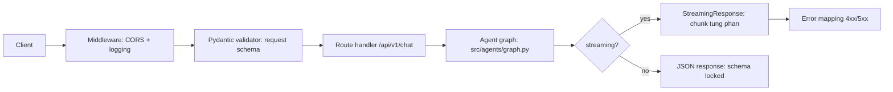

# Chương 8: Phát triển API với FastAPI

Sau khi xây dựng AI Agent ở Chương 4, bạn cần "đóng gói" agent thành một dịch vụ web mà người dùng có thể truy cập. FastAPI là framework Python hiện đại, lý tưởng để xây dựng API cho AI agents. Chương này sẽ hướng dẫn bạn từ cơ bản đến nâng cao — từ việc tạo route đầu tiên đến triển khai streaming response và kết nối với LangGraph agent.

---

## 8.1 FastAPI — Framework hiện đại cho AI

### Tại sao chọn FastAPI?

FastAPI là framework Python được thiết kế đặc biệt cho xây dựng API hiện đại. Nó nổi bật nhờ bốn ưu điểm chính:

**Hiệu năng cao:** FastAPI xây dựng trên Starlette (ASGI) và Pydantic, đạt hiệu năng ngang với NodeJS và Go — nhanh hơn Flask và Django đáng kể. Khi bạn xử lý hàng ngàn request đến AI agent, hiệu năng này tạo sự khác biệt lớn.

**Async-first:** AI agents thường gọi LLM API, search API, và database — tất cả đều là I/O-bound operations. FastAPI hỗ trợ async/await native, cho phép xử lý nhiều request đồng thời mà không block thread. Điều này quan trọng vì một request đến AI agent có thể mất 5-30 giây để hoàn thành.

**Auto-documentation:** FastAPI tự động sinh OpenAPI (Swagger) documentation từ code. Mỗi route, parameter, request body, và response model đều được document tự động. Bạn không cần viết API docs thủ công — docs luôn đồng bộ với code.

**Type-safe:** Pydantic validation tích hợp sâu giúp bắt lỗi early — sai kiểu dữ liệu, thiếu field, giá trị ngoài range — tất cả được phát hiện trước khi logic xử lý chạy. Điều này giảm bug và tăng độ tin cậy.

### So sánh với Flask và Django

| Tiêu chí | FastAPI | Flask | Django |
|-----------|---------|-------|--------|
| Async | Native async | WSGI (sync), cần extension | ASGI từ Django 3.0 |
| API Docs | Tự động (Swagger) | Cần Flask-RESTX | Cần DRF + drf-spectacular |
| Validation | Pydantic tích hợp | Cài thêm | Django forms / DRF serializers |
| Hiệu năng | Rất cao | Trung bình | Trung bình |
| Learning curve | Dễ | Rất dễ | Khá khó |
| Phù hợp cho | API, microservices | Small apps, prototypes | Full-stack web apps |

FastAPI là lựa chọn đúng khi bạn xây dựng **API backend cho AI application**. Flask phù hợp cho prototype nhanh, nhưng thiếu async và auto-docs. Django quá nặng cho API-only service.

### Khi nào FastAPI là lựa chọn đúng?

FastAPI là lựa chọn tuyệt vời khi:
- Bạn xây dựng API backend (không render HTML)
- Cần async (gọi nhiều API bên ngoài, I/O nặng)
- Muốn auto-documentation cho team collaboration
- Xây dựng microservices hoặc serverless functions
- Cần type validation mạnh mẽ

FastAPI có thể không phù hợp khi:
- Cần render HTML templates (dùng Django hoặc Flask thay)
- Project nhỏ, prototype nhanh không cần production-ready
- Team đã quen Django và không muốn học framework mới

> 💡 **MẸO:** Cài đặt FastAPI kèm uvicorn (ASGI server) để chạy: `pip install fastapi uvicorn`. Uvicorn là server ASGI hiệu năng cao, tương tự như Gunicorn cho WSGI. Trong production, chạy uvicorn với multiple workers: `uvicorn src.main:app --workers 4`.

---



## 8.2 Routes và Schemas

### Định nghĩa Routes

Route (tuyến) là điểm truy cập vào API. Mỗi route kết hợp HTTP method (GET, POST, PUT, DELETE) với URL path:

```python
from fastapi import FastAPI

app = FastAPI(
    title="AI20K Agent API",
    description="API cho AI Agent xây dựng với LangGraph",
    version="1.0.0",
)

@app.get("/")
async def root():
    """Health check endpoint."""
    return {"status": "ok", "message": "AI20K Agent API đang chạy"}

@app.get("/health")
async def health_check():
    """Kiểm tra sức khỏe hệ thống."""
    return {
        "status": "healthy",
        "version": "1.0.0",
    }

@app.post("/api/v1/chat")
async def chat(request: ChatRequest):
    """Xử lý tin nhắn từ người dùng."""
    # Xử lý logic...
    return {"response": "..."}
```

### Pydantic Request/Response Models

Pydantic models định nghĩa cấu trúc dữ liệu cho request và response. Đây là "hợp đồng" giữa client và server:

```python
from pydantic import BaseModel, Field
from typing import Optional
from datetime import datetime

class ChatRequest(BaseModel):
    """Schema cho request chat."""
    message: str = Field(
        ...,  # ... nghĩa là bắt buộc (required)
        min_length=1,
        max_length=5000,
        description="Tin nhắn từ người dùng",
        examples=["GDP Việt Nam năm 2024 là bao nhiêu?"]
    )
    conversation_id: Optional[str] = Field(
        None,
        description="ID cuộc hội thoại (mặc định: tạo mới)",
    )
    stream: bool = Field(
        False,
        description="Có stream response không",
    )

class ChatResponse(BaseModel):
    """Schema cho response chat."""
    response: str = Field(description="Câu trả lời từ agent")
    conversation_id: str = Field(description="ID cuộc hội thoại")
    sources: list[str] = Field(
        default_factory=list,
        description="Nguồn tham khảo",
    )
    timestamp: datetime = Field(
        default_factory=datetime.now,
        description="Thời gian phản hồi",
    )

# Sử dụng trong route
@app.post("/api/v1/chat", response_model=ChatResponse)
async def chat(request: ChatRequest):
    """Xử lý tin nhắn chat với agent."""
    # Logic xử lý...
    return ChatResponse(
        response="Câu trả lời mẫu",
        conversation_id=request.conversation_id or "new-id",
        sources=["source1", "source2"],
    )
```

### Field Validators

Pydantic cho phép thêm validation phức tạp với validators:

```python
from pydantic import BaseModel, Field, field_validator

class QueryRequest(BaseModel):
    """Request cho agent research."""
    query: str = Field(
        ...,
        min_length=3,
        max_length=1000,
    )
    max_iterations: int = Field(
        default=3,
        ge=1,   # greater than or equal
        le=10,  # less than or equal
    )
    
    @field_validator("query")
    @classmethod
    def validate_query(cls, v: str) -> str:
        """Chuẩn hóa query."""
        v = v.strip()
        if not v:
            raise ValueError("Query không được rỗng")
        return v
```

### API Versioning

Luôn version API để duy trì khả năng tương thích:

```python
from fastapi import APIRouter

# Tạo router cho v1
v1_router = APIRouter(prefix="/api/v1")

@v1_router.post("/chat", response_model=ChatResponse)
async def chat_v1(request: ChatRequest):
    """Chat endpoint version 1."""
    return ChatResponse(
        response="Response v1",
        conversation_id="id",
    )

# Router cho v2 (khi cần thay đổi API mà không break v1)
v2_router = APIRouter(prefix="/api/v2")

@v2_router.post("/chat", response_model=ChatResponseV2)
async def chat_v2(request: ChatRequestV2):
    """Chat endpoint version 2 — hỗ trợ streaming."""
    # Logic mới...
    pass

# Đăng ký routers
app.include_router(v1_router)
app.include_router(v2_router)
```

> 🔑 **ĐIỂM CHÍNH:** Pydantic models là trái tim của FastAPI. Chúng đảm bảo: (1) request đúng format, (2) response đúng schema, (3) auto-documentation luôn chính xác. Luôn định nghĩa rõ request và response models cho mọi endpoint.

---

## 8.3 Validation với Pydantic

Pydantic là thư viện validation mạnh mẽ được tích hợp sâu trong FastAPI. Khi request đến, Pydantic tự động parse và validate data trước khi route handler nhận được. Nếu validation fail, FastAPI tự động trả về 422 Unprocessable Entity với chi tiết lỗi.

### BaseModel

`BaseModel` là base class cho mọi Pydantic model:

```python
from pydantic import BaseModel, Field
from typing import Optional
from enum import Enum

class MessageRole(str, Enum):
    """Vai trò của message."""
    USER = "user"
    ASSISTANT = "assistant"
    SYSTEM = "system"

class Message(BaseModel):
    """Một tin nhắn trong cuộc hội thoại."""
    role: MessageRole
    content: str = Field(..., min_length=1)
    timestamp: Optional[str] = None

class ConversationContext(BaseModel):
    """Ngữ cảnh cuộc hội thoại."""
    conversation_id: str
    user_id: Optional[str] = None
    history: list[Message] = Field(default_factory=list)
```

### Field Constraints

Pydantic cung cấp nhiều constraint qua `Field`:

```python
from pydantic import BaseModel, Field
from typing import Literal

class AgentConfig(BaseModel):
    """Cấu hình cho agent."""
    # Danh sách model cập nhật 2026-09 — review mỗi cohort (xem cost-management.md).
    # gpt-3.5-turbo đã bị retire — KHÔNG dùng nữa.
    model: Literal["gpt-4o", "gpt-4o-mini", "gpt-4.1",
                   "claude-sonnet-4-5", "claude-haiku-4-5",
                   "gemini-2.5-pro", "gemini-2.5-flash"] = Field(
        default="gpt-4o-mini",
        description="LLM model sử dụng",
    )
    temperature: float = Field(
        default=0.7,
        ge=0.0,    # >= 0.0
        le=2.0,    # <= 2.0
        description="Nhiệt độ sinh text",
    )
    max_tokens: int = Field(
        default=2048,
        gt=0,      # > 0
        le=8192,   # <= 8192
    )
    tools: list[str] = Field(
        default_factory=lambda: ["web_search"],
        description="Danh sách tools agent có thể sử dụng",
    )
```

### Custom Validators

```python
from pydantic import BaseModel, Field, field_validator, model_validator

class ResearchRequest(BaseModel):
    """Request cho agent nghiên cứu."""
    query: str = Field(..., min_length=3, max_length=2000)
    depth: Literal["shallow", "medium", "deep"] = "medium"
    language: str = "vi"
    
    @field_validator("query")
    @classmethod
    def clean_query(cls, v: str) -> str:
        """Loại bỏ khoảng trắng thừa."""
        return " ".join(v.split())
    
    @field_validator("language")
    @classmethod
    def validate_language(cls, v: str) -> str:
        """Chỉ hỗ trợ tiếng Việt và tiếng Anh."""
        v = v.lower()
        if v not in ["vi", "en"]:
            raise ValueError("Chỉ hỗ trợ ngôn ngữ: vi (tiếng Việt), en (tiếng Anh)")
        return v
    
    @model_validator(mode="after")
    def validate_depth_for_query(self):
        """Deep research chỉ cho query dài."""
        if self.depth == "deep" and len(self.query) < 20:
            raise ValueError(
                "Deep research yêu cầu query ít nhất 20 ký tự. "
                "Hãy mô tả chi tiết hơn những gì bạn cần nghiên cứu."
            )
        return self
```

### Nested Models

```python
from pydantic import BaseModel

class ToolCall(BaseModel):
    """Một lần gọi tool."""
    tool_name: str
    arguments: dict
    result: str | None = None

class AgentStep(BaseModel):
    """Một bước xử lý của agent."""
    thought: str
    action: str | None = None
    observation: str | None = None

class ChatResponse(BaseModel):
    """Response đầy đủ từ agent."""
    answer: str
    conversation_id: str
    steps: list[AgentStep] = Field(default_factory=list)
    tool_calls: list[ToolCall] = Field(default_factory=list)
    total_tokens: int = 0
    latency_ms: float = 0.0
```

> 💡 **MẸO:** Khi client gửi request sai format, FastAPI tự động trả về 422 với chi tiết lỗi rất hữu ích. Hãy tận dụng tính năng này — đừng validate thủ công trong route handler. Định nghĩa ràng buộc trong Pydantic model là đủ.

---

## 8.4 Error Handling

Xử lý lỗi đúng cách là yếu tố then chốt cho API production. API cần trả về error response có cấu trúc, không leak thông tin nhạy cảm, và giúp client hiểu và xử lý lỗi.

### HTTPException

FastAPI sử dụng `HTTPException` cho error responses:

```python
from fastapi import HTTPException

@app.get("/api/v1/conversations/{conversation_id}")
async def get_conversation(conversation_id: str):
    """Lấy thông tin cuộc hội thoại."""
    conversation = await db.get_conversation(conversation_id)
    
    if not conversation:
        raise HTTPException(
            status_code=404,
            detail=f"Không tìm thấy cuộc hội thoại: {conversation_id}",
        )
    
    return conversation
```

### Global Exception Handler

Bắt tất cả exceptions chưa được xử lý ở global level:

```python
from fastapi import Request
from fastapi.responses import JSONResponse
import logging

logger = logging.getLogger(__name__)

class AgentError(Exception):
    """Lỗi từ agent."""
    def __init__(self, message: str, code: str = "AGENT_ERROR"):
        self.message = message
        self.code = code
        super().__init__(message)

class RateLimitError(Exception):
    """Lỗi rate limit."""
    pass

@app.exception_handler(AgentError)
async def agent_error_handler(request: Request, exc: AgentError):
    """Xử lý lỗi từ agent."""
    logger.warning(f"Agent error: {exc.message}")
    return JSONResponse(
        status_code=503,
        content={
            "error": "agent_error",
            "message": "Agent không thể xử lý yêu cầu. Vui lòng thử lại.",
            "code": exc.code,
        }
    )

@app.exception_handler(RateLimitError)
async def rate_limit_handler(request: Request, exc: RateLimitError):
    """Xử lý lỗi rate limit."""
    return JSONResponse(
        status_code=429,
        content={
            "error": "rate_limit",
            "message": "Quá nhiều yêu cầu. Vui lòng thử lại sau 60 giây.",
            "retry_after": 60,
        }
    )

@app.exception_handler(Exception)
async def global_error_handler(request: Request, exc: Exception):
    """Catch-all — không bao giờ leak internal error."""
    logger.error(f"Unhandled exception: {exc}", exc_info=True)
    return JSONResponse(
        status_code=500,
        content={
            "error": "internal_error",
            "message": "Lỗi hệ thống. Vui lòng thử lại sau.",
            # KHÔNG bao gồm str(exc) — có thể leak thông tin nhạy cảm
        }
    )
```

### Domain Errors to HTTP Codes

Ánh xạ lỗi nghiệp vụ sang HTTP status codes:

```python
from fastapi import HTTPException

class ErrorCode:
    """Tập trung định nghĩa error codes."""
    AGENT_TIMEOUT = ("agent_timeout", 504, "Agent xử lý quá lâu")
    INVALID_QUERY = ("invalid_query", 400, "Câu hỏi không hợp lệ")
    CONVERSATION_NOT_FOUND = ("not_found", 404, "Không tìm thấy cuộc hội thoại")
    RATE_LIMIT = ("rate_limit", 429, "Quá nhiều yêu cầu")
    MODEL_ERROR = ("model_error", 502, "Lỗi từ LLM provider")

def raise_agent_error(code: tuple, detail: str = ""):
    """Helper raise error với cấu trúc chuẩn."""
    error_code, status, message = code
    raise HTTPException(
        status_code=status,
        detail={
            "error": error_code,
            "message": detail or message,
        }
    )

# Sử dụng
@app.post("/api/v1/chat")
async def chat(request: ChatRequest):
    try:
        result = await agent.run(request.message)
    except TimeoutError:
        raise_agent_error(ErrorCode.AGENT_TIMEOUT)
    except ValueError as e:
        raise_agent_error(ErrorCode.INVALID_QUERY, str(e))
    
    return result
```

> ⚠️ **LƯU Ý:** Nguyên tắc bảo mật quan trọng: **KHÔNG BAO GIỜ** expose stack trace, internal error message, hoặc thông tin hệ thống trong 500 responses. Một attacker có thể dùng thông tin này để tìm lỗ hổng. Global exception handler phải "sanitize" mọi error response.

---

## 8.5 CORS và Middleware

### CORS là gì?

CORS (Cross-Origin Resource Sharing) là cơ chế bảo mật của browser. Khi frontend chạy ở `http://localhost:3000` (Next.js) gọi API ở `http://localhost:8000` (FastAPI), browser sẽ block request vì "cross-origin". CORS middleware cho phép bạn chỉ định domain nào được phép gọi API.

### Cấu hình CORS cho Frontend

```python
from fastapi.middleware.cors import CORSMiddleware

app.add_middleware(
    CORSMiddleware,
    allow_origins=[
        "http://localhost:3000",      # Next.js dev server
        "http://localhost:3001",      # Alternative port
        "https://ai20k.yourdomain.com",  # Production frontend
    ],
    allow_credentials=True,           # Cho phép gửi cookies
    allow_methods=["*"],              # Cho phép tất cả HTTP methods
    allow_headers=["*"],              # Cho phép tất cả headers
)

# Cho development — cho phép tất cả origins (KHÔNG dùng trong production)
if os.getenv("ENVIRONMENT") == "development":
    app.add_middleware(
        CORSMiddleware,
        allow_origins=["*"],
        allow_credentials=True,
        allow_methods=["*"],
        allow_headers=["*"],
    )
```

### Logging Middleware với Timing

Middleware chạy trước và sau mỗi request — phù hợp cho logging và monitoring:

```python
import time
import logging
from fastapi import Request

logger = logging.getLogger("api")

@app.middleware("http")
async def logging_middleware(request: Request, call_next):
    """Log mọi request với thời gian xử lý."""
    start_time = time.time()
    
    # Log request
    logger.info(f"→ {request.method} {request.url.path}")
    
    try:
        response = await call_next(request)
    except Exception as e:
        # Log lỗi
        duration = (time.time() - start_time) * 1000
        logger.error(
            f"✗ {request.method} {request.url.path} "
            f"ERROR {duration:.0f}ms — {str(e)}"
        )
        raise
    
    # Log response
    duration = (time.time() - start_time) * 1000
    logger.info(
        f"← {request.method} {request.url.path} "
        f"{response.status_code} {duration:.0f}ms"
    )
    
    # Thêm timing header
    response.headers["X-Process-Time"] = f"{duration:.0f}ms"
    return response
```

### Rate Limiting

```python
from fastapi import Request, HTTPException
from collections import defaultdict
import time

# Simple in-memory rate limiter (dùng Redis trong production)
rate_limits: dict[str, list[float]] = defaultdict(list)

RATE_LIMIT = 30  # 30 requests
RATE_WINDOW = 60  # per 60 seconds

@app.middleware("http")
async def rate_limit_middleware(request: Request, call_next):
    """Giới hạn số request per IP."""
    client_ip = request.client.host
    
    # Clean old entries
    now = time.time()
    rate_limits[client_ip] = [
        t for t in rate_limits[client_ip]
        if now - t < RATE_WINDOW
    ]
    
    # Check limit
    if len(rate_limits[client_ip]) >= RATE_LIMIT:
        raise HTTPException(
            status_code=429,
            detail=f"Quá nhiều yêu cầu. Thử lại sau {RATE_WINDOW} giây."
        )
    
    rate_limits[client_ip].append(now)
    return await call_next(request)
```

> 💡 **MẸO:** Trong development, dùng `allow_origins=["*"]` để nhanh chóng. Nhưng trong production, luôn chỉ định chính xác domains được phép. Rate limiter in-memory phù hợp cho development; dùng Redis cho production để hoạt động đúng khi chạy multiple workers.

---

## 8.6 Streaming Response

AI agents thường mất nhiều giây để sinh câu trả lời. Streaming response (phản hồi luồng) giúp người dùng thấy câu trả lời từng phần ngay khi LLM sinh ra, thay vì chờ đến khi hoàn thành.

### SSE (Server-Sent Events) Pattern

SSE là chuẩn web cho server push data đến client. FastAPI hỗ trợ SSE qua `StreamingResponse`:

```python
from fastapi.responses import StreamingResponse
import asyncio
import json

@app.post("/api/v1/chat/stream")
async def chat_stream(request: ChatRequest):
    """Stream response từ agent."""
    
    async def event_generator():
        """Generator tạo SSE events."""
        try:
            # Gửi status bắt đầu
            yield f"data: {json.dumps({'type': 'start'})}\n\n"
            
            # Stream từ agent
            async for chunk in agent.astream(request.message):
                event = {
                    "type": "token",
                    "content": chunk,
                }
                yield f"data: {json.dumps(event)}\n\n"
            
            # Gửi status kết thúc
            yield f"data: {json.dumps({'type': 'done'})}\n\n"
            
        except Exception as e:
            error_event = {
                "type": "error",
                "message": "Lỗi khi xử lý. Vui lòng thử lại.",
            }
            yield f"data: {json.dumps(error_event)}\n\n"
    
    return StreamingResponse(
        event_generator(),
        media_type="text/event-stream",
        headers={
            "Cache-Control": "no-cache",
            "Connection": "keep-alive",
            "X-Accel-Buffering": "no",  # Nginx: disable buffering
        },
    )
```

### Async Generators với LangGraph

LangGraph hỗ trợ streaming qua `astream` và `astream_events`:

```python
from langchain_core.messages import HumanMessage

@app.post("/api/v1/agent/stream")
async def agent_stream(request: ChatRequest):
    """Stream response từ LangGraph agent."""
    
    async def stream_generator():
        """Stream tokens từ LangGraph agent."""
        config = {
            "configurable": {
                "thread_id": request.conversation_id or "default",
            }
        }
        
        inputs = {
            "messages": [HumanMessage(content=request.message)]
        }
        
        async for event in agent.astream_events(inputs, config, version="v2"):
            kind = event.get("event")
            
            if kind == "on_chat_model_stream":
                # Token mới từ LLM
                token = event["data"]["chunk"].content
                if token:
                    yield f"data: {json.dumps({'type': 'token', 'content': token})}\n\n"
            
            elif kind == "on_tool_start":
                # Agent bắt đầu gọi tool
                tool_name = event.get("name", "unknown")
                yield f"data: {json.dumps({'type': 'tool_start', 'tool': tool_name})}\n\n"
            
            elif kind == "on_tool_end":
                # Tool hoàn thành
                tool_name = event.get("name", "unknown")
                output = str(event["data"].get("output", ""))[:200]
                yield f"data: {json.dumps({'type': 'tool_end', 'tool': tool_name, 'preview': output})}\n\n"
        
        yield f"data: {json.dumps({'type': 'done'})}\n\n"
    
    return StreamingResponse(
        stream_generator(),
        media_type="text/event-stream",
    )
```

> 🔑 **ĐIỂM CHÍNH:** Streaming là "must-have" cho AI chat applications. Người dùng không muốn nhìn vào màn hình trống trong 10-30 giây. SSE là chuẩn đơn giản nhất — client chỉ cần `EventSource` hoặc `fetch` với `ReadableStream`.

---

## 8.7 Kết nối Agent với API

Phần quan trọng nhất: kết nối LangGraph agent (Chương 4) với FastAPI API. Có hai pattern chính: singleton agent và per-request agent.

### Dependency Injection Pattern

```python
from fastapi import FastAPI, Depends
from langgraph.graph import StateGraph

app = FastAPI(title="AI20K Agent API")

# Agent singleton — chia sẻ giữa requests
class AgentManager:
    """Quản lý agent instance."""
    def __init__(self):
        self._agent = None
    
    async def get_agent(self):
        """Lazy initialization."""
        if self._agent is None:
            # Build graph (từ Chương 4)
            graph = StateGraph(ResearchState)
            graph.add_node("analyze", analyze_node)
            graph.add_node("plan", plan_node)
            graph.add_node("research", research_node)
            graph.add_node("synthesize", synthesize_node)
            graph.add_node("review", review_node)
            graph.add_node("finalize", finalize_node)
            
            graph.add_edge(START, "analyze")
            graph.add_edge("analyze", "plan")
            graph.add_edge("plan", "research")
            graph.add_edge("research", "synthesize")
            graph.add_edge("synthesize", "review")
            graph.add_conditional_edges(
                "review",
                should_continue_research,
                {"research": "research", "finalize": "finalize"}
            )
            graph.add_edge("finalize", END)
            
            self._agent = graph.compile()
        
        return self._agent

agent_manager = AgentManager()

async def get_agent():
    """Dependency injection cho agent."""
    return await agent_manager.get_agent()
```

### Lifespan Pattern

Lifespan pattern cho phép khởi tạo và dọn dẹp tài nguyên khi app start/stop:

```python
from contextlib import asynccontextmanager
from fastapi import FastAPI

@asynccontextmanager
async def lifespan(app: FastAPI):
    """Khởi tạo tài nguyên khi app start, dọn dẹp khi stop."""
    # Startup
    logger.info("Starting AI20K Agent API...")
    app.state.agent = await initialize_agent()
    app.state.vectorstore = await initialize_vectorstore()
    logger.info("Agent và VectorStore đã sẵn sàng")
    
    yield  # App chạy ở đây
    
    # Shutdown
    logger.info("Shutting down...")
    await cleanup_resources()

app = FastAPI(
    title="AI20K Agent API",
    lifespan=lifespan,
)

# Truy cập tài nguyên qua request.app.state
@app.post("/api/v1/chat", response_model=ChatResponse)
async def chat(request: ChatRequest):
    """Chat endpoint sử dụng agent từ lifespan."""
    from langchain_core.messages import HumanMessage
    
    agent = request.app.state.agent
    
    result = await agent.ainvoke({
        "messages": [HumanMessage(content=request.message)],
        "query": request.message,
    })
    
    return ChatResponse(
        response=result.get("draft", "Không thể tạo câu trả lời"),
        conversation_id=request.conversation_id or "new",
        sources=result.get("search_results", []),
    )
```

### Ví dụ hoàn chỉnh

```python
# main.py — File chính chạy API

import os
import logging
from contextlib import asynccontextmanager
from fastapi import FastAPI, HTTPException
from fastapi.middleware.cors import CORSMiddleware
from fastapi.responses import StreamingResponse
from pydantic import BaseModel, Field
from typing import Optional
from datetime import datetime

# Cấu hình logging
logging.basicConfig(level=logging.INFO)
logger = logging.getLogger("ai20k_api")

# ==================== SCHEMAS ====================

class ChatRequest(BaseModel):
    message: str = Field(..., min_length=1, max_length=5000)
    conversation_id: Optional[str] = None
    stream: bool = False

class ChatResponse(BaseModel):
    response: str
    conversation_id: str
    sources: list[str] = []
    timestamp: datetime = Field(default_factory=datetime.now)

class HealthResponse(BaseModel):
    status: str
    version: str
    agent_ready: bool

# ==================== LIFESPAN ====================

@asynccontextmanager
async def lifespan(app: FastAPI):
    # Startup
    logger.info("Khởi tạo AI20K Agent API...")
    from src.agents.graph import build_graph
    app.state.agent = build_graph()
    logger.info("Agent đã sẵn sàng!")
    
    yield
    
    # Shutdown
    logger.info("Đóng API...")

# ==================== APP ====================

app = FastAPI(
    title="AI20K Agent API",
    version="1.0.0",
    lifespan=lifespan,
)

# CORS
app.add_middleware(
    CORSMiddleware,
    allow_origins=os.getenv("ALLOWED_ORIGINS", "http://localhost:3000").split(","),
    allow_credentials=True,
    allow_methods=["*"],
    allow_headers=["*"],
)

# ==================== ROUTES ====================

@app.get("/health", response_model=HealthResponse)
async def health():
    return HealthResponse(
        status="healthy",
        version="1.0.0",
        agent_ready=hasattr(app.state, "agent"),
    )

@app.post("/api/v1/chat", response_model=ChatResponse)
async def chat(request: ChatRequest):
    """Chat với agent — trả về response hoàn chỉnh."""
    from langchain_core.messages import HumanMessage
    
    agent = app.state.agent
    
    try:
        result = await agent.ainvoke({
            "messages": [HumanMessage(content=request.message)],
            "query": request.message,
        })
    except TimeoutError:
        raise HTTPException(status_code=504, detail="Agent timeout")
    except Exception as e:
        logger.error(f"Agent error: {e}", exc_info=True)
        raise HTTPException(status_code=503, detail="Agent không khả dụng")
    
    return ChatResponse(
        response=result.get("draft", "Không thể tạo câu trả lời"),
        conversation_id=request.conversation_id or "conv-001",
        sources=result.get("search_results", []),
    )

@app.post("/api/v1/chat/stream")
async def chat_stream(request: ChatRequest):
    """Chat với agent — stream response."""
    import json
    from langchain_core.messages import HumanMessage
    
    agent = app.state.agent
    
    async def generate():
        try:
            async for event in agent.astream_events(
                {"messages": [HumanMessage(content=request.message)]},
                config={"configurable": {"thread_id": request.conversation_id or "default"}},
                version="v2",
            ):
                if event["event"] == "on_chat_model_stream":
                    token = event["data"]["chunk"].content
                    if token:
                        yield f"data: {json.dumps({'type': 'token', 'content': token})}\n\n"
            
            yield f"data: {json.dumps({'type': 'done'})}\n\n"
        except Exception as e:
            yield f"data: {json.dumps({'type': 'error', 'message': str(e)})}\n\n"
    
    return StreamingResponse(generate(), media_type="text/event-stream")

# ==================== RUN ====================

if __name__ == "__main__":
    import uvicorn
    uvicorn.run(
        "main:app",
        host="0.0.0.0",
        port=8000,
        reload=True,  # Auto-reload khi code thay đổi (development only)
    )
```

> 🔑 **ĐIỂM CHÍNH:** Lifespan pattern là cách đúng để khởi tạo LangGraph agent trong FastAPI. Agent được tạo một lần khi app start và được tái sử dụng cho mọi request. Điều này tránh overhead tạo graph mỗi request và cho phép agent duy trì state (nếu dùng checkpointer).

---

## Tóm tắt

1. **FastAPI** là framework lý tưởng cho AI API: async-first, auto-docs, type-safe. Chọn FastAPI khi xây dựng API backend cho AI applications.

2. **Routes + Schemas** là nền tảng: định nghĩa routes rõ ràng, dùng Pydantic models cho request/response, version API từ đầu.

3. **Pydantic Validation** giúp bắt lỗi early: dùng Field constraints, custom validators, và nested models để đảm bảo data integrity.

4. **Error Handling** cần global handler: ánh xạ domain errors sang HTTP codes, không leak internal errors, log mọi thứ.

5. **CORS + Middleware** là lớp bảo vệ: cấu hình CORS đúng cho frontend, thêm logging/timing middleware, rate limiting cho production.

6. **Streaming** là must-have cho AI chat: dùng SSE pattern với `StreamingResponse`, stream từ LangGraph qua `astream_events`.

7. **Kết nối Agent** dùng lifespan pattern: khởi tạo agent khi app start, tái sử dụng qua `app.state`, dependency injection cho testability.

---

## Câu hỏi ôn tập

1. Tại sao FastAPI phù hợp hơn Flask cho AI agent API? Nêu ít nhất 3 lý do cụ thể.

2. Viết Pydantic model cho `TranslationRequest` với: `text` (bắt buộc, 1-10000 ký tự), `source_lang` (mặc định "auto"), `target_lang` (bắt buộc, chỉ "vi" hoặc "en"). Thêm validator kiểm tra `source_lang` khác `target_lang`.

3. Giải thích tại sao cần CORS middleware. Điều gì xảy ra nếu frontend ở `localhost:3000` gọi API ở `localhost:8000` mà không có CORS?

4. So sánh streaming response và regular response. Khi nào nên dùng mỗi loại?

5. Viết route `POST /api/v1/agent/stream` stream response từ LangGraph agent. Xử lý cả trường hợp agent throw error.
