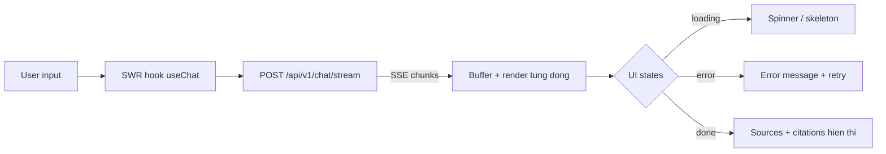

# Chương 9: Giao diện người dùng

Sau khi xây dựng AI Agent (Chương 4) và API backend (Chương 8), bạn cần giao diện người dùng (UI) để người dùng tương tác với agent. Chương này hướng dẫn xây dựng frontend chat application với Next.js — từ setup dự án đến hiển thị streaming response từ AI agent.

> 💡 **MẸO:** Nếu thời gian có hạn và bạn cần prototype nhanh cho demo, hãy bắt đầu với **Streamlit** (xem phần 6.0 bên dưới). Sau khi prototype ổn định, bạn có thể migrate sang Next.js cho giao diện polished hơn.

---

## 9.0 Streamlit — Prototype trong 30 phút

Nếu bạn chưa biết React/Next.js hoặc cần giao diện demo nhanh nhất có thể, **Streamlit** là lựa chọn tuyệt vời. Chỉ cần Python — không cần JavaScript, không cần npm, không cần frontend knowledge. Bạn có thể tạo giao diện chat hoàn chỉnh trong dưới 30 phút.

### Cài đặt và chạy

```bash
pip install streamlit requests
```

Tạo file `app.py` ở thư mục gốc:

```python
# app.py — Streamlit Chat UI cho AI Agent
import streamlit as st
import requests
import json

# Page config
st.set_page_config(
    page_title="AI20K Agent",
    page_icon="🤖",
    layout="wide",
)

# Initialize chat history
if "messages" not in st.session_state:
    st.session_state.messages = []

# Title
st.title("🤖 AI20K Agent")
st.caption("Trợ lý AI thông minh — Powered by LangGraph")

# Display chat history
for message in st.session_state.messages:
    with st.chat_message(message["role"]):
        st.markdown(message["content"])

# Chat input
if prompt := st.chat_input("Nhập câu hỏi..."):
    # Add user message
    st.session_state.messages.append({"role": "user", "content": prompt})
    with st.chat_message("user"):
        st.markdown(prompt)

    # Call API
    with st.chat_message("assistant"):
        API_URL = "http://localhost:8000/api/v1/chat"
        
        with st.spinner("Đang suy nghĩ..."):
            try:
                response = requests.post(
                    API_URL,
                    json={"message": prompt},
                    timeout=60,
                )
                response.raise_for_status()
                data = response.json()
                answer = data.get("response", "Không có câu trả lời.")
            except requests.exceptions.ConnectionError:
                answer = "❌ Không thể kết nối đến API. Đảm bảo server đang chạy: `make run`"
            except requests.exceptions.Timeout:
                answer = "⏱️ Agent phản hồi quá lâu. Thử lại với câu hỏi ngắn hơn."
            except Exception as e:
                answer = f"❌ Lỗi: {str(e)}"

        st.markdown(answer)

    st.session_state.messages.append({"role": "assistant", "content": answer})

# Sidebar — Info
with st.sidebar:
    st.header("Thông tin")
    st.write(f"Số tin nhắn: {len(st.session_state.messages)}")
    if st.button("Xóa lịch sử"):
        st.session_state.messages = []
        st.rerun()
    
    st.divider()
    st.caption("AI20K Build Phase — Template Agent")
```

### Chạy ứng dụng

```bash
# Terminal 1: Chạy FastAPI backend
make run

# Terminal 2: Chạy Streamlit frontend
streamlit run app.py --server.port 8501
```

Mở http://localhost:8501 — bạn đã có giao diện chat hoàn chỉnh!

### Streaming với Streamlit

> ⚠️ **LƯU Ý:** Endpoint `/api/v1/chat/stream` chưa có sẵn trong template — bạn cần tự triển khai endpoint này ở backend (xem Chương 8 phần Streaming Response). Các code mẫu dưới đây giả định bạn đã triển khai endpoint streaming.

```python
# Thay phần "Call API" bằng streaming version:
with st.chat_message("assistant"):
    API_URL = "http://localhost:8000/api/v1/chat/stream"
    
    with st.spinner("Đang suy nghĩ..."):
        try:
            response = requests.post(
                API_URL,
                json={"message": prompt, "stream": True},
                stream=True,  # Bật streaming cho requests
                timeout=60,
            )
            
            answer = st.write_stream(
                line.removeprefix("data: ").strip()
                for line in response.iter_lines(decode_unicode=True)
                if line and line.startswith("data: ")
                and not line.endswith('"type": "done"')
            )
        except Exception as e:
            answer = f"❌ Lỗi: {str(e)}"
            st.error(answer)
```

### Khi nào nên dùng Streamlit vs Next.js?

| Tiêu chí | Streamlit | Next.js |
|-----------|-----------|---------|
| Thời gian setup | 30 phút | 2-3 giờ |
| Cần biết | Chỉ Python | Python + JavaScript/React |
| Giao diện | Đẹp mặc định, ít tùy chỉnh | Tùy chỉnh hoàn toàn |
| Streaming | Hỗ trợ | Hỗ trợ |
| Production | Không phù hợp | Phù hợp |
| Demo Day | ✅ Chấp nhận được | ✅ Tốt hơn |

> 🔑 **ĐIỂM CHÍNH:** Streamlit là công cụ **prototype nhanh nhất** cho AI Agent UI. Dùng nó khi bạn cần focus vào Agent logic (Chương 4) hơn là frontend engineering. Nếu team có thành viên biết React, hãy dùng Next.js (phần 6.1 trở đi) cho giao diện polished hơn.

---



## 9.1 Setup Next.js

### Tại sao chọn Next.js?

Next.js là React framework phổ biến nhất hiện nay, cung cấp nhiều tính năng production-ready out-of-the-box: file-based routing (App Router), server-side rendering (SSR), static site generation (SSG), API routes, và optimization tự động. Đối với AI chat application, Next.js là lựa chọn tuyệt vời vì hỗ trợ streaming natively qua App Router và React Server Components.

### Tạo dự án Next.js

Khởi tạo dự án Next.js với TypeScript và Tailwind CSS:

```bash
npx create-next-app@latest ai20k-chat --typescript --tailwind --eslint --app --src-dir --import-alias "@/*"
```

Khi được hỏi các tùy chọn, chọn:
- TypeScript: Yes
- ESLint: Yes
- Tailwind CSS: Yes
- `src/` directory: Yes
- App Router: Yes
- Import alias: `@/*`

### Cấu trúc thư mục (App Router)

Next.js App Router sử dụng file-based routing — mỗi folder trong `app/` tương ứng với một route:

```
ai20k-chat/
├── src/
│   ├── app/
│   │   ├── layout.tsx          # Root layout (bao bọc mọi page)
│   │   ├── page.tsx            # Home page (/)
│   │   ├── globals.css         # Global styles
│   │   ├── chat/
│   │   │   └── page.tsx        # Chat page (/chat)
│   │   └── api/                # API routes (optional backend)
│   ├── components/
│   │   ├── ChatMessage.tsx     # Component hiển thị message
│   │   ├── ChatInput.tsx       # Component input chat
│   │   ├── Sidebar.tsx         # Sidebar navigation
│   │   └── ThemeToggle.tsx     # Toggle dark/light mode
│   ├── hooks/
│   │   └── useChat.ts          # Custom hook cho chat logic
│   ├── lib/
│   │   └── api.ts              # API client functions
│   └── types/
│       └── chat.ts             # TypeScript types
├── tailwind.config.ts
├── next.config.js
├── package.json
└── tsconfig.json
```

### Pages và Layouts

**Root Layout** (`src/app/layout.tsx`) là bao bọc cho toàn bộ ứng dụng:

```tsx
// src/app/layout.tsx
import type { Metadata } from "next";
import { Inter } from "next/font/google";
import "./globals.css";
import { ThemeProvider } from "@/components/ThemeProvider";

const inter = Inter({ subsets: ["latin"] });

export const metadata: Metadata = {
  title: "AI20K Chat",
  description: "AI Agent Chat Application",
};

export default function RootLayout({
  children,
}: {
  children: React.ReactNode;
}) {
  return (
    <html lang="vi" suppressHydrationWarning>
      <body className={inter.className}>
        <ThemeProvider>
          {children}
        </ThemeProvider>
      </body>
    </html>
  );
}
```

**Home Page** (`src/app/page.tsx`):

```tsx
// src/app/page.tsx
import Link from "next/link";

export default function Home() {
  return (
    <main className="flex min-h-screen flex-col items-center justify-center p-8">
      <div className="max-w-2xl text-center">
        <h1 className="text-4xl font-bold mb-4">
          AI20K Agent
        </h1>
        <p className="text-lg text-gray-600 dark:text-gray-400 mb-8">
          Trợ lý AI thông minh sẵn sàng giúp bạn nghiên cứu,
          phân tích và trả lời câu hỏi.
        </p>
        <Link
          href="/chat"
          className="inline-block bg-blue-600 text-white px-6 py-3 rounded-lg
                     hover:bg-blue-700 transition-colors font-medium"
        >
          Bắt đầu trò chuyện
        </Link>
      </div>
    </main>
  );
}
```

**Chat Page** (`src/app/chat/page.tsx`):

```tsx
// src/app/chat/page.tsx
"use client";

import { useState } from "react";
import ChatMessage from "@/components/ChatMessage";
import ChatInput from "@/components/ChatInput";
import { Message } from "@/types/chat";

export default function ChatPage() {
  const [messages, setMessages] = useState<Message[]>([]);
  const [isLoading, setIsLoading] = useState(false);

  const handleSend = async (content: string) => {
    // Thêm user message
    const userMessage: Message = {
      id: Date.now().toString(),
      role: "user",
      content,
      timestamp: new Date(),
    };
    setMessages((prev) => [...prev, userMessage]);
    setIsLoading(true);

    try {
      // Gọi API
      const response = await fetch("http://localhost:8000/api/v1/chat", {
        method: "POST",
        headers: { "Content-Type": "application/json" },
        body: JSON.stringify({ message: content }),
      });

      const data = await response.json();

      const assistantMessage: Message = {
        id: (Date.now() + 1).toString(),
        role: "assistant",
        content: data.response,
        sources: data.sources,
        timestamp: new Date(),
      };
      setMessages((prev) => [...prev, assistantMessage]);
    } catch (error) {
      console.error("Chat error:", error);
    } finally {
      setIsLoading(false);
    }
  };

  return (
    <div className="flex flex-col h-screen max-w-4xl mx-auto">
      {/* Header */}
      <header className="border-b p-4">
        <h1 className="text-xl font-semibold">AI20K Agent</h1>
      </header>

      {/* Messages */}
      <div className="flex-1 overflow-y-auto p-4 space-y-4">
        {messages.length === 0 ? (
          <div className="text-center text-gray-500 mt-20">
            Gửi tin nhắn để bắt đầu trò chuyện
          </div>
        ) : (
          messages.map((msg) => (
            <ChatMessage key={msg.id} message={msg} />
          ))
        )}
        {isLoading && (
          <div className="text-gray-500 animate-pulse">
            Đang suy nghĩ...
          </div>
        )}
      </div>

      {/* Input */}
      <ChatInput onSend={handleSend} disabled={isLoading} />
    </div>
  );
}
```

> 💡 **MẸO:** `"use client"` directive ở đầu file cho Next.js biết đây là Client Component — component chạy ở browser, có thể dùng useState, useEffect, event handlers. Mặc định tất cả components trong App Router là Server Components (chạy ở server). Dùng `"use client"` chỉ khi cần interactivity.

---

## 9.2 Thiết kế responsive

### Tailwind CSS Basics

Tailwind CSS là utility-first CSS framework — thay vì viết CSS classes riêng, bạn kết hợp các utility classes để tạo giao diện. Mỗi class làm một việc duy nhất:

```html
<!-- Padding, margin, background, text -->
<div class="p-4 bg-white rounded-lg shadow-md">
  <h2 class="text-xl font-bold text-gray-900 mb-2">Tiêu đề</h2>
  <p class="text-gray-600 leading-relaxed">Nội dung...</p>
</div>
```

Các utility class phổ biến:
- **Spacing:** `p-4` (padding), `m-4` (margin), `gap-2` (gap in flex/grid)
- **Sizing:** `w-full`, `h-screen`, `max-w-4xl`, `min-h-screen`
- **Typography:** `text-sm`, `font-bold`, `text-gray-600`, `leading-relaxed`
- **Layout:** `flex`, `grid`, `items-center`, `justify-between`
- **Visual:** `bg-white`, `rounded-lg`, `shadow-md`, `border`
- **Interactivity:** `hover:bg-blue-700`, `focus:ring-2`, `transition-colors`

### Responsive Breakpoints

Tailwind sử dụng mobile-first approach — thiết kế cho mobile trước, rồi thêm styles cho screen lớn hơn:

```html
<!-- Mobile: 1 column, Tablet: 2 columns, Desktop: 3 columns -->
<div class="grid grid-cols-1 md:grid-cols-2 lg:grid-cols-3 gap-4">
  <div>Card 1</div>
  <div>Card 2</div>
  <div>Card 3</div>
</div>
```

Breakpoints:
- Mặc định (không prefix): 0px+ (mobile)
- `sm:`: 640px+ (large phone)
- `md:`: 768px+ (tablet)
- `lg:`: 1024px+ (laptop)
- `xl:`: 1280px+ (desktop)
- `2xl:`: 1536px+ (large desktop)

### Mobile-first Design

Thiết kế cho mobile trước, rồi mở rộng cho desktop:

```tsx
// ChatLayout với responsive sidebar
export default function ChatLayout({
  children,
}: {
  children: React.ReactNode;
}) {
  return (
    <div className="flex h-screen">
      {/* Sidebar: ẩn trên mobile, hiện trên desktop */}
      <aside className="hidden md:flex md:w-64 lg:w-80 flex-col border-r bg-gray-50 dark:bg-gray-900">
        <div className="p-4 border-b">
          <h2 className="font-semibold">Lịch sử chat</h2>
        </div>
        <nav className="flex-1 overflow-y-auto p-2">
          {/* Danh sách conversations */}
        </nav>
      </aside>

      {/* Main content */}
      <main className="flex-1 flex flex-col min-w-0">
        {children}
      </main>
    </div>
  );
}
```

### Grid Layout cho Chat

```tsx
// Dashboard layout với grid
export default function Dashboard() {
  return (
    <div className="grid grid-cols-1 lg:grid-cols-4 gap-4 p-4 h-screen">
      {/* Sidebar */}
      <div className="lg:col-span-1 border rounded-lg p-4">
        <h3 className="font-semibold mb-4">Conversations</h3>
        {/* List */}
      </div>

      {/* Chat area */}
      <div className="lg:col-span-2 border rounded-lg flex flex-col">
        <div className="flex-1 overflow-y-auto p-4">
          {/* Messages */}
        </div>
        <div className="border-t p-4">
          {/* Input */}
        </div>
      </div>

      {/* Info panel */}
      <div className="lg:col-span-1 border rounded-lg p-4">
        <h3 className="font-semibold mb-4">Thông tin</h3>
        {/* Sources, metadata */}
      </div>
    </div>
  );
}
```

> 🔑 **ĐIỂM CHÍNH:** Nguyên tắc mobile-first: viết styles cho mobile trước (không prefix), rồi thêm responsive overrides với `md:`, `lg:`. Điều này đảm bảo giao diện hoạt động trên mọi thiết bị mà không cần media queries thủ công.

> 💡 **MẸO:** Dùng `min-w-0` trên flex/grid children để text không tràn ra ngoài container. Đây là lỗi phổ biến: nội dung dài làm vỡ layout. `min-w-0` cho phép text truncation hoạt động đúng.

---

## 9.3 Dark Mode

### Tại sao cần Dark Mode?

Dark mode không chỉ là xu hướng — nó giảm mỏi mắt khi đọc trong môi trường tối, tiết kiệm pin trên màn hình OLED, và nhiều người dùng đơn giản là thích hơn. Một ứng dụng AI chat hiện đại cần hỗ trợ cả light và dark mode.

### Setup với next-themes

`next-themes` là thư viện phổ biến nhất cho dark mode trong Next.js:

```bash
npm install next-themes
```

### Theme Provider

Tạo ThemeProvider component bao bọc toàn bộ app:

```tsx
// src/components/ThemeProvider.tsx
"use client";

import { ThemeProvider as NextThemesProvider } from "next-themes";
import { ReactNode } from "react";

export function ThemeProvider({ children }: { children: ReactNode }) {
  return (
    <NextThemesProvider
      attribute="class"       // Thêm class "dark" vào <html>
      defaultTheme="system"   // Theo hệ điều hành
      enableSystem={true}     // Cho phép auto-detect system theme
      disableTransitionOnChange  // Tránh flash khi chuyển theme
    >
      {children}
    </NextThemesProvider>
  );
}
```

### Toggle Component

```tsx
// src/components/ThemeToggle.tsx
"use client";

import { useTheme } from "next-themes";
import { useEffect, useState } from "react";

export default function ThemeToggle() {
  const { theme, setTheme } = useTheme();
  const [mounted, setMounted] = useState(false);

  // Chỉ render toggle sau khi mount (tránh hydration mismatch)
  useEffect(() => {
    setMounted(true);
  }, []);

  if (!mounted) {
    return <div className="w-10 h-10" />; // Placeholder tránh layout shift
  }

  return (
    <button
      onClick={() => setTheme(theme === "dark" ? "light" : "dark")}
      className="p-2 rounded-lg hover:bg-gray-100 dark:hover:bg-gray-800 transition-colors"
      aria-label="Chuyển đổi theme"
    >
      {theme === "dark" ? (
        // Sun icon cho dark mode
        <svg className="w-5 h-5" fill="none" viewBox="0 0 24 24" stroke="currentColor">
          <path strokeLinecap="round" strokeLinejoin="round" strokeWidth={2}
            d="M12 3v1m0 16v1m9-9h-1M4 12H3m15.364 6.364l-.707-.707M6.343 6.343l-.707-.707m12.728 0l-.707.707M6.343 17.657l-.707.707M16 12a4 4 0 11-8 0 4 4 0 018 0z"
          />
        </svg>
      ) : (
        // Moon icon cho light mode
        <svg className="w-5 h-5" fill="none" viewBox="0 0 24 24" stroke="currentColor">
          <path strokeLinecap="round" strokeLinejoin="round" strokeWidth={2}
            d="M20.354 15.354A9 9 0 018.646 3.646 9.003 9.003 0 0012 21a9.003 9.003 0 008.354-5.646z"
          />
        </svg>
      )}
    </button>
  );
}
```

### Tailwind Dark Mode Configuration

Cấu hình Tailwind để hỗ trợ dark mode qua class:

```javascript
// tailwind.config.ts
import type { Config } from "tailwindcss";

const config: Config = {
  darkMode: "class",  // Sử dụng class strategy (tương thích next-themes)
  content: [
    "./src/pages/**/*.{js,ts,jsx,tsx,mdx}",
    "./src/components/**/*.{js,ts,jsx,tsx,mdx}",
    "./src/app/**/*.{js,ts,jsx,tsx,mdx}",
  ],
  theme: {
    extend: {},
  },
  plugins: [],
};

export default config;
```

### Sử dụng Dark Mode trong Components

Tailwind cung cấp `dark:` prefix cho mọi utility class:

```tsx
// Message component hỗ trợ dark mode
export default function ChatMessage({ message }: { message: Message }) {
  const isUser = message.role === "user";

  return (
    <div className={`flex ${isUser ? "justify-end" : "justify-start"}`}>
      <div
        className={`max-w-[80%] rounded-2xl px-4 py-3 ${
          isUser
            ? "bg-blue-600 text-white"          // User message: blue
            : "bg-gray-100 dark:bg-gray-800 text-gray-900 dark:text-gray-100"  // AI message: gray
        }`}
      >
        <p className="whitespace-pre-wrap">{message.content}</p>
        {message.sources && message.sources.length > 0 && (
          <div className="mt-2 pt-2 border-t border-gray-200 dark:border-gray-700">
            <p className="text-xs text-gray-500 dark:text-gray-400">Nguồn:</p>
            {message.sources.map((src, i) => (
              <p key={i} className="text-xs text-gray-400 dark:text-gray-500 truncate">
                {src}
              </p>
            ))}
          </div>
        )}
      </div>
    </div>
  );
}
```

> ⚠️ **LƯU Ý:** Luôn xử lý hydration mismatch khi dùng `next-themes`. Theme được xác định ở client, nên server và client có thể khác nhau. Pattern `mounted` state (như trong ThemeToggle) giải quyết vấn đề này — chỉ render UI phụ thuộc theme sau khi component đã mount.

---

## 9.4 Kết nối với API

### Fetch API

Cách cơ bản nhất để gọi API từ frontend:

```typescript
// src/lib/api.ts
const API_BASE = process.env.NEXT_PUBLIC_API_URL || "http://localhost:8000";

export interface ChatRequest {
  message: string;
  conversation_id?: string;
  stream?: boolean;
}

export interface ChatResponse {
  response: string;
  conversation_id: string;
  sources: string[];
  timestamp: string;
}

export async function sendMessage(
  request: ChatRequest
): Promise<ChatResponse> {
  const response = await fetch(`${API_BASE}/api/v1/chat`, {
    method: "POST",
    headers: { "Content-Type": "application/json" },
    body: JSON.stringify(request),
  });

  if (!response.ok) {
    throw new Error(`API error: ${response.status}`);
  }

  return response.json();
}
```

### SWR (Stale-While-Revalidate)

SWR là thư viện data fetching từ Vercel (tác giả Next.js). Nó cung cấp caching, revalidation, optimistic UI, và error handling:

```bash
npm install swr
```

```tsx
// src/hooks/useChat.ts
"use client";

import { useState, useCallback } from "react";
import { Message } from "@/types/chat";
import { sendMessage } from "@/lib/api";

export function useChat() {
  const [messages, setMessages] = useState<Message[]>([]);
  const [isLoading, setIsLoading] = useState(false);
  const [error, setError] = useState<string | null>(null);

  const send = useCallback(async (content: string) => {
    setIsLoading(true);
    setError(null);

    // Optimistic update: thêm user message ngay lập tức
    const userMsg: Message = {
      id: Date.now().toString(),
      role: "user",
      content,
      timestamp: new Date().toISOString(),
    };
    setMessages((prev) => [...prev, userMsg]);

    try {
      const data = await sendMessage({ message: content });

      const assistantMsg: Message = {
        id: (Date.now() + 1).toString(),
        role: "assistant",
        content: data.response,
        sources: data.sources,
        timestamp: data.timestamp,
      };
      setMessages((prev) => [...prev, assistantMsg]);
    } catch (err) {
      setError(
        err instanceof Error ? err.message : "Lỗi không xác định"
      );
    } finally {
      setIsLoading(false);
    }
  }, []);

  const clear = useCallback(() => {
    setMessages([]);
    setError(null);
  }, []);

  return { messages, isLoading, error, send, clear };
}
```

### Error Handling

```tsx
// src/components/ChatError.tsx
export default function ChatError({
  error,
  onRetry,
}: {
  error: string;
  onRetry: () => void;
}) {
  return (
    <div className="flex items-center gap-3 p-4 bg-red-50 dark:bg-red-900/20 rounded-lg">
      <svg className="w-5 h-5 text-red-500 shrink-0" fill="none" viewBox="0 0 24 24" stroke="currentColor">
        <path strokeLinecap="round" strokeLinejoin="round" strokeWidth={2}
          d="M12 8v4m0 4h.01M21 12a9 9 0 11-18 0 9 9 0 0118 0z"
        />
      </svg>
      <p className="text-sm text-red-700 dark:text-red-300 flex-1">{error}</p>
      <button
        onClick={onRetry}
        className="text-sm text-red-600 dark:text-red-400 underline hover:no-underline"
      >
        Thử lại
      </button>
    </div>
  );
}
```

### Loading States

```tsx
// src/components/ChatInput.tsx
"use client";

import { useState, KeyboardEvent } from "react";

interface ChatInputProps {
  onSend: (message: string) => void;
  disabled?: boolean;
}

export default function ChatInput({ onSend, disabled }: ChatInputProps) {
  const [input, setInput] = useState("");

  const handleSend = () => {
    const trimmed = input.trim();
    if (!trimmed || disabled) return;
    onSend(trimmed);
    setInput("");
  };

  const handleKeyDown = (e: KeyboardEvent<HTMLTextAreaElement>) => {
    if (e.key === "Enter" && !e.shiftKey) {
      e.preventDefault();
      handleSend();
    }
  };

  return (
    <div className="border-t p-4 dark:border-gray-800">
      <div className="flex gap-2 max-w-4xl mx-auto">
        <textarea
          value={input}
          onChange={(e) => setInput(e.target.value)}
          onKeyDown={handleKeyDown}
          placeholder="Nhập câu hỏi..."
          rows={1}
          disabled={disabled}
          className="flex-1 resize-none rounded-lg border border-gray-300 dark:border-gray-700
                     bg-white dark:bg-gray-800 px-4 py-2.5 text-sm
                     focus:outline-none focus:ring-2 focus:ring-blue-500
                     disabled:opacity-50 disabled:cursor-not-allowed"
        />
        <button
          onClick={handleSend}
          disabled={disabled || !input.trim()}
          className="bg-blue-600 text-white px-4 py-2.5 rounded-lg font-medium
                     hover:bg-blue-700 disabled:opacity-50 disabled:cursor-not-allowed
                     transition-colors"
        >
          {disabled ? "Đang gửi..." : "Gửi"}
        </button>
      </div>
    </div>
  );
}
```

> 💡 **MẸO:** Luôn xử lý ba trạng thái cho mọi async operation: loading (hiển thị spinner/skeleton), success (hiển thị data), và error (hiển thị error message + retry button). Đây là pattern UI cơ bản nhưng nhiều developer bỏ quên.

---

## 9.5 Hiển thị AI Response

### Chat UI Pattern

Giao diện chat có pattern chuẩn: messages hiển thị theo thứ tự thời gian, user message bên phải, AI message bên trái, input ở dưới cùng:

```tsx
// src/components/ChatMessage.tsx
"use client";

import { Message } from "@/types/chat";

interface ChatMessageProps {
  message: Message;
}

export default function ChatMessage({ message }: ChatMessageProps) {
  const isUser = message.role === "user";

  return (
    <div className={`flex ${isUser ? "justify-end" : "justify-start"} mb-4`}>
      {/* Avatar */}
      {!isUser && (
        <div className="w-8 h-8 rounded-full bg-blue-100 dark:bg-blue-900
                        flex items-center justify-center mr-2 shrink-0">
          <span className="text-sm">AI</span>
        </div>
      )}

      {/* Message bubble */}
      <div
        className={`max-w-[80%] rounded-2xl px-4 py-3 ${
          isUser
            ? "bg-blue-600 text-white rounded-br-md"
            : "bg-gray-100 dark:bg-gray-800 text-gray-900 dark:text-gray-100 rounded-bl-md"
        }`}
      >
        {/* Nội dung: markdown rendering */}
        <div className="prose prose-sm dark:prose-invert max-w-none">
          {message.content}
        </div>

        {/* Sources */}
        {message.sources && message.sources.length > 0 && (
          <div className="mt-3 pt-3 border-t border-gray-200 dark:border-gray-700">
            <p className="text-xs font-medium opacity-60 mb-1">Nguồn tham khảo:</p>
            {message.sources.map((src, i) => (
              <p key={i} className="text-xs opacity-50 truncate">{src}</p>
            ))}
          </div>
        )}

        {/* Timestamp */}
        <p className="text-xs opacity-40 mt-2">
          {new Date(message.timestamp).toLocaleTimeString("vi-VN")}
        </p>
      </div>
    </div>
  );
}
```

### Streaming Display

Hiển thị response từng token khi nhận được từ SSE stream:

```typescript
// src/lib/stream.ts
export async function streamChat(
  message: string,
  onToken: (token: string) => void,
  onDone: () => void,
  onError: (error: string) => void,
): Promise<void> {
  const API_BASE = process.env.NEXT_PUBLIC_API_URL || "http://localhost:8000";

  try {
    const response = await fetch(`${API_BASE}/api/v1/chat/stream`, {
      method: "POST",
      headers: { "Content-Type": "application/json" },
      body: JSON.stringify({ message, stream: true }),
    });

    if (!response.ok) {
      throw new Error(`API error: ${response.status}`);
    }

    const reader = response.body?.getReader();
    const decoder = new TextDecoder();

    if (!reader) throw new Error("No reader available");

    let buffer = "";

    while (true) {
      const { done, value } = await reader.read();
      if (done) break;

      buffer += decoder.decode(value, { stream: true });

      // Parse SSE events
      const lines = buffer.split("\n");
      buffer = lines.pop() || ""; // Giữ phần chưa hoàn thành

      for (const line of lines) {
        if (line.startsWith("data: ")) {
          const data = JSON.parse(line.slice(6));

          switch (data.type) {
            case "token":
              onToken(data.content);
              break;
            case "done":
              onDone();
              break;
            case "error":
              onError(data.message);
              break;
          }
        }
      }
    }
  } catch (err) {
    onError(err instanceof Error ? err.message : "Lỗi streaming");
  }
}
```

```tsx
// Sử dụng streaming trong component
"use client";

import { useState, useCallback, useRef } from "react";
import { streamChat } from "@/lib/stream";

export function useStreamingChat() {
  const [messages, setMessages] = useState<Message[]>([]);
  const [isStreaming, setIsStreaming] = useState(false);
  const streamRef = useRef<string>("");

  const sendStream = useCallback(async (content: string) => {
    // Thêm user message
    setMessages((prev) => [
      ...prev,
      {
        id: Date.now().toString(),
        role: "user",
        content,
        timestamp: new Date().toISOString(),
      },
    ]);

    // Tạo placeholder cho AI message
    const assistantId = (Date.now() + 1).toString();
    setMessages((prev) => [
      ...prev,
      {
        id: assistantId,
        role: "assistant",
        content: "",
        timestamp: new Date().toISOString(),
      },
    ]);

    setIsStreaming(true);
    streamRef.current = "";

    await streamChat(
      content,
      // onToken: cập nhật message content
      (token) => {
        streamRef.current += token;
        setMessages((prev) =>
          prev.map((msg) =>
            msg.id === assistantId
              ? { ...msg, content: streamRef.current }
              : msg
          )
        );
      },
      // onDone
      () => setIsStreaming(false),
      // onError
      (error) => {
        setMessages((prev) =>
          prev.map((msg) =>
            msg.id === assistantId
              ? { ...msg, content: `Lỗi: ${error}` }
              : msg
          )
        );
        setIsStreaming(false);
      }
    );
  }, []);

  return { messages, isStreaming, sendStream };
}
```

### Markdown Rendering

AI agent thường trả về markdown (headers, lists, code blocks). Hiển thị markdown trong React:

```bash
npm install react-markdown remark-gfm rehype-highlight
```

```tsx
// src/components/MarkdownRenderer.tsx
"use client";

import ReactMarkdown from "react-markdown";
import remarkGfm from "remark-gfm";
import rehypeHighlight from "rehype-highlight";

interface MarkdownRendererProps {
  content: string;
}

export default function MarkdownRenderer({ content }: MarkdownRendererProps) {
  return (
    <ReactMarkdown
      remarkPlugins={[remarkGfm]}
      rehypePlugins={[rehypeHighlight]}
      components={{
        // Custom rendering cho code blocks
        code({ inline, className, children, ...props }) {
          if (inline) {
            return (
              <code
                className="bg-gray-100 dark:bg-gray-800 px-1.5 py-0.5 rounded text-sm"
                {...props}
              >
                {children}
              </code>
            );
          }

          return (
            <div className="relative my-3">
              <pre className="bg-gray-900 text-gray-100 rounded-lg p-4 overflow-x-auto">
                <code className={className} {...props}>
                  {children}
                </code>
              </pre>
            </div>
          );
        },
        // Custom rendering cho links
        a({ href, children }) {
          return (
            <a
              href={href}
              target="_blank"
              rel="noopener noreferrer"
              className="text-blue-500 hover:underline"
            >
              {children}
            </a>
          );
        },
        // Custom rendering cho tables
        table({ children }) {
          return (
            <div className="overflow-x-auto my-3">
              <table className="min-w-full border-collapse border border-gray-300 dark:border-gray-700">
                {children}
              </table>
            </div>
          );
        },
      }}
    >
      {content}
    </ReactMarkdown>
  );
}
```

Cập nhật ChatMessage để dùng MarkdownRenderer:

```tsx
// Cập nhật ChatMessage component
import MarkdownRenderer from "./MarkdownRenderer";

// Trong ChatMessage, thay thế:
// <div>{message.content}</div>
// bằng:
<MarkdownRenderer content={message.content} />
```

> 🔑 **ĐIỂM CHÍNH:** Streaming display là yếu tố then chốt cho UX của AI chat. Người dùng thấy câu trả lời xuất hiện từng phần, tạo cảm giác "AI đang suy nghĩ và trả lời". Kết hợp với markdown rendering, bạn có giao diện chat chuyên nghiệp, tương tự ChatGPT.

> 💡 **MẸO:** Thêm cursor blinking animation khi đang stream để người dùng biết AI vẫn đang sinh nội dung:

```css
/* Thêm vào globals.css */
.typing-cursor::after {
  content: "▋";
  animation: blink 1s infinite;
}

@keyframes blink {
  0%, 50% { opacity: 1; }
  51%, 100% { opacity: 0; }
}
```

---

## Tóm tắt

1. **Next.js App Router** cung cấp file-based routing, layouts, và server components. Cấu trúc thư mục rõ ràng: `app/` cho pages, `components/` cho reusable UI, `hooks/` cho custom hooks, `lib/` cho utilities.

2. **Tailwind CSS** với mobile-first approach giúp tạo giao diện responsive nhanh chóng. Dùng `sm:`, `md:`, `lg:` breakpoints và luôn test trên nhiều kích thước màn hình.

3. **Dark mode** với `next-themes` dễ setup: ThemeProvider bao bọc app, `dark:` prefix trong Tailwind classes, xử lý hydration mismatch với `mounted` state.

4. **API integration** cần xử lý ba trạng thái: loading, success, error. Dùng custom hooks (`useChat`, `useStreamingChat`) để tách logic khỏi UI components.

5. **AI response display** cần: chat UI pattern (user phải, AI trái), streaming display qua SSE, và markdown rendering cho code blocks, tables, links.

---

## Câu hỏi ôn tập

1. Giải thích sự khác biệt giữa Server Component và Client Component trong Next.js App Router. Khi nào cần dùng `"use client"`?

2. Thiết kế responsive layout cho chat app: sidebar (conversations) + main chat area + info panel. Sidebar ẩn trên mobile, hiện trên desktop. Viết code Tailwind CSS.

3. Tại sao cần xử lý `mounted` state trong ThemeToggle component? Điều gì xảy ra nếu không xử lý?

4. Viết hàm `streamChat` gọi SSE endpoint và cập nhật UI realtime. Xử lý trường hợp connection bị ngắt giữa chừng.

5. So sánh hai cách hiển thị AI response: chờ response hoàn chỉnh rồi hiển thị vs. streaming từng token. Ưu/nhược điểm của mỗi cách?
