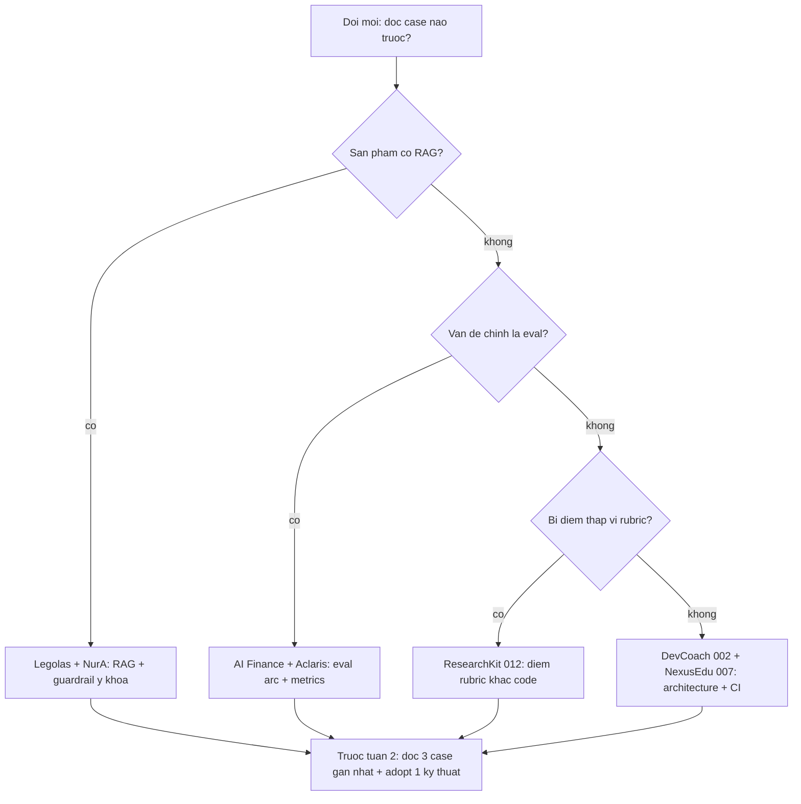

# Case Studies — Học từ 3 thế hệ đội AI20K

> "Người dùng đi sâu hơn được một đoạn, song vẫn chưa chạm tới giá trị AI cốt lõi."
> — Nhận định QA về đội bị chặn điểm cao nhất phase RA (Gamma VCoder, v2). Sản phẩm bị đánh giá theo khả năng người dùng chạm được giá trị AI, không theo số lượng feature.

Chương này là lớp học liệu "học từ đội thật": 12 case study được chọn từ 3 thế hệ đội AI20K, mỗi case có số liệu eval VERBATIM từ evidence gốc và path nguồn để bạn tự kiểm chứng. Không case nào là hoàn hảo — có đội điểm code cao nhất cohort nhưng thiếu journal, có đội positioning sắc bén nhưng bị chặn 2 lần. Đọc cả hai mặt.

## Bảng tổng quan 12 case

| # | Case | Cohort | USP một câu | Metric nổi bật | Chương liên quan |
|---|---|---|---|---|---|
| 1 | Aclaris AI Knowledge Hub | C2 [118] | Pipeline biên soạn tri thức thành wiki có verifier dò mâu thuẫn | Hit Rate 0.91, Groundedness 0.96, $0.0011/câu | [Chương 4](chapter-04.md), [Chương 10](chapter-10.md) |
| 2 | NurA Nurse Assistant | C2 [074] | Guardrail 4 lớp cho trợ lý y khoa tiếng Việt | Action accuracy 100%, LLM-judge 4.62/5 | [Chương Privacy](chapter-11.md), [Chương 10](chapter-10.md) |
| 3 | MindCare AI | C2 [109] | Phân loại rủi ro trước khi AI phản hồi, escalation clinician | Risk accuracy 97%, crisis recall 96% | [Chương Privacy](chapter-11.md), [Chương 10](chapter-10.md) |
| 4 | AI Finance Assistant | C2 [057] | Trình bày eval như improvement arc (đo baseline trước) | Behavior Accuracy 64% -> 96% | [Chương 10](chapter-10.md) |
| 5 | Legolas AI | C2 [108] | Legal-tech citations kiểm chứng được | Citation hit 83.3%, keyword recall 96.5% | [Chương 10](chapter-10.md) |
| 6 | DevCoach AI | C1-2 code [002] | Full loop code -> test -> eval -> CI -> deploy | Auto 37.0, code cao nhất cohort | [Chương 4](chapter-04.md), [Chương 12](chapter-12.md), [Chương 10](chapter-10.md) |
| 7 | NexusEdu | C1-2 code [007] | DDD thật + guardrail PII nghiêm túc nhất cohort | 38.3 — điểm cao nhất cohort | [Chương 4](chapter-04.md), [Chương Privacy](chapter-11.md) |
| 8 | ResearchKit | C1-2 code [012] | Schema-first không framework, Pydantic mọi output | 28.9 điểm nhưng 67 unit tests, code thuần nhất | [Chương 4](chapter-04.md), [Chương 10](chapter-10.md) |
| 9 | Buddy | C1-2 code [008] | Guardrails class + golden benchmark cho safety-UX | Golden scenarios + cost benchmark chạy thật | [Chương 10](chapter-10.md), [Chương Privacy](chapter-11.md) |
| 10 | VCareer (Delta) | Phase RA | Governance chuẩn mực: cost locks + privacy APAC | 80/100 — cao nhất phase RA | [Chương Workflow](chapter-07.md), [Chương Privacy](chapter-11.md) |
| 11 | VCoder (Gamma) | Phase RA | Bài học bị chặn: user chưa chạm giá trị AI | 52/100, bị chặn 2 lần | [Chương USP](chapter-05.md), [Chương Workflow](chapter-07.md) |
| 12 | Red Team Agent (Luna Wolves) | C3 [138] | AI Red Teaming tự động theo OWASP Top 10 for LLM (2025) | Bộ dữ liệu 18,293 kịch bản tấn công | [Chương 4](chapter-04.md), [Chương Privacy](chapter-11.md) |

---

## Nhóm 1 — Cohort 2: 5 đội có số liệu eval đầy đủ

5 đội này cùng thuộc một cohort, cùngdeadline, và cùng trình bày eval bằng số. Điểm chung: mỗi đội chọn MỘT trục đánh giá làm xương sống sản phẩm (groundedness, guardrail, risk, improvement arc, citation) rồi đo nó thật.

### Case 1 — Aclaris AI Knowledge Hub [C2-118]

**(a) Sản phẩm và đội.** Hệ thống biên soạn tri thức thành wiki: AI thu thập, tổng hợp, kiểm chứng rồi commit tri thức thành trang wiki có liên kết. Xây theo mô hình 2-agent kết hợp MCP.

**(b) USP.** Tri thức vào wiki không phải "AI viết xong là xong" — có bước VERIFY riêng và verifier dò mâu thuẫn trước khi COMMIT. Wiki có wikilink graph, tức tri thức được cấu trúc hóa thành mạng, không phải danh sách văn bản rời rạc.

**(c) Kỹ thuật đáng học.** Pipeline 5 pha tách bạch trách nhiệm: MAP -> REDUCE -> REFINE -> VERIFY -> COMMIT. Phần VERIFY là node riêng với verifier dò mâu thuẫn — đúng tư tưởng "verification tách khỏi generation" ([Chương 4](chapter-04.md)). Guardrail prompt-injection đặt ở server-side với JWT gắn student_id để override — không tin input từ client ([Chương Privacy](chapter-11.md)).

**(d) Số liệu eval (verbatim từ evidence).**

| Metric | Giá trị |
|---|---|
| Hit Rate | 0.91 |
| Groundedness | 0.96 |
| Cost | $0.0011/câu |

**(e) Bài học cho đội mới.** Groundedness 0.96 không đến từ prompt hay hơn mà từ việc tách VERIFY thành một pha pipeline riêng với quyền từ chối commit. Áp dụng ngay vào [Chương 4](chapter-04.md) (agent core: thêm node verify) và [Chương 10](chapter-10.md) (đo groundedness như metric chính nếu sản phẩm của bạn sinh tri thức).

**(f) Nguồn evidence.** `cai_tien_tai_lieu_ky_thuat/reference/e1-secondbrain-mine.md` (mục TOP 5 case study cohort 2); dữ liệu gốc: `ai20k-cohort2-data/` (demoday_details, project_intros).

### Case 2 — NurA Nurse Assistant [C2-074]

**(a) Sản phẩm và đội.** Trợ lý điều dưỡng (nurse assistant) cho lĩnh vực y khoa tiếng Việt — domain sai một câu là hậu quả thật.

**(b) USP.** Guardrail 4 lớp xếp tầng, mỗi lớp bắt loại lỗi khác nhau, thay vì một prompt "hãy cẩn thận".

**(c) Kỹ thuật đáng học.** Chuỗi guardrail 4 lớp đúng thứ tự: (1) keyword phủ định lọc nhanh ca cấm -> (2) LLM intent classifier hiểu ý định -> (3) grounding guard buộc câu trả lời bám nguồn -> (4) output guard kiểm soát câu cuối ra user. Retrieval dùng hybrid dense (Cohere multilingual) + BM25 kết hợp RRF — cách chuẩn cho tiếng Việt y khoa vốn thuật ngữ lai Anh-Việt ([Chương Privacy](chapter-11.md): defence-in-depth).

**(d) Số liệu eval (verbatim từ evidence).**

| Metric | Giá trị |
|---|---|
| Action accuracy | 100% |
| Hit rate | 86.8% |
| LLM-judge | 4.62/5 |
| Violation | ~0 |

**(e) Bài học cho đội mới.** "Guardrail >= 2 lớp (code + prompt)" không phải slogan — NurA chứng minh 4 lớp xếp tầng đo được violation ~0. Nếu sản phẩm bạn dính domain nhạy cảm, thiết kế guardrail theo tầng trước khi viết tính năng đầu tiên ([Chương Privacy](chapter-11.md)), và đo mỗi tầng riêng ([Chương 10](chapter-10.md)).

**(f) Nguồn evidence.** `cai_tien_tai_lieu_ky_thuat/reference/e1-secondbrain-mine.md` (mục TOP 5); dữ liệu gốc: `ai20k-cohort2-data/`.

### Case 3 — MindCare AI [C2-109]

**(a) Sản phẩm và đội.** Trợ lý sức khỏe tâm thần — domain nơi sai sót có thể là khủng hoảng.

**(b) USP.** Risk classifier chạy TRƯỚC khi AI phản hồi: mọi tin nhắn được chấm mức rủi ro trước, ca nguy cơ được escalation sang clinician thay vì để AI tự trả lời.

**(c) Kỹ thuật đáng học.** Kiến trúc "phân loại trước, phản hồi sau" kết hợp bộ đo lâm sàng chuẩn PHQ-9/GAD-7; PHI/PII được mã hóa ([Chương Privacy](chapter-11.md): privacy-by-domain, HITL đúng chỗ — escalation là con đường chính, không phải fallback). Eval của đội có bảng so model-alone vs layered kèm false-positive table — hiếm thấy: đội chủ động công bố cả lỗi dương tính giả.

**(d) Số liệu eval (verbatim từ evidence).**

| Metric | Giá trị |
|---|---|
| Risk accuracy | 97% |
| Crisis recall | 96% |
| So sánh | Bảng model-alone vs layered + false-positive table |

**(e) Bài học cho đội mới.** Với sản phẩm dính con người thật, thứ tự quan trọng hơn tính năng: classifier rủi ro đứng TRƯỚC generator. Và khi báo cáo eval, kèm bảng false-positive — báo cáo một chiều là red flag với ban giám khảo ([Chương 10](chapter-10.md), [Chương Privacy](chapter-11.md)).

**(f) Nguồn evidence.** `cai_tien_tai_lieu_ky_thuat/reference/e1-secondbrain-mine.md`; dữ liệu gốc: `ai20k-cohort2-data/`.

### Case 4 — AI Finance Assistant [C2-057]

**(a) Sản phẩm và đội.** Trợ lý tài chính cá nhân — cohort 2.

**(b) USP.** Không phải tính năng mà là CÁCH trình bày eval: đội duy nhất cohort vẽ eval như improvement arc — có baseline xấu trước, có cải tiến sau.

**(c) Kỹ thuật đáng học.** Đo baseline TRƯỚC khi tối ưu: chỉ khi biết Behavior Accuracy đang 64% và Grounding đang 13.3%, mọi cải tiến sau đó mới thành câu chuyện thay vì con số treo lơ lửng ([Chương 10](chapter-10.md): baseline -> thay đổi -> re-measure).

**(d) Số liệu eval (verbatim từ evidence).**

| Metric | Before | After |
|---|---|---|
| Behavior Accuracy | 64% | 96% |
| Grounding | 13.3% | 93.3% |
| Guardrail | — | 100% |

**(e) Bài học cho đội mới.** Tuần 2 hãy đo baseline ngay cả khi số xấu — số xấu hôm nay là bằng chứng cải tiến ngày Demo Day. Grounding 13.3% -> 93.3% thuyết phục hơn tuyệt đối một con số 93.3% không có quá khứ ([Chương 10](chapter-10.md)).

**(f) Nguồn evidence.** `cai_tien_tai_lieu_ky_thuat/reference/e1-secondbrain-mine.md`; dữ liệu gốc: `ai20k-cohort2-data/`.

### Case 5 — Legolas AI [C2-108, spotlight #6]

**(a) Sản phẩm và đội.** Legal-tech: trợ lý pháp lý trả lời kèm citation kiểm chứng được — lọt top 17 spotlight cohort 2.

**(b) USP.** "Citations kiểm chứng được" — cùng họ với bài toán chống bịa, nhưng đo bằng chính độ tin cậy của trích dẫn.

**(c) Kỹ thuật đáng học.** Eval được thiết kế theo từng loại thông tin pháp lý: citation hit, keyword recall, và riêng legal number recall — vì số điều luật sai một chữ là sai toàn bộ câu trả lời ([Chương 10](chapter-10.md): chọn metric theo rủi ro của domain, không đo chung chung).

**(d) Số liệu eval (verbatim từ evidence).**

| Metric | Giá trị | Ngữ cảnh |
|---|---|---|
| Citation hit | 83.3% | 30 câu |
| Keyword recall | 96.5% | 30 câu |
| Legal number recall | 90% | 30 câu / 526 chunks |

**(e) Bài học cho đội mới.** Đặt tên cho cái user sợ nhất trong domain của bạn (sai số điều luật, sai liều thuốc, sai con tiền) rồi đo riêng nó. Nếu mọi metric đều gọi chung "accuracy", bạn chưa có eval ([Chương 10](chapter-10.md)).

**(f) Nguồn evidence.** `cai_tien_tai_lieu_ky_thuat/reference/e1-secondbrain-mine.md`; dữ liệu gốc: `ai20k-cohort2-data/`.

---

## Nhóm 2 — Code-mining cohort 1-2: 4 đội đọc từ repo thật

Nhóm này được đánh giá bằng cách ĐỌC CODE 12 repo cohort 1-2. Số liệu đến từ analysis_results.json và deep_analysis.json. Lưu ý: cả 12 repo đều squash 1 commit nên git history không đánh giá được — bài học nhỏ: commit lịch sử thật cũng là evidence.

Thống kê nền: CI 5/12 đội, Docker 10/12, eval chạy thật (script + dataset + report artifact) chỉ 5/12, guardrail code-level 5/12, guardrail prompt-only tới 11/12 đội.

### Case 6 — DevCoach AI [002]: full loop duy nhất

**(a) Sản phẩm và đội.** AI interview coach — LangGraph supervisor-worker 6 agents, pgvector 13k, frontend React 35 pages, 29 file pytest, CI/CD deploy EC2.

**(b) USP (dưới góc độ kỹ thuật).** Đội duy nhất cohort khép kín full loop: code -> test -> eval -> CI -> deploy. Không đội nào trong 12 đội làm trọn vòng này.

**(c) Kỹ thuật đáng học.** (1) Supervisor-worker với TypedDict state + stage Literal — "một chỗ duy nhất merge state", tránh state conflict khi 6 agents chạy ([Chương 4](chapter-04.md)). (2) Prompt cấu trúc 6 section: role, context, instructions, examples, output_format, verification — prompt tách file riêng, không nhét trong code. (3) Threshold-based regression eval + synthetic answer bank, triết lý "sau mỗi thay đổi code/prompt/retrieval, pipeline còn đúng không?", artifacts commit vào repo ([Chương 10](chapter-10.md)). (4) CI chạy test trong container sạch python:3.12-slim + deploy concurrency guard group production-deploy ([Chương 12](chapter-12.md)). Kèm ROOT_CAUSE_ANALYSIS.md cho process debugging.

**(d) Số liệu eval (verbatim từ evidence).**

| Metric | Giá trị |
|---|---|
| Điểm auto | 37.0 |
| Xếp hạng code | Cao nhất cohort về CHẤT LƯỢNG CODE (điểm auto tổng: 37.0 — thấp hơn 007) |
| Eval | e2e replay + LLM-judge + artifacts (chạy thật) |

**(e) Bài học cho đội mới.** Vòng lặp code -> test -> eval -> CI là MỘT vòng, không phải 4 việc riêng — đội 009 có 89 test files nhưng không workflow nào chạy chúng, tức bài test chết. Bắt đầu từ tuần 3: mỗi thay đổi agent phải chạy lại eval với threshold ([Chương 4](chapter-04.md), [Chương 12](chapter-12.md), [Chương 10](chapter-10.md)).

**(f) Nguồn evidence.** `cai_tien_tai_lieu_ky_thuat/reference/e1-cohort12-code-mining.md` (bảng mục A, practices mục B); repo gốc: `A20-App-002`, analysis_results.json, deep_analysis.json.

### Case 7 — NexusEdu [007]: DDD thật và biết RỜI framework

**(a) Sản phẩm và đội.** Sản phẩm giáo dục, điểm auto 38.3 — cao nhất TỔNG trong 12 đội (007 thắng tổng; 002 thắng hạng code) được soi code.

**(b) USP (dưới góc độ kỹ thuật).** DDD (Domain-Driven Design) 4 lớp làm THẬT, không phải vẽ diagram — và là đội guardrail PII nghiêm túc nhất cohort.

**(c) Kỹ thuật đáng học.** (1) Deterministic chains + BAML structured output: chọn chuỗi tất định thay vì graph tự do, structured generation thay vì parse output tự do ([Chương 4](chapter-04.md)). (2) Pipeline PII 4 bước: mask (Presidio PII mask) -> BAML generate -> semantic validation -> invariant verification ([Chương Privacy](chapter-11.md)). (3) Đáng học nhất: README ghi "refactored from complex graph models for maximum reliability" — đội TỰ RỜI LangGraph khi bài toán không cần graph. Framework là công cụ, không phải KPI. Kèm 37 file pytest, uv sync --frozen + lockfile, Makefile developer-UX (make start/stop/logs/reset_db/reseed).

**(d) Số liệu eval (verbatim từ evidence).**

| Metric | Giá trị |
|---|---|
| Điểm auto | 38.3 (cao nhất cohort) |
| Tests | 37 file pytest |
| Eval chạy thật | Không (điểm trừ) |

**(e) Bài học cho đội mới.** Dùng graph khi bài toán CẦN branching thật; chuỗi tất định + structured output khi không cần — đội điểm cao nhất cohort chọn đường đơn giản hơn. Và quy tắc PII: mask trước khi dữ liệu chạm model ([Chương Privacy](chapter-11.md)).

**(f) Nguồn evidence.** `cai_tien_tai_lieu_ky_thuat/reference/e1-cohort12-code-mining.md`; repo gốc: `A20-App-007`.

### Case 8 — ResearchKit [012]: điểm rubric thấp khác code kém

**(a) Sản phẩm và đội.** Hệ thống claim verification: worker chạy trên Redis event-bus KHÔNG dùng agent framework nào.

**(b) USP (dưới góc độ kỹ thuật).** Anti-hallucination schema-first không framework: MỌI output đi qua Pydantic — sai schema là exception tường minh, không phải fallback im lặng.

**(c) Kỹ thuật đáng học.** (1) Pydantic làm hợp đồng mọi output — sai schema crash to, biết ngay (ngược với anti-pattern "silent fallback" ở chương workflow). (2) Prompt verify yêu cầu verbatim quote + page + confidence: AI phải trích nguyên văn kèm số trang thì mới tính là verify ([Chương 10](chapter-10.md)). (3) CancelToken qua Redis propagate user-cancel vào runner dài hạn. (4) 67 unit tests — nhiều nhất nhóm. README chuẩn: bảng feature + ASCII cây thư mục chú thích + link sản phẩm thật.

**(d) Số liệu eval (verbatim từ evidence).**

| Metric | Giá trị |
|---|---|
| Điểm rubric | 28.9 (thấp nhất top — thiếu journal/worklog) |
| Unit tests | 67 |
| Nhận xét | "Code thuần nhất" (thuần nhất nhất nhóm soi) |

**(e) Bài học cho đội mới.** Hai chiều: (1) đội mới — đừng vì điểm rubric mà bỏ chất lượng code, và đừng vì code đẹp mà bỏ deliverables như journal; 012 mất điểm vì thiếu journal/worklog chứ không phải vì code. (2) khái niệm — "điểm rubric thấp không tương đương code kém" (feedback cohorts trước gửi BTC về rubric thiếu trọng số code) ([Chương 4](chapter-04.md), [Chương 10](chapter-10.md)).

**(f) Nguồn evidence.** `cai_tien_tai_lieu_ky_thuat/reference/e1-cohort12-code-mining.md` (mục D — Top 3); repo gốc: `A20-App-012`.

### Case 9 — Buddy [008]: guardrails class + golden benchmark

**(a) Sản phẩm và đội.** English learning companion — bài toán safety-UX: luyện tiếng Anh với người mới học, phải an toàn cho mọi lứa tuổi.

**(b) USP (dưới góc độ kỹ thuật).** Safety-UX tốt nhất cohort: guardrail không phải comment trong prompt mà là class hoàn chỉnh có test riêng.

**(c) Kỹ thuật đáng học.** (1) Guardrails class: enum SafetyLevel, enum ViolationType, check_input/check_output tách bạch — guardrail vào hệ thống type, có thể review và test ([Chương Privacy](chapter-11.md)). (2) Golden scenario benchmark: mỗi kịch bản ghi rõ must/must-not behavior kèm needs_human_review flag — spec hành vi thành test ([Chương 10](chapter-10.md)). (3) Cost benchmark riêng — chi phí cũng là metric. (4) Tên test đọc như spec: test_blocks_grooming_secret_language — đọc tên test là biết yêu cầu an toàn nào được kiểm. Điểm trừ: repo có buddy.db 311KB commit nhầm và copy nguyên src/agent.py của template không sửa.

**(d) Số liệu eval (verbatim từ evidence).**

| Metric | Giá trị |
|---|---|
| Eval chạy thật | Có — golden_scenarios + cost benchmark |
| Xếp hạng | Safety-UX tốt nhất cohort |
| Điểm trừ | File rác commit (buddy.db 311KB) |

**(e) Bài học cho đội mới.** Biến guardrail thành code có type và test tên-đọc-như-spec, kèm golden benchmark must/must-not cho hành vi an toàn ([Chương 10](chapter-10.md), [Chương Privacy](chapter-11.md)). Và thêm .gitignore cho database file trước tuần 2.

**(f) Nguồn evidence.** `cai_tien_tai_lieu_ky_thuat/reference/e1-cohort12-code-mining.md`; repo gốc: `A20-App-008`.

---

## Nhóm 3 — Phase RA + Cohort 3: governance, bài học bị chặn, và sản phẩm mới nhất

### Case 10 — VCareer (Delta): governance chuẩn mực

**(a) Sản phẩm và đội.** Nền tảng luyện phỏng vấn việc làm (mock interview), 4 team phase RA. Điểm: 80/100 — cao nhất phase RA.

**(b) USP.** Governance là CƠ CHẾ thật chứ không phải landing page viết "chúng tôi tôn trọng privacy": mọi ràng buộc đều thực thi được và có thể chỉ ra code/tài khoản demo.

**(c) Kỹ thuật đáng học.** Cost locks server-side: phiên tối đa 60 phút, idle 30 giây tự ngắt, tối đa 10 phiên/24h, tính toán ở server — client không vượt được ([Chương Workflow](chapter-07.md): workflow governance, [Chương Privacy](chapter-11.md)). AI từ chối phỏng vấn THẬT (chống lạm dụng thay thế người dùng trong quy trình thật). Watermark anti-cheat. Privacy: transcript PII-filter, audio lưu Cloudflare R2 Singapore (PDPA/APAC), xóa sau 24h, không chuyển data ra ngoài APAC. Landing honest: "MVP · Chỉ để luyện tập · Không liên kết nhà tuyển dụng" ([Chương USP](chapter-05.md): messaging đúng với những gì sản phẩm làm được).

**(d) Số liệu eval (verbatim từ evidence).**

| Metric | Giá trị |
|---|---|
| Điểm phase RA | 80 (cao nhất 4 team) |
| Cost locks | 60'/phiên, idle 30s, 10 phiên/24h, server-side |
| Privacy | R2 Singapore, xóa 24h, APAC-only |
| Điểm trừ (QA D-01) | Friction cao, không demo công khai |

**(e) Bài học cho đội mới.** Điểm cao nhất phase RA không đến từ nhiều tính năng mà từ honest messaging + governance có cơ chế: limit tính server-side, PII filter, region lock. Đội nào tuyên bố privacy thì phải chỉ ra được cơ chế ([Chương USP](chapter-05.md), [Chương Workflow](chapter-07.md), [Chương Privacy](chapter-11.md)).

**(f) Nguồn evidence.** `cai_tien_tai_lieu_ky_thuat/reference/e1-cohort-lessons.md` (mục 3, 7, và khối "Điểm chung các team đạt điểm cao"); QA report Delta v1+v2.

### Case 11 — VCoder (Gamma): 2 lần bị chặn và north star

**(a) Sản phẩm và đội.** Nền tảng đánh giá AI readiness cho developer. Điểm: 52/100 — bị chặn 2 lần (login 401, rồi MCQ).

**(b) USP.** Positioning rất sắc: "Prove your AI readiness — 5 axes, 5 levels, LLM-judged, AI-Ready Certificate". Bài học của case này nằm ở KHOẢNG CÁCH giữa định vị tốt và sản phẩm chạm được.

**(c) Kỹ thuật đáng học.** Mặt tốt: Q4 loop-breaking được QA đánh "Xuất sắc" ([Chương Workflow](chapter-07.md): escape hatch chống loop vô hạn — so với anti-pattern team 011 cũng xử lý tốt: interviewer tự check count >= max chuyển phase Closing, luôn có đường tới END); Q7 CLAUDE.md persistent context cũng đánh "Xuất sắc"; leaderboard dùng dữ liệu cohort thật (level 0.0-2.2). Mặt bị chặn: nav null-href "khách mới không thấy giá trị trước khi đăng ký" (G-02); session hết hạn giữa bài thi 35 phút, state không persist -> mất tiến độ (G-06); MCQ click không register, không toast chỉ câu thiếu (G-08); raw React Router dev error lộ production (G-05); messaging lệch hero "~60 min" vs entry-test "~35 phút" -> giảm niềm tin (G-07). V2 xin re-test và fix được CRITICAL đầu (G-01) nhưng regress: lỗi chặn mới (G-08) xuất hiện ngay tại bước nộp bài — thiếu E2E regression test.

**(d) Số liệu eval (verbatim từ evidence).**

| Metric | Giá trị |
|---|---|
| Điểm phase RA | 52 (bị chặn) |
| Số lần bị chặn | 2 (login 401 -> MCQ) |
| QA đánh Xuất sắc | Q4 loop-breaking, Q7 CLAUDE.md persistent context |
| Leaderboard | Dữ liệu cohort thật, level 0.0-2.2 |
| Điểm yếu QA | Thiếu kiểm tính phân biệt, thiếu reproducibility |

**(e) Bài học cho đội mới.** North star của case này: sản phẩm bị đánh giá theo khả năng NGƯỜI DÙNG CHẠM ĐƯỢC GIÁ TRỊ AI (khách mới, không đăng ký, không qua 5 bước) — không theo số feature. Fix xong phải có E2E regression test trong CI vì mỗi lần fix có thể đẻ lỗi chặn mới ([Chương USP](chapter-05.md), [Chương Workflow](chapter-07.md)).

**(f) Nguồn evidence.** `cai_tien_tai_lieu_ky_thuat/reference/e1-cohort-lessons.md` (mục 1, 9, north star cuối file); QA report Gamma v1+v2.

### Case 12 — Red Team Agent / AIP-10 (Luna Wolves) [C3-138]

**(a) Sản phẩm và đội.** Nền tảng AI Red Teaming tự động hóa: kiểm thử an toàn, phát hiện lỗ hổng và đánh giá rủi ro cho các hệ thống LLM / AI Agents, theo tiêu chuẩn OWASP Top 10 for LLM Applications (2025). Đội Luna Wolves, 4 thành viên (github: hieunm12122002, monobear2014, NgoKhoi1, xrl111). Spotlight rank 6/246 dự án cohort 3.

**(b) USP.** (Từ mô tả dự án.) Hệ thống kết hợp LangGraph Control Plane, PyRIT Attack Engine cùng bộ dữ liệu 18,293 kịch bản tấn công — sản phẩm của cohort 3 attack chính là các hệ thống AI khác: đội xây công cụ đánh giá an toàn theo chuẩn công nghiệp có sẵn (OWASP), không tự chế rubric.

**(c) Kỹ thuật đáng học.** Theo mô tả dự án: dùng LangGraph làm control plane (điều phối) tách khỏi attack engine (PyRIT — framework red-teaming của Microsoft) — đúng mô hình orchestrator + specialized engine ([Chương 4](chapter-04.md)). Chọn chuẩn đánh giá ngoài có sức nặng (OWASP Top 10 for LLM Applications 2025) làm xương sống thay vì tự định nghĩa "an toàn". Bộ dữ liệu kịch bản 18,293 cảnh cũng là evidence eval khổng lồ. Số liệu benchmark an toàn chi tiết khác: (chưa công bố).

**(d) Số liệu eval (verbatim từ mô tả dự án).**

| Metric | Giá trị |
|---|---|
| Spotlight cohort 3 | Rank 6 |
| Bộ dữ liệu kịch bản tấn công | 18,293 kịch bản |
| Chuẩn áp dụng | OWASP Top 10 for LLM Applications (2025) |
| Kiến trúc (theo desc) | LangGraph Control Plane + PyRIT Attack Engine |
| Eval an toàn chi tiết | (chưa công bố) |

Demo: https://c3-app-138.tech-vibe.io.vn/ — Video: https://drive.google.com/file/d/1dlpjHG2W4Dk6v6-NEn0zmCAIb5vKScXA/view?usp=sharing

**(e) Bài học cho đội mới.** Đừng tự chế thước đo an toàn: bám chuẩn công nghiệp (OWASP) + dataset tấn công lớn + framework chuyên dụng (PyRIT), sản phẩm của bạn ngay lập tức nghiêm túc hơn ([Chương 4](chapter-04.md), [Chương Privacy](chapter-11.md)). Đây cũng là hướng đi mới ở cohort 3: đánh giá AI như một product category riêng.

**(f) Nguồn evidence.** `cai_tien_tai_lieu_ky_thuat/reference/e1-cohort3-demoday-projects.json` (bản ghi team "Luna Wolves", code 138, spotlight_rank 6 — desc/demo/video/slides verbatim).

---

## Cách dùng chương này

1. **Trước tuần 2, đọc 3 case gần sản phẩm của bạn nhất.** Sản phẩm sinh tri thức/RAG -> Case 1, 5, 8. Domain nhạy cảm (y tế, tài chính, pháp lý, giáo dục) -> Case 2, 3, 4, 9. Muốn chuẩn hóa kỹ thuật đội -> Case 6, 7. Đang định nghĩa USP và public demo -> Case 10, 11, 12.
2. **Mỗi case, đọc theo thứ tự (b) -> (d) -> (e).** USP cho bạn định vị, số liệu cho bạn target, bài học cho bạn hành động tuần này. Phần (f) là path evidence — mở ra và tự đối chiếu, đừng tin chương này một chiều.
3. **Với mọi con số, hỏi: đội kia đo bằng gì, trên tập nào, ai chấm?** Nếu bạn không trả lời được cho con số của chính mình, bạn chưa có eval ([Chương 10](chapter-10.md)).
4. **Case 11 (Gamma) đọc kỹ nhất trước Demo Day** — hai lần bị chặn đều ở chỗ user chạm sản phẩm, không phải ở chỗ AI thông minh.

## Exit-test — 3 câu tự kiểm

Trả lời được cả 3 câu mới quay lại làm sản phẩm:

1. **Case nào gần sản phẩm của bạn nhất, và USP của họ khác bạn ở điểm gì?** (Nếu trả lời "giống hệt" — bạn chưa có USP, xem lại [Chương USP](chapter-05.md).)
2. **Một kỹ thuật nào trong 12 case bạn adopt được ngay tuần này?** (Ví dụ: guardrail lớp 2 ở NurA, baseline eval ở AI Finance Assistant, Pydantic mọi output ở ResearchKit, golden must/must-not ở Buddy, cost lock server-side ở Delta.)
3. **Nếu QA phát hiện sản phẩm của bạn có lỗi chặn ngay tại bước đầu tiên của người dùng mới, bạn phát hiện nó bằng cơ chế nào của chính đội mình?** (Nhớ: ở cohorts trước, không đội nào tự phát hiện lỗi của mình — mọi CRITICAL/HIGH do QA bên ngoài tìm ra.)

---

Evidence gốc của toàn chương: `cai_tien_tai_lieu_ky_thuat/reference/` (e1-secondbrain-mine.md, e1-cohort12-code-mining.md, e1-cohort-lessons.md, e1-cohort3-demoday-projects.json). Mọi số liệu trong chương lấy verbatim; thông tin thiếu được ghi rõ "(chưa công bố)".
