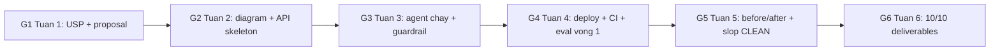

## 15.1 Lộ trình học 6 tuần

Lộ trình này thiết kế cho sinh viên VinUni tham gia AI20K Build Phase, với mục tiêu từ "chưa biết LangGraph" đến "có thể build và deploy AI Agent hoàn chỉnh" trong 6 tuần. Mỗi tuần có focus cụ thể, kết hợp lý thuyết và thực hành.

### Tuần 1: Nền tảng Python và API

Mục tiêu: Hiểu FastAPI, viết được API endpoint, biết gọi LLM API.

- Học FastAPI fundamentals: routing, request/response, Pydantic models
- Làm quen với async/await trong Python
- Gọi OpenAI API cơ bản: chat completion, streaming
- Setup project structure: `app/`, `tests/`, `requirements.txt`
- Bài tập: Viết FastAPI app có 3 endpoints (GET /health, POST /chat, GET /history)

Tài liệu: FastAPI official tutorial (2-3 giờ), Python async docs (1 giờ), OpenAI API quickstart (1 giờ).

### Tuần 2: LangGraph Fundamentals

Mục tiêu: Hiểu LangGraph graph, state, nodes, edges. Build được agent đơn giản.

- Học LangGraph concepts: StateGraph, nodes, edges, conditional routing
- Build graph đầu tiên: 2-3 nodes, conditional routing
- Thử nghiệm với different state schemas (TypedDict vs Pydantic)
- Debug với LangSmith tracing
- Bài tập: Build agent có routing dựa trên intent (FAQ → retrieval, chitchat → respond directly)

Tài liệu: LangGraph Academy Module 1-2 (4-5 giờ), Lance Martin YouTube LangGraph playlist (2 giờ).

### Tuần 3: RAG và Vector Store

Mục tiêu: Hiểu RAG pipeline, load documents, embed, retrieve.

- Học document loading: PDF, web, text files
- Text splitting strategies: chunk size, overlap
- Embedding models: OpenAI embeddings, local alternatives
- Vector stores: ChromaDB (local), PGVector (production)
- RAG pipeline: retrieve → rerank → generate
- Bài tập: Build RAG agent trả lời câu hỏi từ 10 tài liệu PDF

Tài liệu: DeepLearning.AI "Building RAG Agents with LLMs" (4 giờ), LangChain RAG tutorial (2 giờ).

### Tuần 4: Agent nâng cao và Tools

Mục tiêu: Agent có tools, memory, multi-step reasoning.

- Học LangGraph tools: @tool decorator, tool calling
- Agent memory: conversation history, long-term memory
- Multi-step reasoning: ReAct pattern, planning
- Error handling trong agent: retry, fallback
- Bài tập: Build agent có 3+ tools (search, calculator, database query)

Tài liệu: LangGraph Academy Module 3-4 (4 giờ), DeepLearning.AI "AI Agents in LangGraph" (3 giờ).

### Tuần 5: DevOps, Testing, và Deploy

Mục tiêu: Dockerize, viết tests, deploy lên cloud, setup CI/CD.

- Docker: Dockerfile multi-stage, Docker Compose
- Testing: pytest, mock LLM, test coverage
- CI/CD: GitHub Actions workflow
- Deploy: Render (backend), Vercel (frontend)
- Monitoring: structured logging, LangSmith, health checks
- Bài tập: Dockerize app, đạt 60%+ test coverage, deploy lên Render

Tài liệu: Chương 12 và 8 của guidebook này, Docker official tutorial (2 giờ), pytest docs (1 giờ).

### Tuần 6: Evaluation và Chuẩn bị Demo Day

Mục tiêu: Đánh giá chất lượng agent, chuẩn bị deliverables.

- RAGAS evaluation: faithfulness, relevance, precision
- Evaluation report: metrics table, test results, user feedback
- Hoàn thiện 10 deliverables
- Pitch Deck: 10 slides, thuyết trình
- Code review: xóa bare except, thêm type hints, cleanup
- Bài tập: Nộp đủ 10 deliverables, đạt 35+/50 điểm dự kiến

Tài liệu: Chương 13 của guidebook này, RAGAS docs (2 giờ).

> 💡 **MẸO:** Lộ trình này intensity cao — ~15-20 giờ/tuần. Nếu bạn có ít thời gian, ưu tiên: Tuần 2 (LangGraph) > Tuần 3 (RAG) > Tuần 5 (DevOps) > Tuần 6 (Evaluation). Đây là thứ tự impact đến điểm số.

### Tổng kết thời gian

| Tuần | Chủ đề | Giờ học | Giờ code |
|------|--------|---------|----------|
| 1 | FastAPI + LLM API | 6 | 8 |
| 2 | LangGraph fundamentals | 6 | 10 |
| 3 | RAG + Vector Store | 6 | 10 |
| 4 | Agent nâng cao + Tools | 7 | 10 |
| 5 | DevOps + Testing + Deploy | 5 | 12 |
| 6 | Evaluation + Demo Day prep | 4 | 10 |
| **Tổng** | | **34** | **60** |

## 15.2 Khóa học DeepLearning.AI

DeepLearning.AI (deeplearning.ai) là nền tảng học AI hàng đầu của Andrew Ng, với hơn 121 khóa học ngắn (short courses). Các khóa học này miễn phí, duration 1-2 giờ, và được thiết kế bởi chuyên gia từ OpenAI, LangChain, Google, Anthropic. Đây là nguồn học tập chất lượng cao nhất cho AI20K.

### Top khóa học cho AI20K

| Khóa học | Chủ đề | Thời gian | Ưu tiên |
|----------|--------|-----------|---------|
| AI Agents in LangGraph | LangGraph agents, ReAct, tools | 2 giờ | CAO |
| Building RAG Agents with LLMs | RAG pipeline, retrieval, evaluation | 2 giờ | CAO |
| Prompt Engineering with LLMs | Prompt design, chain-of-thought | 1 giờ | CAO |
| Functions, Tools and Agents with LangChain | Tool use, agents, chains | 1.5 giờ | CAO |
| Multi-AI Agent Systems with CrewAI | Multi-agent collaboration | 1.5 giờ | TRUNG BÌNH |
| Evaluating and Debugging Generative AI | Evaluation methods, metrics | 1 giờ | TRUNG BÌNH |
| LangChain for LLM Application Development | LangChain basics, chains, memory | 1.5 giờ | TRUNG BÌNH |
| ChatGPT Prompt Engineering for Developers | Prompt engineering basics | 1 giờ | THẤP |
| Building Systems with the ChatGPT API | API usage, system design | 1 giờ | THẤP |
| Red Teaming LLM Applications | Security, adversarial testing | 1 giờ | BONUS |

### Cách học hiệu quả từ DeepLearning.AI

**Chiến lược học tập:**

1. **Xem video ở 1.5x speed.** Các khóa học DeepLearning.AI nói chậm, tăng tốc 1.5x tiết kiệm 33% thời gian mà vẫn hiểu.

2. **Code along.** Mỗi khóa có Jupyter notebook. Code cùng video, không chỉ xem. Sau đó, thử modify code và xem kết quả thay đổi thế nào.

3. **Áp dụng ngay.** Sau mỗi khóa, áp dụng concept vào dự án AI20K của bạn. Ví dụ: học xong "AI Agents in LangGraph" → thêm 1 node mới vào agent của bạn.

4. **Ghi chú vào journal.** Mỗi khóa học, ghi 3 điểm chính vào Development Journal — vừa ôn tập, vừa có material cho deliverable.

**AI Agents courses (35 khóa):** DeepLearning.AI có 35 khóa liên quan đến AI Agents, từ cơ bản đến nâng cao. Không cần học tất cả — chọn 3-4 khóa có priority CAO trong bảng trên, rồi mở rộng nếu có thời gian.

> 🔑 **ĐIỂM CHÍNH:** Bốn khóa học bắt buộc cho AI20K: (1) AI Agents in LangGraph, (2) Building RAG Agents with LLMs, (3) Prompt Engineering with LLMs, (4) Functions, Tools and Agents with LangChain. Hoàn thành 4 khóa này trong 2 tuần đầu.

### Lộ trình học DeepLearning.AI theo tuần

- **Tuần 1:** Prompt Engineering + Building Systems with ChatGPT API (2 khóa)
- **Tuần 2:** AI Agents in LangGraph + Functions/Tools/Agents (2 khóa)
- **Tuần 3:** Building RAG Agents (1 khóa, nhưng intensive)
- **Tuần 4:** Evaluating and Debugging Generative AI (1 khóa)
- **Tuần 5-6:** Bonus courses tùy thời gian

## 15.3 Tài liệu LangGraph

LangGraph là framework chính cho AI20K, và tài liệu chính thức là nguồn học tập đáng tin cậy nhất. Ngoài docs, còn có nhiều tài nguyên cộng đồng chất lượng cao.

### Tài liệu chính thức

**LangGraph Documentation** (langchain-ai.github.io/langgraph/):
- Core concepts: StateGraph, nodes, edges, state, tools
- Tutorials: step-by-step guides cho common patterns
- API reference: chi tiết mọi class và function
- How-to guides: specific tasks như "add memory to agent", "human-in-the-loop"

**LangGraph Academy** (academy.langchain.com):
- Module 1: Fundamentals — StateGraph, nodes, edges
- Module 2: State management — TypedDict state, reducers
- Module 3: Tools and human-in-the-loop
- Module 4: Multi-agent systems
- Module 5: Persistence and deployment
- Mỗi module 2-3 giờ, có code exercises

### Kênh YouTube

**Lance Martin** (youtube.com/@LanceMartinAI):
- LangGraph tutorials từ cơ bản đến nâng cao
- RAG deep dives
- Agent patterns and best practices
- Cập nhật liên tục khi LangGraph release version mới
- Ưu điểm: ngắn gọn (10-20 phút/video), practical, code-first

**James Briggs** (youtube.com/@JamesBriggs):
- Vector databases and embeddings
- RAG optimization techniques
- LangChain ecosystem tutorials
- Ưu điểm: deep technical explanations, production-focused

**LangChain Official** (youtube.com/@LangChain):
- Official tutorials và announcements
- LangGraph release walkthroughs
- Community showcases

### GitHub examples

**langchain-ai/langgraph** (github.com/langchain-ai/langgraph):
- Thư mục `examples/` chứa dozens of complete examples
- Examples theo pattern: ReAct agent, RAG, multi-agent, human-in-the-loop
- Mỗi example có README và requirements.txt — chạy được ngay

```bash
# Clone LangGraph repo và xem examples
git clone https://github.com/langchain-ai/langgraph.git
cd langgraph/examples
ls -la

# Chạy một example
cd rag/
pip install -r requirements.txt
python agent.py
```

**langchain-ai/langchain** (github.com/langchain-ai/langchain):
- Thư mục `templates/` chứa project templates
- `cookbook/` chứa recipes cho specific use cases
- Useful cho tìm solutions cho specific problems

> 💡 **MẸO:** Khi gặp lỗi với LangGraph, search GitHub Issues trước: `repo:langchain-ai/langgraph "error message"`. 90% lỗi phổ biến đã được hỏi và trả lời. Nếu không tìm thấy, mở issue mới — maintainers phản hồi nhanh.

## 15.4 BMAD Method

BMAD (Breakthrough Method for Agile AI-Driven Development) là một phương pháp phát triển phần mềm AI-first, phiên bản mới nhất là BMAD-v6. BMAD sử dụng 6 AI agents chuyên biệt, mỗi agent đảm nhiệm một vai trò trong quy trình phát triển, tương tự như một development team thực tế. Hiểu BMAD giúp bạn tư duy về multi-agent systems và project management hiệu quả.

### 6 AI Agents trong BMAD-v6

| Agent | Vai trò | Analog thực tế | Khi nào dùng |
|-------|---------|----------------|-------------|
| **Mary** (Analyst) | Phân tích yêu cầu, viết PRD, user stories | Business Analyst | Đầu dự án, khi nhận brief |
| **John** (Architect) | Thiết kế kiến trúc, tech stack, system design | Solution Architect | Sau khi có PRD |
| **Winston** (Developer) | Viết code, implement features | Developer | Sau khi có architecture |
| **Amelia** (Designer) | UI/UX design, wireframes, user flow | UX Designer | Song song với development |
| **Sally** (QA) | Viết test, review code, quality assurance | QA Engineer | Song song với development |
| **Paige** (PM) | Quản lý tiến độ, priorities, deliverables | Project Manager | Xuyên suốt dự án |

### 4-phase workflow

**Phase 1: Discovery (Khám phá) — Agent Mary + Paige**
Mary phân tích requirements từ BTC brief, viết Product Requirements Document (PRD), xác định user personas và use cases. Paige tạo project plan với timeline, milestones, và resource allocation. Output: PRD document + project plan.

**Phase 2: Design (Thiết kế) — Agent John + Amelia**
John thiết kế system architecture: tech stack, data flow, API design, deployment strategy. Amelia thiết kế UI/UX: wireframes, user flows, interaction patterns. Output: Architecture document + UI mockups.

**Phase 3: Build (Xây dựng) — Agent Winston + Sally**
Winston implement code theo architecture design. Sally viết tests song song, review code, đảm bảo quality standards. Output: Working code + test suite.

**Phase 4: Deliver (Giao hàng) — Agent Paige + Sally**
Paige quản lý deliverables checklist, đảm bảo đủ 10/10. Sally chạy final evaluation, verify tất cả quality gates pass. Output: Complete deliverables package.

### Khi nào sử dụng BMAD

BMAD phù hợp khi:
- Dự án có scope rõ ràng, cần structure
- Team mới làm việc cùng nhau, cần roles phân minh
- Cần documentation đầy đủ cho Demo Day
- Muốn học multi-agent thinking pattern

BMAD không phù hợp khi:
- Prototype nhanh, thử nghiệm ý tưởng
- Solo developer, không cần role separation
- Dự án rất nhỏ (1-2 endpoints)

> ⚠️ **LƯU Ý:** BMAD là framework tư duy, không phải tool bắt buộc. Bạn không cần cài đặt gì cả. Hãy áp dụng mindset: phân tích trước khi code (Mary), thiết kế trước khi implement (John), test song song với dev (Sally), quản lý deliverables xuyên suốt (Paige).

### Áp dụng BMAD vào AI20K

Trong AI20K, bạn có thể áp dụng BMAD bằng cách:

1. **Session 1 (Mary):** Đọc BTC brief, viết PRD 1 trang: problem, solution, target user, features, non-goals
2. **Session 2 (John):** Vẽ architecture diagram, chọn tech stack, define API contracts
3. **Session 3-10 (Winston + Sally):** Implement + test song song. Mỗi feature mới = test mới
4. **Session 11-12 (Paige + Sally):** Hoàn thiện deliverables, chạy evaluation, chuẩn bị Pitch Deck

## 15.5 Dự án mẫu tham khảo

Khi học cách xây dựng AI Agent, việc tham khảo các dự án mẫu tốt là một trong những cách học nhanh nhất. Dưới đây là những pattern và best practices mà các dự án AI Agent chất lượng cao thường có, để bạn học hỏi và áp dụng vào dự án của mình.

### Pattern 1: Sự hoàn chỉnh (Completeness)

Dự án AI Agent chất lượng cao không cần xuất sắc ở mọi mặt, nhưng phải đủ tốt ở tất cả. Điểm đều ở 5 tiêu chí (Kiến trúc, Code, Tài liệu, Demo, Sáng tạo) tốt hơn điểm cao ở 1-2 tiêu chí.

Đặc điểm của dự án hoàn chỉnh:
- Code structure rõ ràng, modular
- Đầy đủ deliverables (gần đủ 10/10)
- README chuyên nghiệp, có screenshot và hướng dẫn
- DevOps setup hoàn chỉnh: Docker, CI/CD, health check

Học: **completeness** — không cần perfect, nhưng không bỏ trống phần nào.

### Pattern 2: Kỷ luật code (Code Discipline)

Code chất lượng không cần kỹ thuật phức tạp — chỉ cần consistent application of best practices:
- Type hints cho tất cả functions
- Docstrings chi tiết
- Error handling cụ thể (không bare except)
- Code style nhất quán
- Có tests (ít nhưng chất)

Học: **discipline** — chất lượng code đến từ thói quen, không phải kỹ thuật cao siêu.

### Pattern 3: Độ sâu trong LangGraph (Depth)

Thay vì xây nhiều features nông, xây ít features nhưng sâu và đúng:
- Graph design phức tạp: 5+ nodes, conditional routing, tools
- State management đúng cách (TypedDict với reducers)
- Human-in-the-loop pattern
- RAG pipeline tối ưu: chunking, retrieval, reranking

Học: **depth** — hiểu sâu một vài pattern tốt hơn hiểu nông nhiều pattern.

### Pattern 4: Infrastructure First

Deploy sớm, deploy thường. Infrastructure vững chắc giúp development nhanh hơn:
- Multi-stage Dockerfile tối ưu
- Docker Compose với nhiều services
- Live URL hoạt động ổn định
- Environment-based configuration

Học: **infrastructure first** — khi infrastructure vững, bạn tập trung vào logic thay vì fight với môi trường.

### Pattern 5: Thử nghiệm multi-agent (Ambition)

Thử nghiệm approach phức tạp hơn, kể cả khi chưa hoàn hảo:
- Nhiều agents chuyên biệt (retrieval agent + reasoning agent)
- Agent-to-agent communication
- Task delegation based on query type

Học: **ambition** — BTC đánh giá cao nỗ lực học hỏi và innovation. Thử nghiệm approach mới là cách học nhanh nhất.

### Bảng tham chiếu nhanh

| Khi bạn muốn học về... | Tập trung vào pattern... | Tài liệu tham khảo |
|------------------------|--------------------------|-------------------|
| Tổng thể hoàn chỉnh | Completeness | README mẫu, deliverables checklist |
| Code sạch, có discipline | Code Discipline | Type hints guide, ruff config |
| LangGraph nâng cao | Depth | LangGraph examples trên GitHub |
| Docker, DevOps | Infrastructure First | Docker docs, CI/CD templates |
| Multi-agent | Ambition | CrewAI docs, LangGraph multi-agent |
| Documentation | Completeness | README template, ADR mẫu |

> 💡 **MẸO:** Đừng copy code từ dự án khác. Học **pattern** và **approach**, rồi áp dụng vào context dự án của bạn. BTC có thể nhận ra code copy và đánh giá thấp. Hiểu tại sao họ làm vậy quan trọng hơn làm đúng hệt họ.



## 10.x Gates G1-G6 — rubric tiến độ theo tuần

> Nguồn: Sổ Tay Mentor Duty AI20K. Mentor dùng 6 gates này check đội mỗi tuần — tự chấm trước buổi mentor duty để không bị bất ngờ.

| Gate | Tuần | Bằng chứng tối thiểu | Chương guidebook |
|---|---|---|---|
| G1 — Idea & scope | 1 | USP statement + 1 trang proposal + prototype tầng 1 đã cho 5 user xem | Ch USP + Ch02 |
| G2 — Architecture | 2 | Kiến trúc diagram + API skeleton chạy + repo đúng cấu trúc template | Ch03 + Ch02 |
| G3 — Agent chạy | 3 | Agent trả lời được 5 câu hỏi cốt lõi + tools thật được gọi + guardrail 1 lớp | Ch04 + Ch12 |
| G4 — Production | 4 | Deploy lên cloud + CI xanh + golden dataset ≥45 case + eval vòng 1 có số | Ch08 + Ch07 |
| G5 — Production-ready | 5 | Eval before/after + feedback ≥5 user thật + slop-check CLEAN + tổng duyệt BGK | Ch08 + Ch09 |
| G6 — Demo Day | 6 | 10/10 deliverables + video demo + pitch theo AIDA | Ch09 |

**At-risk triggers (mentor sẽ flag):** miss standup 2 ngày liên tiếp · không commit 3 ngày · gate trễ >3 ngày. Tự theo dõi các trigger này trong journal của đội.

## 10.y Danh mục stack — có NGÀY HẾT HẠN, review mỗi cohort

> Tech đổi nhanh. Danh mục dưới đây verify 2026-09 — đầu mỗi cohort, mentor review lại trước khi phát cho học viên.

| Thành phần | Phiên bản đề xuất (2026-09) | Ngày cần review |
|---|---|---|
| Python | 3.12.x | mỗi cohort |
| LangGraph / LangChain | 1.2.x / 1.4.x | mỗi cohort (breaking changes thường xuyên) |
| FastAPI / Pydantic | 0.141.x / 2.13.x | 6 tháng |
| Model OpenAI | gpt-4o / gpt-4o-mini / gpt-4.1 | mỗi cohort — kiểm tra model đã retire chưa |
| Model Anthropic | claude-sonnet-4-5 / claude-haiku-4-5 | mỗi cohort |
| Model Google | gemini-2.5-pro / gemini-2.5-flash | mỗi cohort |
| RAGAS | 0.4.x | mỗi cohort |
| ~~gpt-3.5-turbo~~ | ĐÃ RETIRE — không dùng | — |

## 10.z 17 đội spotlight cohort 2 (nguồn cảm hứng — case đầy đủ ở chương Case Studies)

Turtalk · Arionear · MedEvidence · SilentGuard · EduGap · Legolas · PaperPulse · Quizify · Smart-XR · PickPilot · SecuSense · VISA · Sim2Real · EdupulseAI · VinAIR · AI Academic Advisor · PromptPilot

## Tóm tắt

Trong chương cuối này, chúng ta đã tổng hợp tài nguyên học tập cho hành trình AI20K:

- **Lộ trình 6 tuần** từ FastAPI cơ bản đến Demo Day, ~94 giờ tổng cộng
- **DeepLearning.AI courses** — 4 khóa bắt buộc: LangGraph agents, RAG, Prompt Engineering, Tools
- **LangGraph resources** — Official docs, Academy, YouTube channels (Lance Martin, James Briggs), GitHub examples
- **BMAD Method** — 6 agents, 4 phases, áp dụng như framework tư duy cho project management
- **Dự án mẫu tham khảo** — 5 pattern chính: completeness, code discipline, depth, infrastructure first, ambition

AI20K Build Phase là hành trình ngắn nhưng intense. 6 tuần không nhiều, nhưng đủ để build một AI Agent hoàn chỉnh nếu bạn sử dụng thời gian và tài nguyên wisely. Lộ trình, tài liệu, và kinh nghiệm thực tiễn đã sẵn sàng — giờ là lúc bạn bắt tay vào code.

## Lời kết

Chúc các bạn VinUni AI20K thành công. Hãy nhớ:

- **Start simple, iterate fast.** Bắt đầu với 1 endpoint, 1 node, 1 test. Rồi mở rộng.
- **Ship early, ship often.** Deploy trong tuần đầu tiên. Mỗi tuần thêm feature mới.
- **Document everything.** README, journal, architecture. Deliverables đầy đủ = nửa chiến thắng.
- **Tránh những sai lầm phổ biến.** Hầu hết đội thiếu CI/CD, thiếu tests, thiếu Evaluation Evidence. Tránh những lỗi này, bạn đã ở top.

May mắn và hẹn gặp ở Demo Day.
